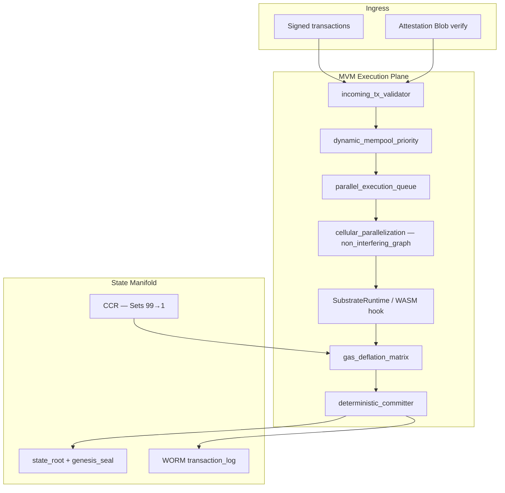
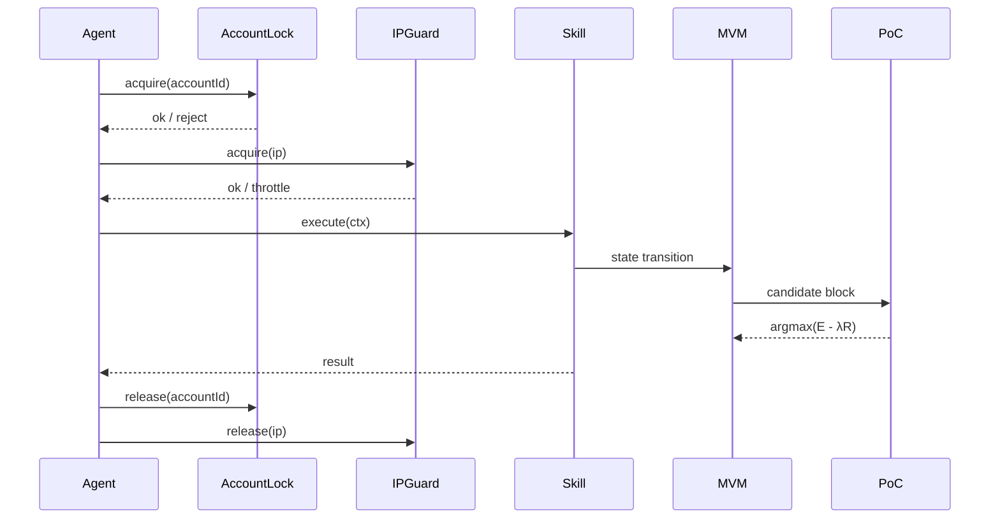

# Technical Due Diligence Deep-Dive — $CLRTY / CLARITY

**Audience:** Technical reviewers, institutional allocators, exchange diligence teams  
**Status:** Living artifact — synthesized from investor whitepaper, PPM, Moniverse theory materials, and repository implementation (June 2026)  
**Notion cross-links:** [Institutional Vision](https://app.notion.com/p/383704760d248039950eef8816181040) · [MVM / PoC synthesis](https://app.notion.com/p/37f704760d24800298b3ede45d52ce4d)

---

## Executive Summary

$CLRTY (CLARITY) is positioned as **institutional-grade circulatory capital infrastructure** — a deterministic L1 substrate (`clrty-1`) where compliance, execution quality, and wallet behavior are encoded at the protocol layer rather than bolted on post hoc.

The architecture addresses three structural market failures:

| Gap | CLARITY response |
|-----|------------------|
| **Fragmentation** — no unified system of record across custodians, wallets, and venues | Hard-kernel L1 + global supply checksum + WORM settlement logs |
| **Compliance friction** — reactive AML/KYC excludes institutions from on-chain liquidity | **Compliance-as-Code** via Attestation Blob at execution time |
| **Execution risk** — MEV, slippage, parallel bot abuse | Serialized execution (dual-lock model), PoC `argmax(E − λR)`, MIRRA dark-pool gates |

**Honesty for reviewers:** Many investor-facing surfaces (Skills service, full IP guard, x402 middleware) are **scaffold or planned**. Core substrate modules — PoC consensus, settlement gatekeeper, attestation blobs, supply cap, MSA-100 / Sovereign-600 registries — are **implemented or partially implemented** with documented gaps. Status labels below follow the repo’s `implemented | partial | planned` convention.

**Tokenomics deep-dive:** Full economic transparency artifact — allocations, vesting, burn phases, treasury policy, Set-tier economics — [`tokenomics_model.md`](tokenomics_model.md).

**Operational roadmap:** TGE, MIRRA deployment, compliance gates, pretest campaign, and accountability table — [`roadmap_milestone_tracker.md`](roadmap_milestone_tracker.md).

---

## §1 Market Problem — The Institutional Infrastructure Gap

### 1.1 Fragmentation

Digital asset infrastructure today splinters across chains, custodians, CEX/DEX order books, and off-chain compliance systems. Institutional auditors cannot reconstruct a single authoritative ledger of capital movement, identity binding, and fee attribution. The investor whitepaper frames this as capital behaving as **static balances** rather than **stateful, classifiable participants** in a coordinated manifold.

### 1.2 Compliance friction

Legacy DeFi treats KYC/AML as perimeter checks at onboarding. FATF Travel Rule and institutional counterparty diligence require **per-transaction** identity linkage. Reactive compliance creates regulatory creep, excludes regulated allocators from liquidity, and increases operational due diligence cost for every counterparty.

### 1.3 Execution risk

High-stakes capital management requires:

- Deterministic, auditable state transitions (not probabilistic mempool races)
- Slippage and exposure bounds before trade dispatch
- Protection from MEV, bot flooding, and parallel capital misuse
- Circuit breakers during systemic stress (Black Swan signatures)

The Private Placement Memorandum (PPM) explicitly cites **MIRRA Dark Pool** execution with full audit transparency as the institutional value proposition — private order flow with protocol-level accountability.

### 1.4 Why incumbents fall short

| Layer | Typical market | Gap |
|-------|----------------|-----|
| Ledger | General-purpose EVM/SVM | No behavior-sensitive fee surface; no native compliance primitive |
| Consensus | PoS / PoW throughput focus | Does not optimize for **execution efficiency minus structural risk** |
| Execution | Concurrent DEX routers | Race conditions, MEV, unbounded parallel strategies |
| Compliance | Off-chain SaaS add-ons | Not cryptographically bound to state transition |

CLARITY’s thesis: **move compliance, concurrency policy, and execution quality into the kernel** — not the application wrapper.

---

## §2 $CLRTY Solution — Network Architecture

### 2.1 Deterministic kernel

The PPM describes a **hard-kernel substrate** targeting sub-millisecond finality with state-verified, immutable transitions. In the repository this manifests as:

- `CLRTY_SUBSTRATE/` — L1 crate (`clarityd`, `clrty-gatekeeper`)
- `mvm_execution/` — Moniverse Virtual Machine execution plane
- `state_manifold/` — state root, genesis seal, WORM transaction log
- `processing_pipeline/deterministic_committer.rs` — block commit scaffold

The staged evolution (whitepaper §9): deploy on established rails first (`clrty-1` authoritative), prove demand, then deepen custom runtime semantics — not day-one isolated sovereign L1 risk.

### 2.2 Unified ledger

- **Fixed supply:** 16,000,000 CLRTY (9 decimals), NULL mint post-genesis — [`economic_engine/tokenomics/supply_checksum.rs`](../../CLRTY_SUBSTRATE/economic_engine/tokenomics/supply_checksum.rs)
- **Global accountant:** `supply_oracle.rs` + NTT harmonizer (Phase 10 bridge deferred — see [`l1_launch/DEFERRED_BRIDGE.md`](../l1_launch/DEFERRED_BRIDGE.md))
- **Settlement gatekeeper:** VIS Gnosis Safe → attestation → register binding — [`settlement/commit_payment.rs`](../../CLRTY_SUBSTRATE/settlement/commit_payment.rs)

### 2.3 Resilient design

- **Circuit breakers:** slippage governor (`economic_core.rs`), bridge pause + dead-man switch (`arbitrage_core/`)
- **Treasury:** 3-of-5 multisig — [`bridge_perimeter/multisig_config.rs`](../../CLRTY_SUBSTRATE/bridge_perimeter/multisig_config.rs)
- **Security stack:** MSA-100 + Sovereign-600 (§8)

### 2.4 Positioning — Execution Layer for the Internet of Value

| Primitive | Role |
|-----------|------|
| **x402** | Access protocol (payment-gated HTTP) |
| **$CLRTY** | Value unit + gas + coordination rights |
| **Agents** | Users / operators |
| **CLARITY Skills** | Deterministic apps (one skill per context) |
| **Actions / Blinks** | UI abstraction for one-link execution |
| **CLARITY PAY** | Native settlement primitive |

See [`protocol/PLATFORM_SURFACE_MAP.md`](../protocol/PLATFORM_SURFACE_MAP.md).

---

## §3 MVM Architecture — Moniverse Virtual Machine

The **Moniverse Virtual Machine (MVM)** is CLRTY’s execution substrate — bridging Moniverse-inspired topology (state compression, behavioral collapse) with programmatic financial execution.

### 3.1 Stack overview



**Module map** (`CLRTY_SUBSTRATE/mvm_execution/`):

| Module | Path | Role | Status |
|--------|------|------|--------|
| Executor shell | `mod.rs` (`MvmExecutor`) | Block gas budget; zero-gas Set-1 routing | **partial** |
| Runtime | `vm_runtime/core_substrate_runtime.rs` | WASM execution hook | **scaffold** |
| Pipeline | `processing_pipeline/` | Validator → mempool → commit | **partial** |
| Parallelization | `cellular_parallelization/non_interfering_graph.rs` | Non-interfering task graph | **scaffold** |
| Fee / burn | `gas_deflation_matrix/` | Entropy-linked fees, compression burn | **partial** |

### 3.2 Hard-kernel design rationale

The investor whitepaper and Notion synthesis emphasize **avoiding interpreted bytecode overhead** for institutional paths. The repository’s `SubstrateRuntime::execute_wasm` is presently a stub returning empty output — production path targets bounded epigenesis (Blue Code patch registry) rather than arbitrary bytecode mutation at launch.

**Design intent:**

1. **Deterministic transitions** — same inputs → same state root (feeds PoC audit trail)
2. **Computational commodities** — tokens as **access rights** to execution lanes, not side effects of transfer
3. **State-sensitive economics** — fee surface depends on CCR tier, λ pressure, entropy sink

### 3.3 Autonetic Moniversion Ledger (Sets 99→1)

Wallet addresses occupy a **100-tier binary search tree** (Sets 99→1). Each transfer re-solves tier assignment:

```
Transaction → feature extraction → score S(x) = W·X + b → set migration → fee / priority consequences
```

**Feature vector** (whitepaper §6–7, repo telemetry):

| Feature | Symbol | Source |
|---------|--------|--------|
| Bid-ask spread thickness | M₀ | CEX/DEX order books |
| Holding half-life | M₁ | On-chain activity profile |
| Cross-chain bridge velocity | M₂ | NTT transfer rate (Phase 10) |
| Wallet cluster entropy | M₃ | `poc_consensus/telemetry_listeners/clustering_detector.rs` |

**Proposed initialization weights** (governance-controlled pilot, not validated constants):

| Feature | Weight | Rationale |
|---------|--------|-----------|
| Holding duration (H) | 0.40 | Velocity defense; institutional credibility |
| Transaction velocity (V) | 0.30 | Productive participation vs churn |
| Bridge frequency (B) | 0.15 | Cross-chain utility with anti-loop safeguards |
| Wallet entropy (E) | 0.15 | Fragmentation / sybil penalty |

**Set 1 (singularity):** zero-gas kernel routing via `MvmExecutor::apply_transfer_gas` when `TransferResult.zero_gas == true`.

**Code anchors:** `entropy_sink_engine/set_dynamics/`, `entropy_sink_engine/ccr_orchestrator/`, `token_core/layout_v2.rs`, [`governance/BINARY_INDEX_CONSENSUS_MAP.md`](../governance/BINARY_INDEX_CONSENSUS_MAP.md).

### 3.4 Computational commodities

Execution licensing, node registration, parallel execution slots, and MIRRA dark-pool routing are **metered capabilities** settled in $CLRTY. The Moniverse Economic Engine doc frames fee capture → redistribution → burn → tier scarcity as four structural value legs — see [`moniverse_economic_engine.md`](moniverse_economic_engine.md).

### 3.5 Moniverse theory (design language)

Chandler William Ferguson’s Moniverse framing (quantum-engineering vocabulary) is used as **systems language** for state compression and behavioral collapse — not as a claim of validated physics. Engineering translation: feature extraction, bounded scoring, policy classification, deterministic transitions. See extracted theory context in project materials and [`whitepaper.md`](../whitepaper.md) §1–3.

---

## §4 Consensus & Deterministic Execution

### 4.1 Proof-of-Convergence (PoC)

Validators maximize **E(x) − λR(x)** where:

- **E** — execution efficiency (throughput, Set-tier bonus, gas burn contribution)
- **R** — structural risk (propagation latency, divergence count)
- **λ** — adaptive pressure from EntropyBus / entropy sink engine

```rust
// CLRTY_SUBSTRATE/poc_consensus/mod.rs — objective and selection
pub fn objective(&self, c: &PocBlockCandidate) -> f64 {
    c.e - c.lambda * c.r
}
/// argmax(E(x) - λR(x)) over candidates
pub fn select_block<'a>(&self, candidates: &'a [PocBlockCandidate]) -> Option<&'a PocBlockCandidate>
```

**Supporting modules:**

| Module | File | Function |
|--------|------|----------|
| Efficiency | `efficiency_evaluator.rs` | `evaluate_efficiency`, `build_candidate` |
| Risk | `efficiency_evaluator.rs` | `evaluate_risk` |
| λ injection | `lambda_pressure_injector.rs` | Entropy-linked λ surge |
| Finality | `convergence_committer.rs` | Commit gate on objective |
| State update | `state_stabilizer.rs` | Manifold update on commit |
| Slashing | `entropy_slashing/malicious_divergence.rs` | Divergence penalties |

### 4.2 EntropyBus λ-heartbeat

The PPM references **EntropyBus λ-heartbeat** as the audit anchor for regulators and institutional auditors — immutable logs of state transitions tied to compliance status and treasury integrity. Telemetry: `poc_consensus/telemetry_listeners/`, `data_lake_pipeline/structural_dashboards/consensus_metrics.md`.

Normalized signal allowlist: [`signal_normalization.md`](signal_normalization.md).

### 4.3 Serialized execution model

Parallel execution is **prohibited at the policy layer** for capital-bearing skills to prevent race conditions and bot-driven capital misuse. Enforcement spans:

1. **Account-level lock** — one active skill / mutating command per account
2. **IP-level guard** — configurable concurrency ceiling per IP (abuse prevention)
3. **CLI funnel** — `AtomicStateLock` serializes mutating operator commands
4. **Quant skill uniqueness** — `QuantSkillEngine.enforceUniqueness()` (frontend scaffold)



### 4.4 Dual-lock implementation map

| Layer | Spec (TypeScript pseudocode) | Repo implementation | Status |
|-------|------------------------------|----------------------|--------|
| Account lock | `AccountExecutionLock` Map | `clrty-cli-core/middleware.rs` → `AtomicStateLock` | **partial** (global stub, not per-account Map) |
| IP guard | `IpExecutionGuard` | `clrty network ip-status` — not implemented | **planned** |
| Skill uniqueness | `QuantSkillEngine.enforceUniqueness` | `frontend/lib/clarity-scaffold.js` | **scaffold** |
| Combined gate | `executeSkill({ accountId, ip, skill, ctx })` | `clrty-cli-core/funnel/mod.rs` pipeline | **partial** |
| Pipeline serialize | — | `docs/cli/execution_funnel.md` stages | **partial** |

**Reviewer note:** Dual-lock semantics are **architecturally specified** and partially reflected in CLI middleware and JS scaffold. Production requires per-account lock map, IP rate limiting in `clrty-api`, and skills-service backend (**planned**).

---

## §5 CLARITY Skills

> **Install intelligence. Execute instantly.**

CLARITY Skills are the **execution layer** of the $CLRTY ecosystem — modular, downloadable units of intelligence that allow agents to perform complex actions (quantitative trading, payments, growth automation) with precision, speed, and accountability.

**Core principle:** Each skill does exactly one thing, and does it **deterministically**.

Related spec: [`protocol/clarity-skills.md`](../protocol/clarity-skills.md) · Product surface: [`frontend/products/clarity-skills.html`](../../frontend/products/clarity-skills.html) · **Execution layer guide:** [`investor/clarity_skills_overview.md`](clarity_skills_overview.md)

### 5.1 One skill at a time — enforced at multiple layers

CLARITY enforces a strict **single-skill execution model**, secured across:

| Layer | Mechanism | Purpose |
|-------|-----------|---------|
| **Account-level locking** (primary) | One active skill per account ID | Prevents parallel capital misuse |
| **IP-level concurrency control** (secondary) | Configurable max active executions per IP | Bot resistance, fair network usage |

At any moment:

- Only **one skill** can run per account
- Only **one active execution** per IP (default; configurable)
- All other requests are **queued, throttled, or rejected**

This prevents: race conditions, execution abuse, bot flooding, parallel capital misuse. Execution is **serialized, enforced, and globally consistent**.

### 5.2 Dual lock system (Account + IP)

Every execution must pass **two gates**.

**1. Account Lock (Deterministic Core)**

```typescript
class AccountExecutionLock {
  private locks = new Map<AccountId, boolean>()
  acquire(accountId: string) {
    if (this.locks.get(accountId)) {
      throw new Error("Account locked: skill already running")
    }
    this.locks.set(accountId, true)
  }
  release(accountId: string) {
    this.locks.delete(accountId)
  }
}
```

**Repo mapping:** `QuantSkillEngine.activeSkillId` in [`frontend/lib/clarity-scaffold.js`](../../frontend/lib/clarity-scaffold.js); CLI `AtomicStateLock` in [`clrty-cli-core/src/middleware.rs`](../../clrty-cli-core/src/middleware.rs). Full per-account Map — **planned** in `skills-service`.

**2. IP Lock (Abuse Prevention Layer)**

```typescript
class IpExecutionGuard {
  private active = new Map<string, number>()
  acquire(ip: string) {
    const count = this.active.get(ip) || 0
    if (count >= 1) {
      throw new Error("IP concurrency limit reached")
    }
    this.active.set(ip, count + 1)
  }
  release(ip: string) {
    const count = this.active.get(ip) || 1
    this.active.set(ip, Math.max(0, count - 1))
  }
}
```

**Repo mapping:** `clrty network ip-status` — **planned** (`clrty-cli-core/src/handlers/network.rs` currently exposes `peers` only).

**Combined execution gate**

```typescript
async function executeSkill({ accountId, ip, skill, ctx }) {
  accountLock.acquire(accountId)
  ipGuard.acquire(ip)
  try {
    return await skill.execute(ctx)
  } finally {
    accountLock.release(accountId)
    ipGuard.release(ip)
  }
}
```

### 5.3 CLI (with network enforcement)

| Command | Purpose | Status |
|---------|---------|--------|
| `clarity skill run market-arbitrage --account=0xABC --capital=1000` | Execute skill under dual lock | **planned** |
| `clarity skill run metric-collapse-arbitrage --account=0xINST --capital=5000000` | Quantum Skill MCA | **implemented** |
| `clarity skill status --account=0xABC` | Inspect account lock | **implemented** |
| `clarity network ip-status` | View IP concurrency usage | **implemented** |
| `clarity skill halt --account=0xABC` | Halt active execution | **implemented** |
| `clarity strategy run --steps=...` | Sequential skill pipeline | **implemented** |

See [`investor/quantum_skills_trading_suite.md`](quantum_skills_trading_suite.md) for the 4 Quantum Skills spec (MCA, TSR, AVR, EHL). Full execution-layer narrative: [`investor/clarity_skills_overview.md`](clarity_skills_overview.md).

**Existing CLI paths:**

| Command | Handler | Role |
|---------|---------|------|
| `clrty exec market` | `clrty-cli-core/src/handlers/exec.rs` | Market execution funnel |
| `clrty producer start\|pause\|deadman` | `handlers/producer.rs` | Producer / bridge controls |
| `clrty funnel market` | `funnel/mod.rs` | Staged execution funnel |
| `clrty settlement *` | `handlers/settlement.rs` | Gatekeeper operations |

Install: [`cli/install.md`](../cli/install.md) · Funnel: [`cli/execution_funnel.md`](../cli/execution_funnel.md)

### 5.4 Quantitative execution constraints

Every execution is bounded by strict quantitative rules:

- Capital allocation caps
- Exposure limits
- Slippage thresholds
- Risk triggers

```javascript
await agent.use("market-arbitrage-skill", {
  capital: 1000,
  maxExposure: 0.2,
  slippage: 0.01
})
```

**Repo mapping:**

| Constraint | Implementation | Path |
|------------|----------------|------|
| Capital / position cap | `position_limit_ok`, `MAX_TRADE_SIZE` | `arbitrage_core/src/risk/mod.rs`, `clrty-signal-bridge` |
| Slippage gate | `SLIPPAGE_PAUSE_BPS = 150` | `token_core/blue_code/economic_core.rs` |
| NTT execution gate | `DEFAULT_MAX_SLIPPAGE = 0.0005` | `quant_stack/fma/execution_gate.rs` |
| Drawdown | `max_drawdown_ok` | `arbitrage_core/src/risk/mod.rs` |
| Dead-man / bridge pause | `check_dead_man`, `bridge_pause_active` | `arbitrage_core/` |

Execution is not just controlled — it is **financially constrained by design**.

### 5.5 Sequential strategy pipelines

Parallel execution is **prohibited**. CLARITY uses deterministic pipelines:

```bash
clarity strategy run --steps="risk-manager,market-arbitrage,payment-executor"
```

Each step:

1. Acquires locks
2. Executes
3. Releases locks
4. Passes output forward

**Repo mapping:** Execution funnel stages (`RequireAuth` → `AtomicStateLock` → Handler → `LogVerify`) in [`clrty-cli-core/src/pipeline.rs`](../../clrty-cli-core/src/pipeline.rs). Named multi-step `strategy run` — **planned**. Producer loop (`arbitrage_core/src/loop_engine.rs`) implements sequential poll cycles with risk gates.

### 5.6 Default skill catalog

| ID | Name | Tag | Backend mapping |
|----|------|-----|-----------------|
| `market-arbitrage` | Market Arbitrage | quant | `arbitrage_core/`, `quant_stack/fma/` |
| `payment-executor` | Payment Executor | payments | `CLRTY_SUBSTRATE/settlement/` |
| `lead-scraper` | Lead Scraper | growth | **planned** (agent scaffold) |
| `entropy-monitor` | Entropy Monitor | infra | `poc_consensus/`, EntropyBus telemetry |

**Future Rust registry:** `clrty-signal-bridge/` (signal validation), `arbitrage_core/` (producer execution), `skills-service` (**planned** — registry + monetization).

### 5.7 Why IP locking matters

The IP layer adds:

- Bot resistance
- Abuse throttling
- Fair network usage
- Protection against multi-account farming

It does **not** replace identity. CLARITY remains:

- **Account-first**
- **Agent-native**
- **Deterministic at the core**

### 5.8 Example — one command, full pipeline

```javascript
await agent.use("market-arbitrage-skill")
```

Behind one command:

1. Account lock engaged
2. IP validated
3. Capital allocated
4. Trade executed
5. Risk enforced
6. Locks released

### 5.9 The big idea

CLARITY transforms execution into a **controlled, scarce resource**.

| Dimension | Rule |
|-----------|------|
| One account | one execution lane |
| One IP | one concurrency channel |
| One skill | one deterministic outcome |

This is not just automation. This is **rate-limited, capital-aware, adversarially secure execution infrastructure** — aligned with PoC `argmax(E − λR)` and entropy-linked fee routing.

Unlike general-purpose agent plugins, CLARITY Skills are **quantitative, sequential, and mutually exclusive per context**.

---

## §6 Compliance-as-Code

**Regulatory framing:** Internal Howey Test utility analysis (not legal advice) — [`regulatory_opinion_memo.md`](regulatory_opinion_memo.md) · Task 24 ledger — [`howey_risk_ledger.md`](../compliance/data_room/legal_templates/howey_risk_ledger.md)

### 6.1 Attestation Blob gateway

Protocol-layer AML/KYC via **Attestation Blob** — ed25519-signed credential with Blue Code salt `#0A192F`:

```rust
// settlement/attestation_blob.rs
pub struct AttestationBody {
    pub wallet: [u8; 20],
    pub investor_id: [u8; 32],
    pub kyc_tier: u8,
    pub system_salt: [u8; 3],  // BLUE_CODE_SALT
    pub expires_at: u64,
    pub cpu_register_hint: u16,
}
```

**Flow:** KYC webhook → gatekeeper signs blob → investor sends capital to VIS Safe → `commit_payment_to_register` verifies blob before register write.

Full ops: [`settlement_gatekeeper.md`](settlement_gatekeeper.md) · [`compliance/data_room/technical/vis_identity_gatekeeper_ops.md`](../compliance/data_room/technical/vis_identity_gatekeeper_ops.md)

### 6.2 FATF / Travel Rule at execution layer

The PPM §8.1 states every transaction is cryptographically linked to verified identity and compliance profile, fulfilling Travel Rule requirements for digital asset transfers. The MVM ingress path is designed to **reject unattested capital flows** — unauthorized deposits flagged in `var/settlement/flagged.wrm`.

### 6.3 Sanctions and VIS perimeter

- `CLRTY_SUBSTRATE/compliance/sanctions_scanner.rs`
- VIS node map: [`compliance/VIS_CLRITY_PROTOCOL_MAP.md`](../compliance/VIS_CLRITY_PROTOCOL_MAP.md) (N01 Gatekeeper, N02 Sanctions)

---

## §7 Quantitative Execution Constraints

### 7.1 Capital caps and exposure

| Control | Constant / function | Location |
|---------|---------------------|----------|
| Max trade size | `MAX_TRADE_SIZE` | `clrty-signal-bridge` |
| Position limit | `position_limit_ok()` | `arbitrage_core/src/risk/mod.rs` |
| Private seed cap | 2M CLRTY from bucket | `settlement_config.json` |
| Genesis tiers | $100k–$500k / $500k+ / hardware | [`settlement_gatekeeper.md`](settlement_gatekeeper.md) |

### 7.2 Slippage and MIRRA dark pool

| Mechanism | Threshold | File |
|-----------|-----------|------|
| Slippage pause | 150 bps spread | `economic_core.rs` |
| NTT impact gate | 0.05% default | `execution_gate.rs` |
| Dark pool routing | `route_dark_pool(order_size, threshold)` | `economic_core.rs` |
| Block fragmentation | `fragment_block_order` → micro-strategy slices | `economic_core.rs` |

PPM §9 — MIRRA Dark Pool: encrypted state-transition layers, hard-coded slippage gates, real-time treasury reconciliation against supply checksums.

### 7.3 Producer / arb pipeline

```
FeedHub.poll → spread_scan → position_limit_ok → (dispatch if !dry_run)
         ↑ dead_man + bridge_pause gates
```

See `arbitrage_core/src/loop_engine.rs`, [`arbitrage/producer_engine.md`](../arbitrage/producer_engine.md).

### 7.4 HELIX hidden exchange layer (L0.5)

HELIX sits **between MIRRA and canonical commit** — shadow-state execution with NetZero netting before `deterministic_committer` writes to `state_manifold`.

| Component | Role | Repo anchor | Status |
|-----------|------|-------------|--------|
| HELIX-01 | Dark matching grid | `helix_engine/matching_grid.rs` · `economic_core::route_dark_pool` | partial |
| HELIX-02 | Intent resolver | `helix_engine/intent_resolver.rs` | partial |
| HELIX-03 | Net settlement | `helix_engine/net_settlement.rs` | partial |
| HELIX-05 | Arb mesh | `helix_engine/arb_mesh.rs` · `arbitrage_core` | partial |
| HELIX-10 | Continuous kernel | `helix_engine/kernel.rs` · `helixd` | partial |

Dual-state path: shadow simulate → AVR gate → verified delta → canonical state root.

Investor doc: [`helix_engine.md`](helix_engine.md) · Verify: `scripts/audit/verify_helix_components.sh` · ATU **2601–2610**.

---

## §8 Security Stack — MSA-100 + Sovereign-600

Three-tier model (brief — full doc: [`SOVEREIGN_600_ARCHITECTURE.md`](../security/SOVEREIGN_600_ARCHITECTURE.md)):

```
MSA-100 (PT-001–100)  →  Sovereign SP-001–500 (perimeter)  →  SP-501–600 (atomic)
```

| Tier | Scope | DD relevance |
|------|-------|--------------|
| **MSA-100** | Operational pretest, sim validation, settlement perimeter | Launch gate evidence |
| **Sovereign Perimeter** | Hardware RoT → governance singularity (SP-500) | Institutional trust boundary |
| **Atomic Defense** | Token + ledger mathematical immutability (SP-600 terminal seal) | Supply / finality proofs |

**Verification:**

```bash
python3 scripts/investor/generate_sovereign_protocols.py
bash scripts/audit/verify_sovereign_protocols.sh
bash scripts/audit/verify_security_layers.sh
bash scripts/launch/launch_readiness.sh
```

Gate threshold: ≥80% documented across 600 protocols; atomic band tracked separately. See also [`MASS_SECURITY_ARCHITECTURE.md`](../security/MASS_SECURITY_ARCHITECTURE.md), [`audit/INVESTOR_SECURITY_SUMMARY.md`](../audit/INVESTOR_SECURITY_SUMMARY.md), **[`security_audit_report.md`](security_audit_report.md)** (full investor audit synthesis).

---

## §9 Due Diligence Summary Table

| Pillar | Technical implementation | Goal | Status |
|--------|-------------------------|------|--------|
| **VM execution** | MVM hard-kernel, `deterministic_committer`, `SubstrateRuntime` | Deterministic state transition | partial |
| **Behavior topology** | CCR Sets 99→1, `W·X+b` over M₀–M₃ | Behavior-aware fee / priority surface | partial |
| **Consensus** | PoC `argmax(E − λR)`, EntropyBus λ | Optimize execution quality under risk pressure | implemented |
| **Concurrency** | Dual-lock (Account + IP), `AtomicStateLock`, `QuantSkillEngine` | Eliminate race conditions / bot abuse | partial / scaffold |
| **Compliance** | Attestation Blob, gatekeeper, sanctions scanner | Protocol-layer AML/KYC / Travel Rule | partial |
| **Execution risk** | MIRRA gates, slippage governor, dead-man, execution_gate | Institutional dark-pool safety | partial |
| **Supply integrity** | 16M cap, `supply_checksum`, genesis seal | Non-inflationary system of record | implemented |
| **Treasury** | 3-of-5 Safe, vesting escrow, WORM logs | Capital protection / audit trail | partial |
| **Security registry** | MSA-100 + Sovereign-600 manifests | Verifiable defense coverage | implemented (registry) |
| **Skills platform** | `QuantSkillEngine`, skills-service, CLI skill commands | Deterministic agent execution layer | scaffold / planned |

---

## §10 Code & Document References

### Primary documents

| Document | Path |
|----------|------|
| Technical whitepaper | [`docs/whitepaper.md`](../whitepaper.md) |
| Tokenomics model | [`docs/investor/tokenomics_model.md`](tokenomics_model.md) |
| Moniverse economic engine | [`docs/investor/moniverse_economic_engine.md`](moniverse_economic_engine.md) |
| Launch strategy (Notion) | [`docs/simulation/CLRTY_Live_Market_Notion.md`](../simulation/CLRTY_Live_Market_Notion.md) |
| Roadmap & milestone tracker | [`docs/investor/roadmap_milestone_tracker.md`](roadmap_milestone_tracker.md) |
| Repo map | [`docs/architecture/REPO_MAP.md`](../architecture/REPO_MAP.md) |
| Settlement gatekeeper | [`docs/investor/settlement_gatekeeper.md`](settlement_gatekeeper.md) |
| Regulatory opinion memo | [`docs/investor/regulatory_opinion_memo.md`](regulatory_opinion_memo.md) |
| Clarity Skills spec | [`docs/protocol/clarity-skills.md`](../protocol/clarity-skills.md) |
| CLARITY Skills execution layer | [`docs/investor/clarity_skills_overview.md`](clarity_skills_overview.md) |
| Platform surface map | [`docs/protocol/PLATFORM_SURFACE_MAP.md`](../protocol/PLATFORM_SURFACE_MAP.md) |
| Website & investor portal | [`docs/investor/website_and_investor_portal.md`](website_and_investor_portal.md) |

### Core substrate paths

| Component | Path |
|-----------|------|
| MVM | `CLRTY_SUBSTRATE/mvm_execution/` |
| PoC consensus | `CLRTY_SUBSTRATE/poc_consensus/` |
| Blue Code / economic core | `CLRTY_SUBSTRATE/token_core/blue_code/` |
| Settlement | `CLRTY_SUBSTRATE/settlement/attestation_blob.rs`, `commit_payment.rs` |
| State manifold | `CLRTY_SUBSTRATE/state_manifold/` |
| Boot / genesis | `CLRTY_SUBSTRATE/boot/genesis_entropy.json` |

### CLI & execution

| Component | Path |
|-----------|------|
| CLI handlers | `clrty-cli-core/src/handlers/` (`exec.rs`, `producer.rs`, `settlement.rs`, `network.rs`) |
| Pipeline / middleware | `clrty-cli-core/src/pipeline.rs`, `middleware.rs`, `funnel/mod.rs` |
| Arbitrage producer | `arbitrage_core/src/loop_engine.rs` |
| Signal bridge | `clrty-signal-bridge/` |
| FMA / quant | `quant_stack/fma/` |

### External source materials (PDF extract)

| Source | Pages | Extract location |
|--------|-------|------------------|
| CLRTY Whitepaper — Investor Edition | 34 | `var/tmp/pdf_extract/CLRTY_Whitepaper_—_Investor_Edition_1.pdf.txt` |
| Private Placement Memorandum | 5 | `var/tmp/pdf_extract/-$CLRTY-_-_PRIVATE_PLACEMENT_MEMORANDUM.pdf.txt` |
| Chandler William Ferguson (Moniverse / ML stack CV) | 4 | `var/tmp/pdf_extract/Chandler_William_Ferguson_3.pdf.txt` |

---

## Appendix — Reviewer checklist

- [ ] Confirm supply cap enforcement tests pass: `cargo test -p clrty-substrate supply_checksum`
- [ ] Run launch readiness battery: `bash scripts/launch/launch_readiness.sh --continue --skip-foundry`
- [ ] Verify sovereign registry: `bash scripts/audit/verify_sovereign_protocols.sh`
- [ ] Review settlement PoC gaps: [`token/ldnet_stress_test1.md`](../token/ldnet_stress_test1.md) E1–E7
- [ ] Validate Skills scaffold vs production roadmap (`skills-service`, IP guard, per-account locks)
- [ ] Cross-check Notion vision pages against this doc for messaging alignment

---

*Disclaimer: This document is for technical due diligence only. It is not legal, tax, or investment advice. Aspirational components are labeled honestly. Independent audit and counsel review remain required before any offering or mainnet launch.*
