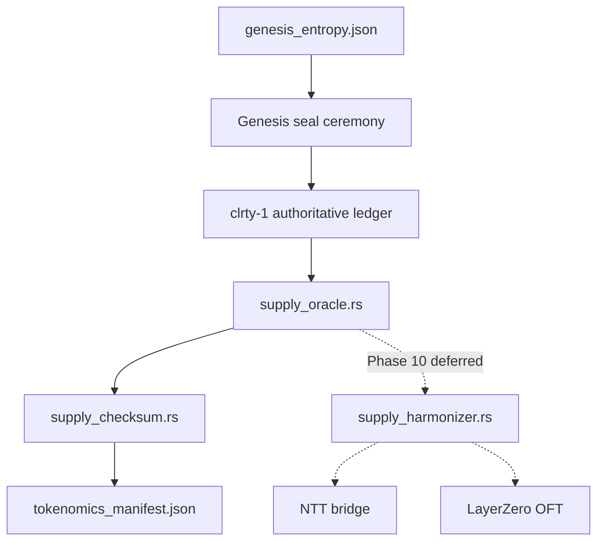
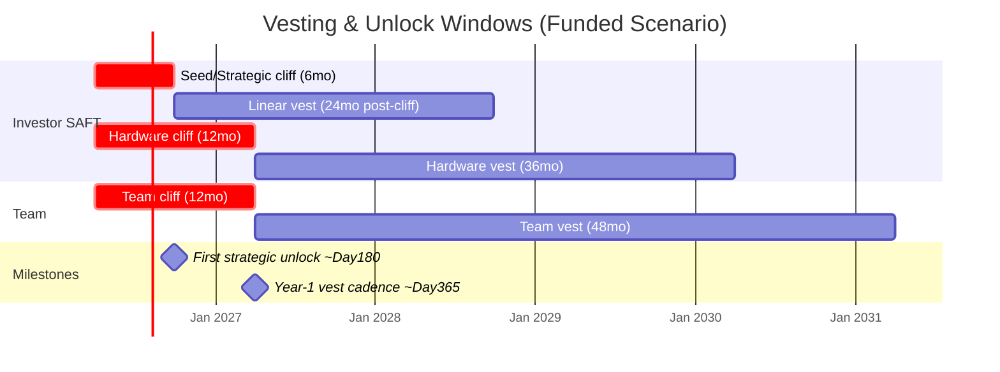
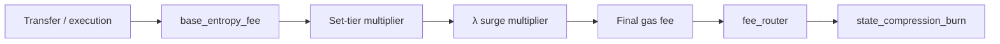
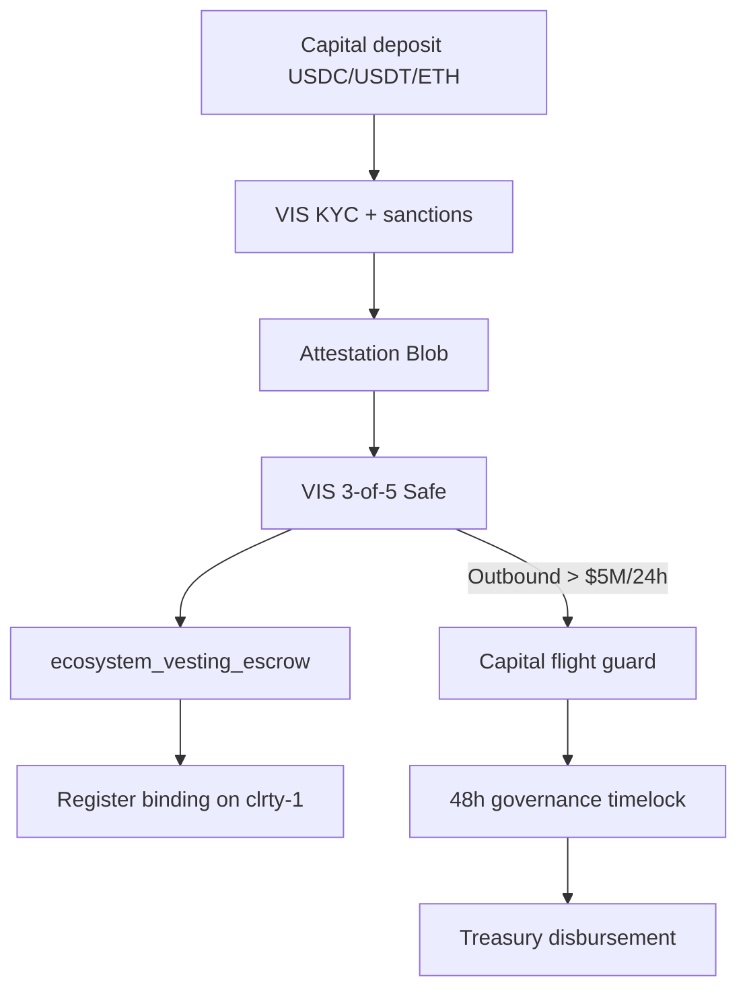

# Tokenomics Model — Economic Transparency

**Audience:** Institutional allocators, exchange listing teams, counsel, and technical due diligence reviewers  
**Status:** Living artifact — synthesized from locked in-repo parameters, substrate modules, simulation models, and investor source materials (June 2026)  
**Notion cross-links:** [CLRTY Institutional Vision](https://app.notion.com/p/CLRTY-383704760d248039950eef8816181040) · [Early Access to CLRITY](https://app.notion.com/p/Early-Access-to-CLRITY-37f704760d24800298b3ede45d52ce4d) · [MVM / PoC synthesis](https://app.notion.com/p/37f704760d24800298b3ede45d52ce4d)

**Related docs:** [`technical_due_diligence.md`](technical_due_diligence.md) · [`roadmap_milestone_tracker.md`](roadmap_milestone_tracker.md) · [`security_audit_report.md`](security_audit_report.md) · [`regulatory_opinion_memo.md`](regulatory_opinion_memo.md) · [`moniverse_economic_engine.md`](moniverse_economic_engine.md) · [`genesis_participation_protocol.md`](genesis_participation_protocol.md) · [`TOKENOMICS_LOCKED.md`](../tokenomics/TOKENOMICS_LOCKED.md)

---

## 1. Executive Summary

$CLRTY (CLARITY) is designed as **institutional-grade circulatory capital infrastructure** on sovereign L1 chain **`clrty-1`** (denom **`uclrty`**, 9 decimals). The economic model rests on three non-negotiable invariants:

| Invariant | Value | Enforcement |
|-----------|-------|-------------|
| **Hard supply cap** | 16,000,000 CLRTY | Genesis seal; `mint_authority: null` |
| **No post-genesis inflation** | Fee redistribution + burn only | `supply_oracle.rs`, adaptive phases |
| **Capital-before-float** | ~64% locked at TGE (funded scenario) | Vesting escrow, backlog tranches |

**Institutional circulatory capital thesis:** Treasury USD ($75M–$150M working scenario) funds depth, compliance, and runway while the **on-chain float remains scarce**. Funding buys market structure; it does **not** mint tokens. SAFT participants receive **weighted register allocations** (1.5×–2.0×) locked in on-chain escrow — not instant liquid supply.

**Honesty for reviewers:**

| Layer | Status |
|-------|--------|
| Genesis parameters, checksum, allocation math | **Frozen in-repo** — board sign-off pending (`locked_at: null`) |
| Supply cap enforcement code | **Implemented** — `cargo test -p clrty-substrate supply_checksum` |
| Vesting escrow, fee router, attestation gatekeeper | **Implemented** (settlement path) |
| TGE circulating supply, burn totals, treasury USD | **Modeled** — funded scenario in `mainnet_listing_config.json` |
| Ethereum Safe settlement | **Deferred** — L1-only launch scope; see [`DEFERRED_SETTLEMENT.md`](../l1_launch/DEFERRED_SETTLEMENT.md) |
| Cross-chain mirrors (NTT / LayerZero) | **Deferred Phase 10** — see [`DEFERRED_BRIDGE.md`](../l1_launch/DEFERRED_BRIDGE.md) |

---

## 2. Token Supply Architecture

### 2.1 Genesis parameters

| Parameter | Value | Source |
|-----------|-------|--------|
| Chain ID | `clrty-1` | `CLRTY_SUBSTRATE/boot/genesis_entropy.json` |
| Denom | `uclrty` | genesis + `global_manifold_state.rs` |
| Total supply | 16,000,000 CLRTY | genesis |
| Base units (nano) | 16,000,000,000,000,000 | `GLOBAL_HARD_CAP_BASE_UNITS` |
| Decimals | 9 | genesis |
| Mint authority | `null` (immutable) | genesis |
| Freeze authority | `null` (immutable) | genesis |
| Convergence ID | `clrty-convergence-v1` | genesis |

### 2.2 Supply authority model

At launch, **`clrty-1` is the sole authoritative ledger** for supply and allocations. The global accountant (`supply_oracle.rs` + `supply_harmonizer.rs`) is architected to harmonize NTT and LayerZero mirror mints under the same 16M cap when Phase 10 bridge work activates — not at TGE.



### 2.3 Supply checksum

Integrity is computed by `economic_engine/tokenomics/supply_checksum.rs`:

```
allocation_checksum = sha256(total_supply.to_le_bytes() || denom.as_bytes())
```

| Field | Value |
|-------|-------|
| **Committed hash** | `df3f767fecd60974c517d954ed0e28b92728c21b507dc54139025f09075f2e61` |
| **Algorithm** | `sha256(total_supply_le64 \|\| denom_utf8)` |
| **Manifest** | `CLRTY_SUBSTRATE/boot/tokenomics_manifest.json` |

**Verify:**

```bash
cargo run -p clarity-cli -- chain genesis-verify
cargo test -p clrty-substrate supply_checksum
```

Post-lock changes require governance snapshot vote + **48-hour timelock** (`governance_substrate/mod.rs`: `TIMELOCK_HOURS = 48`). No supply inflation — only fee redistribution and burn per adaptive tokenomics phases.

---

## 3. Allocation Breakdown

### 3.1 Macro genesis buckets (100% = 16M)

| Bucket | CLRTY | % | Role |
|--------|-------|---|------|
| **Treasury** | 4,000,000 | 25.0% | Team vesting carve-out, reserve, strategic ops |
| **Validators** | 3,000,000 | 18.75% | PoC bonding, staking rewards, security stake |
| **Liquidity** | 4,000,000 | 25.0% | MIRRA book + AMM seed at TGE |
| **Ecosystem** | 3,000,000 | 18.75% | Programmatic grants, infra recycle |
| **Public** | 2,000,000 | 12.5% | Backlog tranches (tiers 0–4) |
| **Total** | **16,000,000** | **100%** | Fixed — no hidden buckets |

**Source:** `CLRTY_SUBSTRATE/boot/genesis_entropy.json` · [`TOKENOMICS_LOCKED.md`](../tokenomics/TOKENOMICS_LOCKED.md)

Chart: [`docs/simulation/charts/01_genesis_allocation.png`](../simulation/charts/01_genesis_allocation.png) · Dashboard: [`frontend/investor/treasury-dashboard.html`](../../frontend/investor/treasury-dashboard.html)

### 3.2 Distribution tiers (S13 detail)

Sub-allocations reconcile to parent buckets per [`distribution_tiers.md`](../tokenomics/distribution_tiers.md):

| Tier | CLRTY | % of cap | Source bucket | Notes |
|------|-------|----------|---------------|-------|
| Team | 1,600,000 | 10.0% | Treasury | 12mo cliff / 48mo vest |
| Private Seed | 2,000,000 | 12.5% | Treasury | SAFT path; 6/24 default |
| Treasury (reserve) | 2,400,000 | 15.0% | Treasury | After team/seed carve-outs; multisig gated |
| Treasury (reserve sub) | 800,000 | 5.0% | Treasury | Discretionary reserve in `sub_allocations` |
| Ecosystem Grants | 3,000,000 | 18.75% | Ecosystem | Governance-gated programmatic release |
| Liquidity Pools | 4,000,000 | 25.0% | Liquidity | TGE deploy; partial LP tranches |
| Validators | 3,000,000 | 18.75% | Validators | Staking program separate from investor vesting |
| Public | 2,000,000 | 12.5% | Public | Backlog tiers 0–4 |

**Checksum:** Team (1.6M) + Private Seed (2M) + Reserve (0.8M) + Treasury reserve note (2.4M) = 4M treasury bucket. Ecosystem + Liquidity + Validators + Public = 12M. Total = 16M.

### 3.3 TGE supply snapshot (funded scenario — modeled)

From `CLRTY_SUBSTRATE/boot/mainnet_listing_config.json`:

| State | CLRTY (est.) | Notes |
|-------|--------------|-------|
| Circulating at TGE | ~3,200,000 | ~20% of cap |
| Locked (vesting) | ~9,000,000 | ~56% of cap |
| Staked | ~2,400,000 | Validator bucket |
| Burned | 0 | Pre-fee-flywheel |

Scheduled unlock windows: **Day ~180**, **Day ~365**.

Reference trajectory (funded scenario, from launch model):

| | M0 (Day 0) | M6 (Day 180) | M12 (Day 365) |
|--|------------|--------------|---------------|
| Circulating | ~3.2M | ~5.0M | ~5.8M |
| Staked | ~2.4M | ~2.6M | ~2.8M |
| Locked (vesting) | ~9.0M | ~7.2M | ~5.8M |
| Burned (cumulative) | 0 | ~45K | ~180K |

Full launch timeline: [`CLRTY_Live_Market_Notion.md`](../simulation/CLRTY_Live_Market_Notion.md)

---

## 4. Vesting Schedules

### 4.1 Genesis participation tiers (SAFT / Reg D / Reg S)

Machine-readable: `CLRTY_SUBSTRATE/boot/mainnet_listing_config.json` · `CLRTY_SUBSTRATE/settlement/allocation_weights.rs`

| Tier | USD minimum | Multiplier | Cliff | Vest | Transfer restricted |
|------|-------------|------------|-------|------|---------------------|
| **Seed Genesis** | $100,000 | 1.5× | 6 months | 24 months | Until TGE + cliff |
| **Strategic Round** | $500,000 | 1.75× | 6 months | 24 months | Until TGE + cliff |
| **Hardware Node Partner** | Compute score ≥ 80 | 2.0× | 12 months | 36 months | Until TGE + cliff |

**Reference price:** $1.00 / CLRTY (`settlement_config.json`: `usd_cents_per_clrty: 100`)  
**Accepted settlement assets:** USDC, USDT, ETH (Ethereum Mainnet)  
**Private seed cap:** 2,000,000 CLRTY from bucket

Allocation formula (`allocation_weights.rs`):

```
base_tokens = usd_cents / usd_cents_per_clrty
weighted_nano = base_tokens × multiplier × 10^9
```

### 4.2 Team and treasury vesting

| Category | CLRTY | Cliff | Vest | Source |
|----------|-------|-------|------|--------|
| Team vesting | 1,600,000 | 12 mo | 48 mo | `genesis_entropy.json:team_vesting` |
| Treasury reserve | 800,000 | — | Multisig gated | `genesis_entropy.json:reserve` |
| Ecosystem grants | 3,000,000 | — | Programmatic | Governance-gated |

### 4.3 Ecosystem vesting escrow

Investor schedules are enforced by `CLRTY_SUBSTRATE/treasury_sink/ecosystem_vesting_escrow.rs`:

```rust
// vested_amount(total, elapsed_months, cliff, vest)
// Returns 0 before cliff; linear vest over vest_months after cliff
```

| Schedule factory | Cliff | Vest | Multiplier |
|------------------|-------|------|------------|
| `seed_genesis()` | 6 mo | 24 mo | 1.5× |
| `strategic_round()` | 6 mo | 24 mo | 1.75× |
| `hardware_node_partner()` | 12 mo | 36 mo | 2.0× |

**Block conversion:** `cliff_blocks = start_block + cliff_months × 432000` (~432K blocks/month assumption)

Escrow records persist to `investor_escrow.wrm` (WORM flat-file manifold). Register-binding flow: [`genesis_participation_protocol.md`](genesis_participation_protocol.md)

### 4.4 CEX staking program (separate from investor vesting)

From `mainnet_listing_config.json` — lockup options: **30, 90, 365, 730 days**. Tier 4 (730 days) carries **5× weight multiplier** for velocity defense (whitepaper §6).

### 4.5 Vesting timeline (first 554 days)



---

## 5. Inflation / Deflation Mechanics

### 5.1 No inflation — deflationary fee path only

Post-genesis supply **never expands**. Value accrual operates through:

1. **Fee capture** on execution and coordination flows
2. **Redistribution** to validators, LPs, treasury
3. **Programmatic burn** on the fee path (adaptive phases)
4. **Set-tier scarcity** (behavior-earned, not minted)

There is **no emission schedule** in the traditional PoS inflation sense. Validator rewards scale with **fee volume**, not protocol mint.

### 5.2 Adaptive tokenomics phases (fee policy)

Govern **fee split and burn rate** — not supply expansion. Source: [`TOKENOMICS_AND_COMPLIANCE.md`](../tokenomics/TOKENOMICS_AND_COMPLIANCE.md) §3 · `simulators/tokenomics/simulate.py`

| Phase | Period | Burn share of fees | Label |
|-------|--------|-------------------|-------|
| Bootstrap | Months 0–3 (~Days 0–90) | **2%** | Early network — recycle-heavy |
| Stabilization | Months 3–6 (~Days 91–180) | **5%** | Post-TGE ramp |
| Mature | Month 6+ (~Day 180+) | **10%** | Full deflationary leg |

Simulator phase params (`simulate.py`):

| Phase | fee_burn | validator_share | lp_share |
|-------|----------|-----------------|----------|
| bootstrap | 0.02 | 0.50 | 0.35 |
| stabilization | 0.05 | 0.40 | 0.35 |
| mature | 0.10 | 0.35 | 0.30 |

**Year-1 burn target (funded volume model):** ~150K–250K CLRTY cumulative @ mature phase.

### 5.3 Fee router (default splits)

`CLRTY_SUBSTRATE/treasury_sink/fee_router.rs` — basis-point routing of collected execution fees:

| Destination | BPS | Share |
|-------------|-----|-------|
| Validators | 4,000 | 40% |
| Treasury | 3,500 | 35% |
| Burn | 2,500 | 25% |

The adaptive phase burn rate applies to the **entropy fee path** via `state_compression_burn.rs`; the fee router governs **post-collection splits**. Both layers compose — they are not duplicate accounting.

### 5.4 Gas deflation matrix

Module: `CLRTY_SUBSTRATE/mvm_execution/gas_deflation_matrix/`



| Component | Function | Formula / behavior |
|-----------|----------|-------------------|
| Set-tier multiplier | `fee_deflection_scaler` | From `genesis_tier_allocations.json` — Set 99: 1.05× → Set 1: 196.485× |
| λ surge | `lambda_surge_multiplier.rs` | `1.0 + (λ × 0.01).min(10.0)` |
| Combined gas | `compute_gas_fee()` | `base × set_mult × surge(λ)` |
| Burn collection | `state_compression_burn.rs` | `burn = fees × rate`; TPS ≥ 10K doubles burn |
| Recursive burn | `economic_core.rs` | `RECURSIVE_BURN_BPS = 250` (2.5%) |

**Set 1 zero-gas routing:** `MvmExecutor::apply_transfer_gas` returns zero fee when `TransferResult.zero_gas == true` — singularity-tier kernel privilege.

### 5.5 PoC consensus and λ (lambda)

Validators maximize **E(x) − λR(x)**:

| Symbol | Meaning |
|--------|---------|
| **E** | Execution efficiency (throughput, Set-tier bonus, burn contribution) |
| **R** | Structural risk (slippage, cluster entropy, bridge velocity) |
| **λ** | Adaptive risk pressure via EntropyBus heartbeat |

λ bounds enforced by `panic_stabilizer.rs`: clamped to `[0.1, 1000.0]`; NaN recovery to 0.1.

λ is the **economic pressure variable** linking consensus selection, fee surges, and circuit-breaker activation — not a mint parameter.

### 5.6 Velocity defense

High-velocity wallets incur **fee deflection penalties** via Set-tier assignment (`activity_profile_tracker.rs`). Tier 4 staking (730 days, 5× weight) locks supply against early secondary distribution — modeled velocity reduction ~15% at tier-4 lock saturation (`simulate.py:stress_staking_locks`).

---

## 6. Treasury Management

### 6.1 Institutional custody

| Control | Configuration | Source |
|---------|---------------|--------|
| EVM treasury | **3-of-5 Gnosis Safe** | `bridge_perimeter/multisig_config.rs` |
| SVM treasury | **3-of-5 Squads** | Same module |
| Supported chains | Ethereum (1), Base (8453), Arbitrum (42161) | `EvmSafeMultisig.chain_ids` |
| Governance timelock | **48 hours** | `governance_substrate/mod.rs` |
| Treasury name | Volkov Intelligence Systems (VIS) Gnosis Safe | `settlement_config.json` |
| Portal | [invest.clrty.network](https://invest.clrty.network) | settlement config |

**Status:** Safe address in `settlement_config.json` is placeholder (`0x000…000`) pending production deployment. Multisig owner keys are zeroed defaults — production ceremony required.

### 6.2 Treasury buckets (USD vs on-chain)

| Layer | Scale (scenario) | Purpose | Does NOT |
|-------|-------------------|---------|----------|
| Treasury USD | $75M – $150M stables + ETH | Audits, compliance, MM retainers, CEX fees, ops | Mint CLRTY |
| On-chain treasury bucket | 4.0M CLRTY (25%) | Team vesting, reserve, strategic token disbursements | Guarantee price |
| Liquidity bucket | 4.0M CLRTY (25%) | AMM + MIRRA seed | Infinite depth |
| MM budget | $5M – $15M / year | Spread management | Prevent drawdowns |

### 6.3 Capital flight guard

`CLRTY_SUBSTRATE/settlement/capital_flight_guard.rs`:

| Parameter | Default |
|-----------|---------|
| Outbound threshold | **$5,000,000 USDC** (24h rolling window) |
| Verdict | `TriggerCapitalFlight` → governance review |

Prevents rapid treasury drainage without multisig deliberation.

### 6.4 Treasury governance flow



WORM audit trail: `state_manifold/transaction_log`, `var/settlement/flagged.wrm` for unauthorized deposits.

---

## 7. Set Tier Economics (Sets 99→1)

### 7.1 CCR — Continuous Classification & Rebalancing

Wallet addresses occupy a **100-tier binary search tree** (Sets 99→1). Each transfer re-solves tier assignment:

```
Transaction → feature extraction → S(x) = W·X + b → set migration → fee / priority consequences
```

**Feature vector** (M₀–M₃):

| Feature | Symbol | Source |
|---------|--------|--------|
| Bid-ask spread thickness | M₀ | CEX/DEX order books |
| Holding half-life | M₁ | On-chain activity profile |
| Cross-chain bridge velocity | M₂ | NTT transfer rate (Phase 10) |
| Wallet cluster entropy | M₃ | `clustering_detector.rs` |

**Pilot weights** (governance-controlled, not validated constants):

| Feature | Weight |
|---------|--------|
| Holding duration (H) | 0.40 |
| Transaction velocity (V) | 0.30 |
| Bridge frequency (B) | 0.15 |
| Wallet entropy (E) | 0.15 |

### 7.2 Fee deflection by Set tier

From `CLRTY_SUBSTRATE/boot/baseline_metrics/genesis_tier_allocations.json`:

| Set | Fee multiplier | IO throttle (ms) | Privilege |
|-----|----------------|------------------|-----------|
| 99 (default) | 1.05× | 2 | Entry tier |
| 50 | 58.16× | 100 | Mid-tree |
| 1 (singularity) | 196.485× | 198 | **Zero-gas kernel routing** |

Higher tiers (lower set number) = higher coordination weight + governance voice. Set 1 is **earned through behavior**, not purchased.

**Code anchors:** `entropy_sink_engine/set_dynamics/`, `entropy_sink_engine/ccr_orchestrator/`, `token_core/layout_v2.rs`, [`BINARY_INDEX_CONSENSUS_MAP.md`](../governance/BINARY_INDEX_CONSENSUS_MAP.md)

---

## 8. MIRRA / Liquidity Bucket Economics

### 8.1 Liquidity bucket (4M CLRTY)

The **25% liquidity allocation** seeds:

| Venue | Role | Status |
|-------|------|--------|
| MIRRA dark pool | Institutional order flow, fragmentation gates | Partial — `economic_core.rs` |
| Native AMM | TGE pool bootstrap | Launch ops |
| LP coordination | Professional market-making quotes | External agreements |

**TGE discipline:** Liquidity bucket deploys at mainnet — it is **not** investor lock-up. Partial LP tranches prevent single-block float shock (`cex_tradable_at_tge: partial_lp_tranches`).

### 8.2 MIRRA dark pool mechanics

| Mechanism | Threshold / behavior | File |
|-----------|---------------------|------|
| Dark pool routing | `order_size ≥ threshold` → hidden book | `route_dark_pool()` |
| Slippage pause | **150 bps** spread | `SLIPPAGE_PAUSE_BPS` |
| Block fragmentation | Parent order → micro-strategy slices | `fragment_block_order()` |
| NTT impact gate | 0.05% default | `execution_gate.rs` |

PPM §9: encrypted state-transition layers, hard-coded slippage gates, real-time treasury reconciliation against supply checksums.

### 8.3 Yield-recycling loop

Entropy fees → validators / LPs / treasury / burn → reinvestment into book depth and security. See [Yield-Recycling logic](../simulation/CLRTY_Live_Market_Notion.md#yield-recycling-logic-mirra--clrty-infrastructure).

**Funded vs unfunded depth targets:**

| Scenario | Adversarial floor | Peak spread (SIM100) |
|----------|-------------------|----------------------|
| Unfunded | ~$0.47M | ~290 bps |
| Funded ($75M–$150M treasury) | $2M–$5M target | Absorption via MM + treasury buffer |

---

## 9. Compliance & Attestation at Economic Layer

Compliance is **embedded in the tokenomics model**, not appended as legal boilerplate.


| Control | Module | Status |
|---------|--------|--------|
| KYC → attestation | `settlement/kyc_webhook.rs` | Implemented |
| Sanctions pre-block | `compliance/sanctions_scanner.rs` | Implemented |
| Wallet registry + SAFT fields | `settlement/wallet_registry.rs` | Implemented |
| Deposit confirm + flag unauthorized | `settlement/deposit_confirm.rs`, `commit_payment.rs` | Implemented |
| Vesting escrow | `treasury_sink/ecosystem_vesting_escrow.rs` | Implemented |
| Governance timelock 48h | `governance_substrate/upgrade_timelock_controller.rs` | Implemented |
| Bot / sybil resistance | `identity_layer/automated_bot_blocker.rs` | Stub |
| Bridge firewall | `bridge_perimeter/edge_security_firewall.rs` | Stub |

**Regulatory posture:** SAFT + Reg D 506(b) / Reg S templates in `docs/compliance/data_room/legal_templates/` — **DRAFT; counsel review required** before any offer.

**Capital without attestation** is flagged in `var/settlement/flagged.wrm` — no silent allocation.

---

## 10. Transparency Artifacts

### 10.1 Machine-readable manifests

| Artifact | Path | Purpose |
|----------|------|---------|
| Genesis entropy | `CLRTY_SUBSTRATE/boot/genesis_entropy.json` | Allocation source of truth |
| Tokenomics manifest | `CLRTY_SUBSTRATE/boot/tokenomics_manifest.json` | Checksum + lock metadata |
| Settlement config | `CLRTY_SUBSTRATE/boot/settlement_config.json` | Treasury, USD reference, asset acceptance |
| Mainnet listing config | `CLRTY_SUBSTRATE/boot/mainnet_listing_config.json` | CEX lock-ups, TGE estimates |
| Set tier allocations | `CLRTY_SUBSTRATE/boot/baseline_metrics/genesis_tier_allocations.json` | Fee multipliers 99→1 |
| Frontend genesis mirror | `frontend/investor/data/genesis_entropy.json` | Dashboard sync |

### 10.2 Compliance outputs (`var/`)

| Report | Path | Generator |
|--------|------|-----------|
| Listing compliance pack | `var/compliance/listing_compliance_report.json` | `scripts/audit/generate_listing_compliance_pack.sh` |
| Sovereign protocols | `var/compliance/sovereign_protocols_report.json` | `scripts/investor/generate_sovereign_protocols.py` |
| Security layers | `var/compliance/security_layers_report.json` | `scripts/audit/verify_security_layers.sh` |
| **Security audit synthesis** | [`security_audit_report.md`](security_audit_report.md) | MSA-100 + Sovereign-600 investor report |
| Bridge connection audit | `var/compliance/bridge_connection_audit_report.json` | `scripts/audit/verify_bridge_connection_hashes.sh` |

### 10.3 Investor dashboards

| Dashboard | Path |
|-----------|------|
| Treasury command nexus | `frontend/investor/clrty-graph.html` |
| Treasury transparency | `frontend/investor/treasury-dashboard.html` |
| 100% asset map | [`treasury_transparency_dashboard.md`](treasury_transparency_dashboard.md) |
| Nano details (100 items) | `frontend/investor/data/nano_details_100.json` |

**Build/sync:**

```bash
bash scripts/investor/build_treasury_data.sh
bash scripts/audit/generate_listing_compliance_pack.sh
python3 scripts/investor/generate_sovereign_protocols.py
```

### 10.4 Simulation & validation

| Artifact | Path |
|----------|------|
| Tokenomics simulator | `simulators/tokenomics/simulate.py` |
| Launch strategy (554-day) | `docs/simulation/CLRTY_Live_Market_Notion.md` |
| SIM100 batch | `bash scripts/sim/run_100_events.sh` |
| Genesis verify | `cargo run -p clarity-cli -- chain genesis-verify` |

---

## 11. Risk Controls & Circuit Breakers

### 11.1 Economic circuit breakers

| Control | Trigger | Module | Status |
|---------|---------|--------|--------|
| Slippage governor | Spread > 150 bps | `economic_core.rs` | Implemented |
| Bridge pause + dead-man | ATU 800 breach | `arbitrage_core/` | Partial |
| Capital flight guard | > $5M outbound / 24h | `capital_flight_guard.rs` | Implemented |
| Supply cap recovery | `current_supply > TOTAL_SUPPLY` | `panic_stabilizer.rs` | Implemented |
| λ bounds | NaN or out of [0.1, 1000] | `panic_stabilizer.rs` | Implemented |
| Global panic on breach | Genesis hardening gate | `resilience.rs` | Implemented |
| NTT outbound cap | 2.5M CLRTY window (sim) | `simulate.py` | Modeled |

### 11.2 Black swan recovery

Pretest manifest includes **black_swan_recovery_1–4** and **black_swan_final_gate** scenarios. SIM100 compresses one market cycle (45% stable, 30% adversarial, 15% expansion, 10% accumulation) — proves ledger survival at E75 when depth collapses.

**Design intent:** Adversarial conditions widen spreads and trigger safety rails — they do **not** break consensus or inflate supply.

### 11.3 Panic stabilizer

`CLRTY_SUBSTRATE/kernel_core/panic_stabilizer.rs`:

- **Supply recovery:** clamps `current_supply` to `TOTAL_SUPPLY` (16M)
- **λ recovery:** resets invalid λ to safe bounds
- Emits `EntropyEventType::GasAdjustment` on supply cap recovery

---

## 12. Summary Tables

### 12.1 Economic model at a glance

| Dimension | CLRTY design | Typical DeFi |
|-----------|--------------|--------------|
| Supply cap | 16M fixed, NULL mint | Often inflationary or mutable |
| Float at TGE | ~20% circulating (funded) | Often >50% unlocked |
| Investor path | SAFT + escrow vest | Often immediate or short cliff |
| Fee policy | Adaptive burn 2→5→10% | Often no burn or buyback-only |
| Tier system | 100 Sets, behavior-derived | Static tiers or none |
| Compliance | Attestation at execution | Perimeter KYC only |
| Treasury | 3-of-5 + 48h timelock | EOA or opaque multisig |

### 12.2 Four structural value legs

| Leg | Mechanism | What it is NOT |
|-----|-----------|----------------|
| Coordination demand | PoC `E − λR`; MIRRA + arb price discovery | Passive float appreciation |
| Fee recycle loop | Entropy fees → validators/LPs/treasury/burn | One-way insider extraction |
| Deflationary burn | Adaptive phases remove CLRTY on fee events | Inflationary emissions |
| Set-tier scarcity | CCR re-solves every transfer | Manual whitelist labels |

### 12.3 Implementation status matrix

| Pillar | Implementation | Goal | Status |
|--------|----------------|------|--------|
| Supply integrity | 16M cap, checksum, genesis seal | Non-inflationary system of record | **Implemented** |
| Vesting escrow | `ecosystem_vesting_escrow.rs` | Scheduled insider supply | **Implemented** |
| Fee routing | `fee_router.rs`, adaptive phases | Recycle + burn | **Partial** |
| Set dynamics | CCR, gas deflation matrix | Behavior-aware economics | **Partial** |
| Treasury | 3-of-5 Safe, capital flight guard | Capital protection | **Partial** (config) |
| MIRRA execution | `economic_core.rs` dark pool | Institutional order flow | **Partial** |
| Bridge harmonizer | `supply_harmonizer.rs` | Cross-chain cap | **Deferred Phase 10** |
| Board sign-off | `tokenomics_manifest.json` | External lock ceremony | **Pending** |

---

## 13. Code & Manifest References

### Primary documents

| Document | Path |
|----------|------|
| Locked tokenomics | [`docs/tokenomics/TOKENOMICS_LOCKED.md`](../tokenomics/TOKENOMICS_LOCKED.md) |
| Tokenomics + compliance | [`docs/tokenomics/TOKENOMICS_AND_COMPLIANCE.md`](../tokenomics/TOKENOMICS_AND_COMPLIANCE.md) |
| Distribution tiers | [`docs/tokenomics/distribution_tiers.md`](../tokenomics/distribution_tiers.md) |
| Technical due diligence | [`docs/investor/technical_due_diligence.md`](technical_due_diligence.md) |
| Moniverse economic engine | [`docs/investor/moniverse_economic_engine.md`](moniverse_economic_engine.md) |
| Launch strategy | [`docs/simulation/CLRTY_Live_Market_Notion.md`](../simulation/CLRTY_Live_Market_Notion.md) |
| Repo map | [`docs/architecture/REPO_MAP.md`](../architecture/REPO_MAP.md) |
| Whitepaper | [`docs/whitepaper.md`](../whitepaper.md) |

### Core substrate paths

| Component | Path |
|-----------|------|
| Supply checksum | `CLRTY_SUBSTRATE/economic_engine/tokenomics/supply_checksum.rs` |
| Supply oracle | `CLRTY_SUBSTRATE/economic_engine/tokenomics/supply_oracle.rs` |
| Tokenomics module | `CLRTY_SUBSTRATE/economic_engine/tokenomics/mod.rs` |
| Vesting escrow | `CLRTY_SUBSTRATE/treasury_sink/ecosystem_vesting_escrow.rs` |
| Fee router | `CLRTY_SUBSTRATE/treasury_sink/fee_router.rs` |
| Allocation weights | `CLRTY_SUBSTRATE/settlement/allocation_weights.rs` |
| Settlement config | `CLRTY_SUBSTRATE/settlement/config.rs` |
| Gas deflation matrix | `CLRTY_SUBSTRATE/mvm_execution/gas_deflation_matrix/` |
| Economic core / MIRRA | `CLRTY_SUBSTRATE/token_core/blue_code/economic_core.rs` |
| Multisig config | `CLRTY_SUBSTRATE/bridge_perimeter/multisig_config.rs` |
| Capital flight guard | `CLRTY_SUBSTRATE/settlement/capital_flight_guard.rs` |
| Panic stabilizer | `CLRTY_SUBSTRATE/kernel_core/panic_stabilizer.rs` |
| Supply harmonizer | `CLRTY_SUBSTRATE/bridge_perimeter/fma/supply_harmonizer.rs` |
| Global manifold state | `CLRTY_SUBSTRATE/kernel_core/global_manifold_state.rs` |

### External source materials (PDF extract)

| Material | Extract path |
|----------|--------------|
| Investor whitepaper | `var/tmp/pdf_extract/CLRTY_Whitepaper_—_Investor_Edition_1.pdf.txt` |
| Private Placement Memorandum | `var/tmp/pdf_extract/-$CLRTY-_-_PRIVATE_PLACEMENT_MEMORANDUM.pdf.txt` |

---

## 14. Cross-Links & Verification Checklist

### Notion workspace

- [CLRTY — Institutional Vision](https://app.notion.com/p/CLRTY-383704760d248039950eef8816181040)
- [Early Access to CLRITY](https://app.notion.com/p/Early-Access-to-CLRITY-37f704760d24800298b3ede45d52ce4d)
- [MVM / PoC synthesis](https://app.notion.com/p/37f704760d24800298b3ede45d52ce4d)

Import launch strategy: [`docs/simulation/CLRTY_Live_Market_Notion.md`](../simulation/CLRTY_Live_Market_Notion.md) (Notion-compatible markdown + charts)

### Due diligence verification commands

```bash
# Supply integrity
cargo run -p clarity-cli -- chain genesis-verify
cargo test -p clrty-substrate supply_checksum

# Listing + compliance packs
bash scripts/audit/generate_listing_compliance_pack.sh
bash scripts/audit/verify_security_layers.sh
python3 scripts/investor/generate_sovereign_protocols.py

# Tokenomics simulation
python3 simulators/tokenomics/simulate.py

# Investor dashboard data
bash scripts/investor/build_treasury_data.sh
```

### Reviewer checklist

- [ ] Confirm 16M cap in `genesis_entropy.json` matches `tokenomics_manifest.json` checksum
- [ ] Verify allocation tiers sum to 16M (macro + distribution tiers)
- [ ] Review vesting schedules against `mainnet_listing_config.json` categories
- [ ] Distinguish **modeled** TGE float (~3.2M) from **on-chain** post-genesis state
- [ ] Confirm no post-genesis mint path (`mint_authority: null`)
- [ ] Review SAFT templates with counsel before reliance
- [ ] Validate treasury multisig deployment (production Safe address ≠ placeholder)

---

*Document version: June 2026 · Parameters frozen in-repo; external board sign-off pending per `TOKENOMICS_LOCKED.md`*
