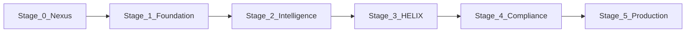

# $CLRTY Federated Nexus — Master Repository Architecture

**Mode today:** Unified **monorepo** (`$CLRTY_PROJECT`) acting as **clrty-core-nexus** orchestrator.  
**Target federation:** Git submodules — each logical module becomes its own repo linked via `.gitmodules` (template: [`.gitmodules.example`](../../.gitmodules.example)).

Public marketing website integration is **deferred** — see [`docs/l1_launch/DEFERRED_PUBLIC_WEBSITE.md`](../l1_launch/DEFERRED_PUBLIC_WEBSITE.md).

100-step map: [`docs/launch/NANO_ORGANIZATION_100.md`](../launch/NANO_ORGANIZATION_100.md)

---

## I. Monorepo-as-Nexus vs Target Federation

| Aspect | Today (monorepo) | Target (federated) |
|--------|------------------|-------------------|
| Layout | All modules in one repo | `clrty-core-nexus` + linked submodules |
| Submodule file | `.gitmodules.example` (template only) | Active `.gitmodules` |
| Module registry | [`manifests/nexus_modules.json`](../../manifests/nexus_modules.json) | Same + per-module `lock_hash` |
| Init | `make init-nexus` (no submodule pull) | `git submodule update --init --recursive` |
| Manifest authority | `CLRTY_SUBSTRATE/boot/` + [`manifests/MANIFEST_INDEX.json`](../../manifests/MANIFEST_INDEX.json) | Boot manifests pinned per submodule tag |
| CI gates | Root `Makefile` + `gates/STAGE_GATES.json` | Nexus orchestrator runs cross-module verify |

**Do not activate submodules** until split repos exist — scaffold only.

---

## II. Module Partition Table

Logical Nexus paths map to physical monorepo locations:

| Nexus path | Monorepo path(s) | Future repo | Stage | Steps |
|------------|------------------|-------------|-------|-------|
| `/core` | `CLRTY_SUBSTRATE/` | `clrty-substrate` | 1 | 1–20 |
| `/skills` | `clrty-cli-core/src/skills/`, `nano_skills/`, `quant_stack/` | `clrty-skills-suite` | 2 | 21–40 |
| `/ai` | `quant_stack/`, `arbitrage_core/` | `vis-intelligence` | 2 | 21–40 |
| `/liquidity` | `helix_engine/` | `clrty-helix-engine` | 3 | 41–60 |
| `/cli` | `clarity-cli/`, `clrty-cli-core/` | `clrty-operator` | 2, 4 | 21–40, 61–80 |
| `/docs` | `docs/`, `frontend/docs/content/` | `clrty-portal-docs` | 1, 5 | 1–20, 81–100 |
| `/frontend` | `frontend/` | `clrty-investor-ui` | 5 | 81–100 |
| `/compliance` | `CLRTY_SUBSTRATE/settlement/`, `neuro_templates_engine/`, `cortexpay_engine/` | `clrty-compliance` | 4 | 61–80 |

Full registry: [`manifests/nexus_modules.json`](../../manifests/nexus_modules.json)

---

## III. Root — System Control Plane

| Nexus path | Purpose | Current location |
|------------|---------|------------------|
| `/manifests` | Version-controlled manifest + module index | [`manifests/`](../../manifests/) |
| `/gates` | Stage 0–5 CI/CD gate definitions | [`gates/STAGE_GATES.json`](../../gates/STAGE_GATES.json) |
| `/orchestration` | Makefile lifecycle | [`Makefile`](../../Makefile), [`orchestration/`](../../orchestration/) |
| `.gitmodules.example` | Federated module template | Root (not active) |
| `Cargo.toml` | Unified Rust workspace | Root workspace (22 members) |
| `var/` | Runtime artifacts (compliance, launch, trading) | [`var/`](../../var/) |

**Verify nexus locks:** `make audit-verify` → `var/compliance/nexus_lock_report.json`

---

## IV. Git Workflow — Stage-Gate Branching Policy

| Branch | Policy |
|--------|--------|
| `main` | Production-immutable; signed audit-verified releases only |
| `release/vX.Y` | Stabilization window before TGE tag |
| `develop` | Integration branch for cross-module work |
| `feature/*` | Modular work (e.g. `feature/helix-wire`, `feature/n08-tensor-bundler`) |

**Versioning:** SemVer for binaries; **manifest-hash major bump** for tokenomics/genesis changes → re-audit required.

Gate definitions: [`gates/STAGE_GATES.json`](../../gates/STAGE_GATES.json)  
Readiness tracker: [`var/launch/readiness.json`](../../var/launch/readiness.json)

---

## V. Cryptographic Gatekeeping

| Gate | Mechanism | Verify command | Artifact |
|------|-----------|----------------|----------|
| Manifest SHA-256 | Hash all entries in `MANIFEST_INDEX.json` | `bash scripts/audit/verify-locks.sh` | `var/compliance/nexus_lock_report.json` |
| GPG commit signing | Required on `main` and `release/*` | org key setup (step 10) | CI signature check |
| HSM signing | Genesis seal + validator keys (steps 18, 89) | external ceremony | ops runbook |
| Model-hash | Compare weights to manifest declarations | `make model-hash-verify` | `var/compliance/model_hash_report.json` |
| Stage gate | Readiness + gate script matrix | `bash scripts/audit/verify-stage-gate.sh [0-5]` | `var/launch/stage_gate_report.json` |

**Signing requirements (documented policy):**

1. All commits to `main` and `release/*` must be GPG-signed once org keys are provisioned.
2. Genesis entropy and tokenomics manifest changes require manifest-hash re-audit (`make audit-verify`) before merge.
3. Model weight changes require DVC/LFS track + `make model-hash-verify` pass before Stage 2 promotion.
4. TGE tag (`TGE_PROD_DEPLOYED`) requires HSM-signed genesis ceremony + external legal audit clearance.

---

## VI. Launch order (100-step stages)



| Stage | Steps | Doc section | Make target |
|-------|-------|-------------|-------------|
| 0 Nexus Init | scaffold | — | `make verify-stage-0` |
| 1 Foundation | 1–20 | [`LAUNCH_STAGES.md`](../launch/LAUNCH_STAGES.md#stage-1) | `make verify-stage-1` |
| 2 Intelligence | 21–40 | [`LAUNCH_STAGES.md`](../launch/LAUNCH_STAGES.md#stage-2) | `make verify-stage-2` |
| 3 HELIX | 41–60 | [`LAUNCH_STAGES.md`](../launch/LAUNCH_STAGES.md#stage-4) | `make verify-stage-3` |
| 4 Compliance | 61–80 | tokenomics + settlement | `make verify-stage-4` |
| 5 Production | 81–100 | commerce + TGE | `make verify-stage-5` |

Chronological launch narrative (VIS → TGE → HELIX → Commerce) remains in [`LAUNCH_STAGES.md`](../launch/LAUNCH_STAGES.md).

---

## VII. Clarity Portal (docs architecture)

Machine-readable docs layout — see [`docs/portal/README.md`](../portal/README.md):

| Section | Content |
|---------|---------|
| `/concepts` | Moniverse primer, abstraction logic |
| `/cli` | `clrty` manuals, execution funnel |
| `/skills` | Quantum + Nano deep dives |
| `/compliance` | Legal-safety, attestation, MSA |
| `/reference` | Manifests, ATU ledger, REPO_MAP |

Entry: [`llms.txt`](../../llms.txt) at repo root for AI agents.

---

## VIII. ML / deterministic validation

- **Model weights:** DVC/LFS patterns in [`.gitattributes`](../../.gitattributes); target path `var/models/`
- **Model-hash gate:** `scripts/audit/verify-model-hashes.sh` (step 40 scaffold)
- **Documentation as code:** `llms.txt` + `SKILL.md` patterns; investor JSON synced via `make portal-sync`

---

## Verification runbook (any time from root)

```bash
make init-nexus
make verify-stage-0          # nexus scaffold
make audit-verify            # manifest locks
make verify-stage-1          # foundation (steps 1–20)
make test-system             # intelligence battery
make model-hash-verify       # step 40
make verify-stage-3          # HELIX (steps 41–60)
make gate-check              # compliance gates
make verify-stage-5          # production readiness
```
