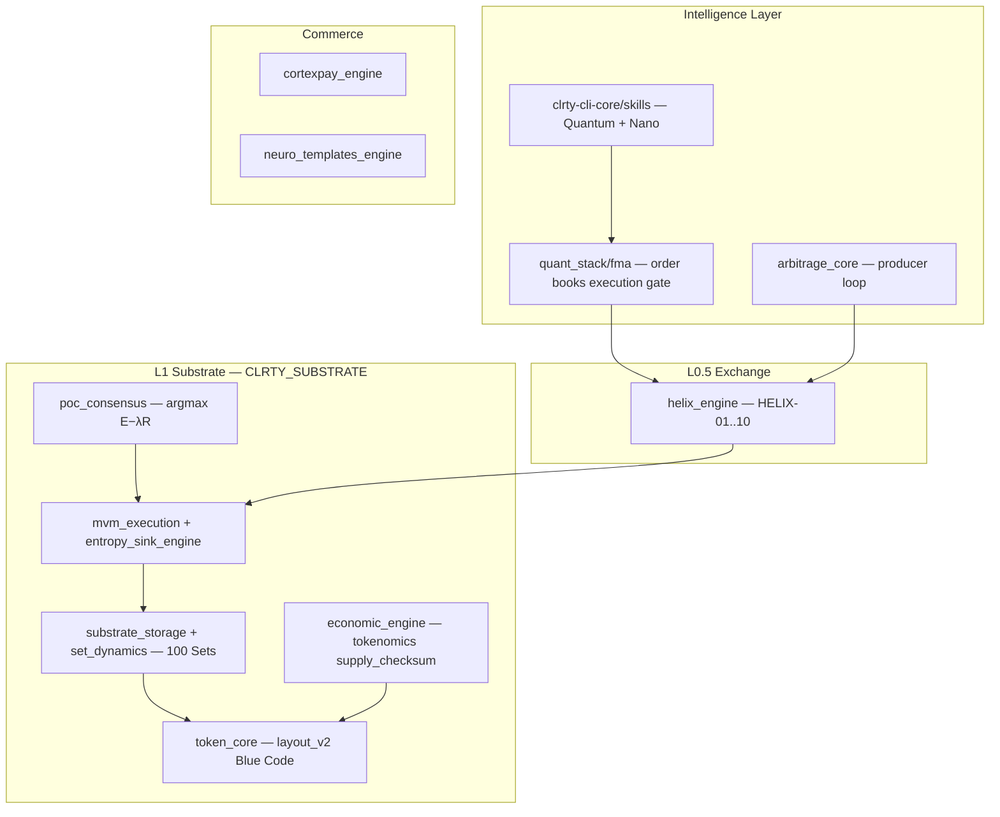

# CLRTY Architecture — Central Reference

Synthesized architecture for **CLARITY IA ($CLRTY)**: sovereign L1 (`clrty-1`), Autonetic Moniversion substrate, federated Nexus monorepo, and launch-scoped product surfaces.

**Quick links:** [Repository map](REPO_MAP.md) · [Nexus federation](NEXUS_REPOSITORY.md) · [Diagram system](../diagrams/README.md) · [Master blueprint](../master_blueprint.md) · [Whitepaper](../whitepaper.md) · [Launch strategy (Notion)](../simulation/CLRTY_Live_Market_Notion.md) · [Documentation index](../README.md)

---

## I. System overview

CLRTY is a custom **Proof-of-Convergence (PoC)** Layer-1 where wallet classification (**Sets 99→1**) emerges from continuous fixed-point inference — **Convergent Collapse Rarity (CCR)**. Every transfer re-solves tier assignment via **S(x) = W·X + B** over telemetry features M₀–M₃ (spread, holding half-life, bridge velocity, cluster entropy).

| Invariant | Value | Authority |
|-----------|-------|-----------|
| Supply cap | 16,000,000 CLRTY (9 decimals) | `CLRTY_SUBSTRATE/boot/genesis_entropy.json` |
| Mint authority | `null` post-genesis | `tokenomics_manifest.json` |
| Chain ID | `clrty-1` / `uclrty` | L1 launch scope (Tasks 41–60) |
| Code freeze | Pre-mainnet | [`CODE_FREEZE.md`](../../CODE_FREEZE.md) |

**Theory primer:** [Moniverse economic engine](../investor/moniverse_economic_engine.md) · **Mechanism catalog (52 items):** [Notion § Unique Mechanisms](../simulation/CLRTY_Live_Market_Notion.md#unique-mechanisms--moniverse-flow)

---

## II. Execution stack

Canonical pipeline from [`master_blueprint.md`](../master_blueprint.md):

```
[LIVE TX] → RL Policy → W·X+B + CA → Blue Code → Moniversion Collapse → Set 1 Singularity
```



| Plane | Path | Role |
|-------|------|------|
| L1 consensus | `poc_consensus/` | Validators maximize **E(x) − λR(x)** |
| VM + Blue Code | `mvm_execution/`, `entropy_sink_engine/blue_assembly/` | Inference, fee deflection, bounded epigenesis |
| Set-Ledger | `substrate_storage/`, `set_dynamics/` | 100 programmable Sets; CCR orchestrator |
| Symbra ↔ CLRTY | `entropy_sink_engine/symbra_integration/` | Agent priority + context feed → token loop |
| State manifold | `state_manifold/` | State root, genesis seal, WORM audit |
| Settlement | `settlement/` | Gatekeeper, attestation, Safe monitor *(Phase 10 for Ethereum)* |

**Deep dives:** [Symbra ecosystem map](symbra_clrty_ecosystem_map.md) · [256-byte layout v2](../simulation/CLRTY_Live_Market_Notion.md#blockchain-custom-layout) · [Whitepaper §1–2](../whitepaper.md)

---

## III. Federated Nexus (monorepo today)

This repository is **clrty-core-nexus** — a unified monorepo acting as orchestrator until submodule federation. Module partition, crypto gatekeeping, and stage-gate branching: [NEXUS_REPOSITORY.md](NEXUS_REPOSITORY.md).

| Nexus module | Monorepo path | Future repo | Launch stage |
|--------------|---------------|-------------|--------------|
| `/core` | `CLRTY_SUBSTRATE/` | `clrty-substrate` | 1 (steps 1–20) |
| `/skills` | `clrty-cli-core/src/skills/`, `quant_stack/` | `clrty-skills-suite` | 2 |
| `/liquidity` | `helix_engine/` | `clrty-helix-engine` | 3 (41–60) |
| `/cli` | `clarity-cli/`, `clrty-cli-core/` | `clrty-operator` | 2, 4 |
| `/compliance` | `settlement/`, `cortexpay_engine/`, `neuro_templates_engine/` | `clrty-compliance` | 4 |
| `/docs` | `docs/`, `frontend/docs/content/` | `clrty-portal-docs` | 1, 5 |
| `/frontend` | `frontend/` | `clrty-investor-ui` | 5 (81–100) |

**100-step operational map:** [NANO_ORGANIZATION_100.md](../launch/NANO_ORGANIZATION_100.md) · **Chronological launch:** [LAUNCH_STAGES.md](../launch/LAUNCH_STAGES.md) · **140-step integrity battery:** `manifests/system_integrity_battery.json`

---

## IV. Workspace crates

Full crate table, `CLRTY_SUBSTRATE` module tree, scripts, and `var/` outputs: [REPO_MAP.md](REPO_MAP.md).

| Layer | Crates | Binaries |
|-------|--------|----------|
| L1 node | `CLRTY_SUBSTRATE` | `clarityd`, `clrty-gatekeeper`, `l-dnet-stress` |
| Operator | `clarity-cli`, `clrty-cli-core`, `clrty-cli-ui` | `clrty` |
| API | `clrty-api`, `clrty-signal-bridge` | `clrty-api` (:8545) |
| Exchange | `helix_engine` | `helixd` |
| Commerce | `cortexpay_engine`, `neuro_templates_engine` | — |
| Quant / arb | `quant_stack`, `arbitrage_core`, `fma-relayer` | `fma-relayer` |
| Verification | `pretest_runner`, `atu_runner` | `pretest_runner`, `atu_runner` |
| Simulation | `simulators/*`, `backlog` | various |

---

## V. Security architecture (three tiers)

```
MSA-100 (PT-001–100)  →  Sovereign SP-001–500  →  SP-501–600 (atomic defense)
```

| Layer | Doc | Manifest | Verify |
|-------|-----|----------|--------|
| MSA-100 | [MASS_SECURITY_ARCHITECTURE.md](../security/MASS_SECURITY_ARCHITECTURE.md) | `boot/security_layers_manifest.json` | `scripts/audit/verify_security_layers.sh` |
| Sovereign-600 | [SOVEREIGN_600_ARCHITECTURE.md](../security/SOVEREIGN_600_ARCHITECTURE.md) | `boot/sovereign_protocols_manifest.json` | `scripts/audit/verify_sovereign_protocols.sh` |
| External audit gates | [SECURITY_AUDIT_COMPLETION_GATES.md](../audit/SECURITY_AUDIT_COMPLETION_GATES.md) | — | Requires code freeze + Tier-1 firm |

Investor synthesis: [security_audit_report.md](../investor/security_audit_report.md)

---

## VI. Product & protocol surfaces

13 core systems across 5 categories on `clrty-1`: [CLARITY_PRODUCT_SUITE.md](../products/CLARITY_PRODUCT_SUITE.md)

| Surface | Architecture doc | Workspace |
|---------|------------------|-----------|
| HELIX L0.5 hidden exchange | [helix_hidden_exchange_layer.md](helix_hidden_exchange_layer.md) · [protocol spec](../protocol/helix_hidden_exchange_layer.md) | `helix_engine/` |
| CLARITY Skills (Quantum + Nano) | [clarity_skills_overview.md](../investor/clarity_skills_overview.md) | `clrty-cli-core/src/skills/` |
| CortexPay commerce | [cortexpay_engine_architecture.md](../investor/cortexpay_engine_architecture.md) | `cortexpay_engine/` |
| NeuroStable (NSD) | [NEUROSTABLE_NSD.md](../products/NEUROSTABLE_NSD.md) | `settlement/neurostable/` |
| Platform API / surfaces | [PLATFORM_SURFACE_MAP.md](../protocol/PLATFORM_SURFACE_MAP.md) | `clrty-api/`, `frontend/` |

Public product HTML exists under `frontend/products/` but stays off public nav until integration gate — [DEFERRED_PUBLIC_WEBSITE.md](../l1_launch/DEFERRED_PUBLIC_WEBSITE.md).

---

## VII. Launch scope & deferred work

**L1 primary (frozen):** consensus, CCR, token_core, genesis manifests, `clarityd`, L1 API routes — see [CODE_FREEZE.md](../../CODE_FREEZE.md) and [l1_launch/checklist.md](../l1_launch/checklist.md).

**Deferred Phase 10 (not frozen for L1 GO):**

| Component | Path | Doc |
|-----------|------|-----|
| Wormhole NTT / LayerZero OFT | `bridge_perimeter/` | [ntt_evm_svm_architecture.md](ntt_evm_svm_architecture.md) |
| Ethereum Safe settlement | `settlement/` | [settlement_gatekeeper.md](../investor/settlement_gatekeeper.md) |
| FMA relayer | `fma-relayer/` | [arbitrage_program_guide.md](../arbitrage/arbitrage_program_guide.md) |

Tokenomics lock: [TOKENOMICS_LOCKED.md](../tokenomics/TOKENOMICS_LOCKED.md)

---

## VIII. Notion-derived launch strategy

[`docs/simulation/CLRTY_Live_Market_Notion.md`](../simulation/CLRTY_Live_Market_Notion.md) is the **Notion export** for launch strategy, market simulation, and investor data-room synthesis (June 2026). Use it for narrative + charts; use repo docs below for authoritative implementation detail.

| Notion section | Repo authority |
|----------------|----------------|
| [554-day launch window](../simulation/CLRTY_Live_Market_Notion.md#less-is-more--50-year-plan-first-554-days) | [roadmap_milestone_tracker.md](../investor/roadmap_milestone_tracker.md) |
| [Genesis allocation / vesting](../simulation/CLRTY_Live_Market_Notion.md#tokenomics-model--summary) | [tokenomics_model.md](../investor/tokenomics_model.md) |
| [52 Moniverse mechanisms](../simulation/CLRTY_Live_Market_Notion.md#unique-mechanisms--moniverse-flow) | [master_blueprint.md](../master_blueprint.md), `CLRTY_SUBSTRATE/` |
| [SIM100 / charts](../simulation/CLRTY_Live_Market_Notion.md#sim100-results-comprehensive) | [events_100_catalog.md](../simulation/events_100_catalog.md), `var/pretest/` |
| [Cross-venue arbitrage](../simulation/CLRTY_Live_Market_Notion.md#cross-venue-arbitrage-architecture) | [arbitrage_program_guide.md](../arbitrage/arbitrage_program_guide.md) |
| [Investor positioning pack](../simulation/CLRTY_Live_Market_Notion.md#investor-positioning-pack) | [investor_kit.md](../investor_kit.md) §16b |
| [Topic → doc cross-links](../simulation/CLRTY_Live_Market_Notion.md#notion-topic--repo-doc-cross-links) | Full mapping table in Notion file |

**Status labels in Notion:** **Confirmed (JSON)** = machine-readable artifact in `var/` · **Modeled** = funded-scenario projection · **Blocked** = external dependency.

---

## IX. Verification runbook

From repo root (do not append shell `#` comments on the same line as `make` targets):

```bash
make help
make verify-all-140-steps
make audit-verify
make verify-stage-0
bash scripts/launch/launch_readiness.sh --continue --skip-foundry
bash scripts/test/full_pretest.sh --continue
cargo run -p clarity-cli --bin clrty -- chain genesis-verify
```

| Artifact | Path |
|----------|------|
| System integrity | `var/compliance/system_integrity_report.json` |
| Launch readiness | `var/launch/launch_readiness_report.json` |
| Pretest 100 | `var/pretest/systemic_readiness.json` |
| Nexus locks | `var/compliance/nexus_lock_report.json` |

---

## X. Related architecture docs

| Doc | Focus |
|-----|-------|
| [REPO_MAP.md](REPO_MAP.md) | Crates, modules, scripts, frontend, investor layer |
| [NEXUS_REPOSITORY.md](NEXUS_REPOSITORY.md) | Federation, gatekeeping, branching policy |
| [symbra_clrty_ecosystem_map.md](symbra_clrty_ecosystem_map.md) | Symbra ↔ token loop |
| [helix_hidden_exchange_layer.md](helix_hidden_exchange_layer.md) | HELIX workspace index |
| [ntt_evm_svm_architecture.md](ntt_evm_svm_architecture.md) | Cross-chain (Phase 10) |
| [master_blueprint.md](../master_blueprint.md) | Canonical stack + 100-task summary |
| [whitepaper.md](../whitepaper.md) | Technical whitepaper (draft S20) |
| [portal/README.md](../portal/README.md) | Clarity Portal docs layout |
| [DOCUMENTATION_INDEX.md](../DOCUMENTATION_INDEX.md) | Full doc catalog |
