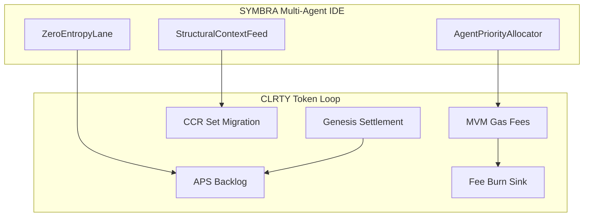

# ΣYMBRA ↔ $CLRTY Ecosystem Map (Task 06)

Maps the Symbra multi-agent IDE integration layer to the CLRTY token loop on `clrty-1`.

## Overview

ΣYMBRA provides agent priority, zero-entropy execution lanes, and structural context feeds. $CLRTY provides gas, CCR Set migration, backlog scoring, settlement, and fee burns. The two systems meet at the **entropy sink engine** — not as separate products.

## Module mapping

| Symbra module | Path | CLRTY connection |
|---------------|------|------------------|
| Agent priority allocator | [`agent_priority_allocator.rs`](../../CLRTY_SUBSTRATE/entropy_sink_engine/symbra_integration/agent_priority_allocator.rs) | Set tier → priority: Set 1 = 255, else `(100 - tier).min(254)` |
| Zero entropy lane | [`zero_entropy_lane.rs`](../../CLRTY_SUBSTRATE/entropy_sink_engine/symbra_integration/zero_entropy_lane.rs) | Zero-gas affinity for Set 1 singularity routing |
| Structural context feed | [`structural_context_feed.rs`](../../CLRTY_SUBSTRATE/entropy_sink_engine/symbra_integration/structural_context_feed.rs) | M₀–M₃ telemetry → CCR `process_transfer` features |

## Token loop detail

| Loop stage | CLRTY artifact | Symbra touchpoint |
|------------|----------------|-------------------|
| **Gas / execution** | `mvm_execution/`, `gas_deflection_matrix/` | Agent workloads consume entropy fees; priority allocator schedules high-Set agents first |
| **CCR / Sets** | [`ccr_orchestrator.rs`](../../CLRTY_SUBSTRATE/entropy_sink_engine/ccr_orchestrator.rs) | Context feed supplies order-book and cluster features for W·X+B inference |
| **Backlog / APS** | `backlog/`, [`referral_registry.rs`](../../backlog/referral_registry.rs) | Zero-entropy lane routes pre-launch demand signals into genesis eligibility |
| **Settlement** | [`settlement/`](../../CLRTY_SUBSTRATE/settlement/), gatekeeper | Institutional capital → register binding → vesting escrow |
| **Burn** | `economic_core.rs`, adaptive tokenomics phases | SaaS/API fee sinks (Task 11) compound deflationary pressure |

## Data flow (transfer event)

1. Symbra agent submits tx via IDE → MVM execution path
2. `StructuralContextFeed` attaches M₀–M₃ snapshot to transfer
3. `CcrOrchestrator::process_transfer` re-solves Set tier
4. `AgentPriorityAllocator` updates queue weight for subsequent agent ops
5. Entropy fee split → validators / LP / burn per phase label
6. Set 1 addresses may route through `zero_entropy_lane` (zero-gas bridge)

## Launch scope notes

- L1-only launch: Symbra integration is **in-substrate**; IDE product deployment is external
- Bridge mirrors deferred Phase 10 — Symbra does not depend on NTT/OFT for L1 loop
- B2B2B white-label tenants (Task 08) may expose Symbra context feeds via `/v1/stream` (Phase 2)

## Related

- Master blueprint stack: [`master_blueprint.md`](../master_blueprint.md)
- Utility profiles: [`utility_profiles.md`](../tokenomics/utility_profiles.md)
- B2B2B API roadmap: [`b2b2b_api_roadmap.md`](../enterprise/b2b2b_api_roadmap.md)
