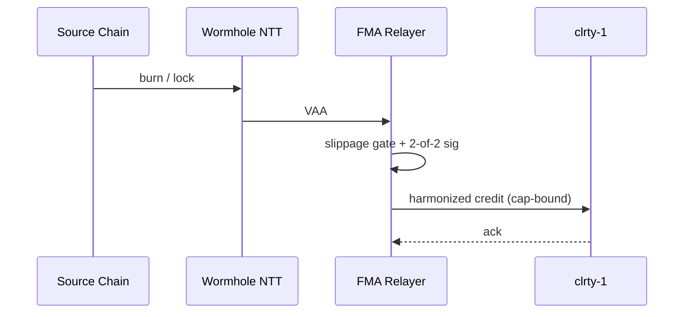

# CLRTY-1 FMA (Financial Mesh Architecture)

**Status:** Scaffold + Foundry tests in-repo. **Not deployed** for CLRTY-1-only launch.

**Scope boundary:** [CLRTY1_ONLY_SCOPE.md](CLRTY1_ONLY_SCOPE.md) · **Bridge decision:** [bridge_standard_decision.md](../omnichain/bridge_standard_decision.md)

---

## Role in the stack

FMA is the **cross-chain execution and attestation plane** between external venues and CLRTY settlement. At L1 launch, FMA artifacts exist for:

- Future Phase 10 omnichain activation
- Clarity Fortress walkthrough education (simulate, HELIX, faucet governance model)
- Foundry CI contract tests

**L1 execution does not depend on FMA.** All production txs commit via PoC → MVM → EntropyBus on `clrty-1`.

---

## Component map

| Component | Path | Launch status |
|-----------|------|---------------|
| EVM contracts | `CLRTY_SUBSTRATE/bridge_perimeter/fma/contracts/` | CI only |
| Supply harmonizer | `fma/supply_harmonizer.rs` | Stub |
| Production matrix | `fma/production_matrix.clrty` | Config template |
| FMA relayer | `fma-relayer/` | Dry-run / consumer |
| Orderbook feeds | `quant_stack/fma/orderbook_feeds/` | Env-gated |
| Execution gate | `quant_stack/fma/execution_gate.rs` | Slippage gate |

---

## Attestation model (Phase 10)

2-of-2 attestation required for cross-chain mint/credit:

1. **Guardian VAA** (Wormhole)
2. **FMA signatory signature** (`FMA_FMA_SIGNATORY_KEY`)



---

## Bridge standard priority

| Path | Use case |
|------|----------|
| **Wormhole NTT** | Institutional FMA settlement, supply harmonization |
| **LayerZero OFTv2** | EVM/SVM reference mesh, multi-DVN fallback |

Detail: [TECHNICAL_LOGIC_LAYERZERO_OFTV2.md](../appendices/TECHNICAL_LOGIC_LAYERZERO_OFTV2.md)

---

## Environment variables (deferred)

| Variable | Default | Purpose |
|----------|---------|---------|
| `FMA_FMA_SIGNATORY_KEY` | — | Attestation signing (HSM in prod) |
| `FMA_RELAYER_KEY` | — | Relayer operator |
| `FMA_ETH_IPC` | — | Ethereum mainnet IPC |
| `FMA_BASE_IPC` | `/tmp/base.ipc` | Base L2 |
| `FMA_ARB_IPC` | Arbitrum public RPC | Arbitrum One |
| `FMA_SOL_WS` | Solana mainnet-beta | Solana feeds |
| `FMA_SOL_GEYSER_SOCK` | — | Geyser socket |

**Do not set production keys for L1-only launch.**

---

## Clarity Fortress integration

Clarity Fortress references FMA in steps 3 (faucet governance), 5 (simulate vector), and 10 (proposal gate). These are **educational hooks** — live L1 paths use clrty-api RPC without FMA relayer.

Walkthrough: `frontend/labs/walkthrough/steps.json`

---

## Verification (CI)

```bash
# Foundry — runs in .github/workflows/ci.yml
cd CLRTY_SUBSTRATE/bridge_perimeter/fma/contracts
forge build && forge test -vv

# Relayer dry-run
bash scripts/fma/run_relayer.sh --dry-run

# Bridge deferred check
cargo run -p clarity-cli -- bridge status --plain
```

---

## Activation checklist (Phase 10)

- [ ] Deploy FMA contracts per `production_matrix.clrty`
- [ ] Register OFT/NTT with bridge providers
- [ ] Wire `supply_harmonizer.rs` to live L1 supply oracle
- [ ] Enable producer mode on `fma-relayer` with HSM keys
- [ ] Re-enable omnichain indexer chains
