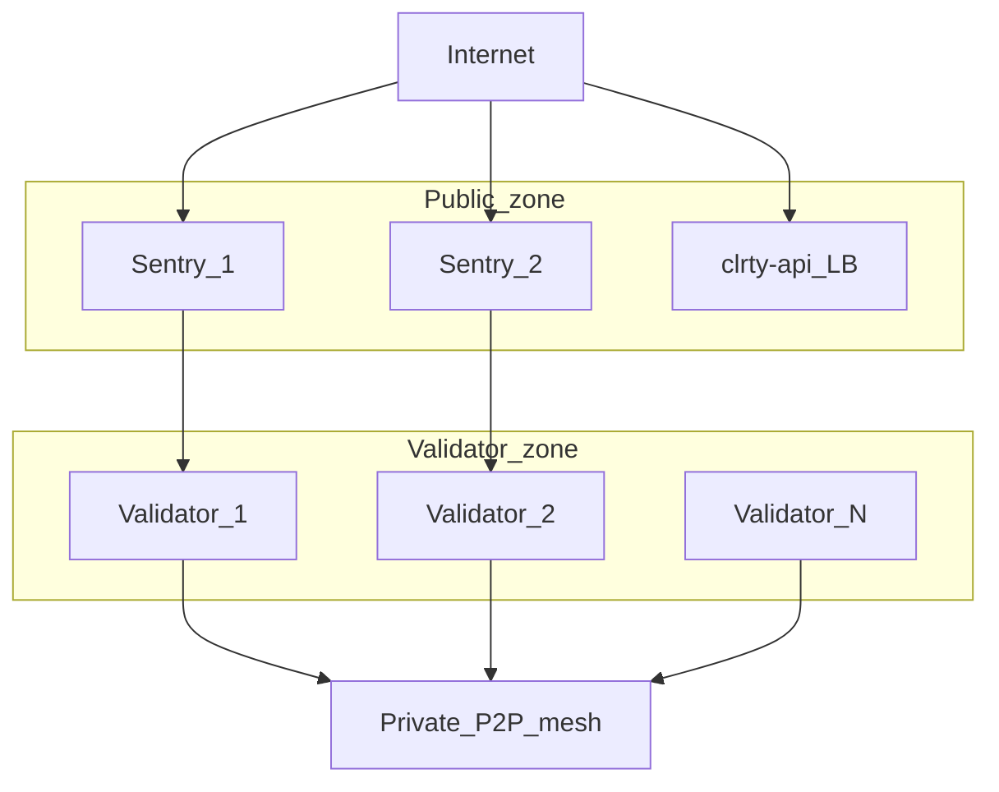

# Validators & Sentry Topology — clrty-1

Validator operations guide for **CLRTY L1** Proof of Convergence network.

**Spec:** [clrty-1.md](clrty-1.md) · **RPC:** [l1_rpc_provision.md](../omnichain/l1_rpc_provision.md)

---

## Architecture



**Sentries** absorb P2P gossip and DDoS; **validators** stay private with no public IP.

---

## Validator singularity set

Machine-readable: [`CLRTY_SUBSTRATE/boot/validator_singularity_set.json`](../../CLRTY_SUBSTRATE/boot/validator_singularity_set.json)

| Parameter | Value |
|-----------|-------|
| Allocation bucket | 3,000,000 CLRTY |
| Consensus | Proof of Convergence |
| λ gate | Entropy sink adaptive |
| Min stake | Per singularity set tier |

---

## Node binaries

| Binary | Role |
|--------|------|
| `clarityd` | Validator / full node |
| `clrty-api` | Public RPC (sentry-adjacent) |

```bash
cargo run -p clarity-cli -- node genesis-verify --plain
cargo run -p clarity-cli -- node status --plain
```

---

## Sentry configuration

| Setting | Recommendation |
|---------|----------------|
| Public ports | P2P 26656, RPC proxy 443 |
| Validator connect | Private VPC peering only |
| Max inbound peers | 200 per sentry |
| Rate limit | 50 conn/s per IP |
| Geo | ≥2 regions for HA |

### sentry.toml template (stub)

```toml
[node]
mode = "sentry"
p2p_laddr = "tcp://0.0.0.0:26656"
validator_addr = "tcp://validator.internal:26656"

[rpc]
proxy_upstream = "http://validator.internal:8545"
public_listen = "0.0.0.0:443"
```

Production P2P is an external blocker — see [EXTERNAL_BLOCKERS.md](../l1_launch/EXTERNAL_BLOCKERS.md).

---

## Operator checklist

- [ ] Genesis hash matches `genesis_entropy.json`
- [ ] Validator key in HSM — never on sentry disk
- [ ] Sentry ↔ validator mTLS enabled
- [ ] `CLRTY_L1_RPC` not pointed at validator directly
- [ ] Monitoring: block height lag < 2 slots
- [ ] λ heartbeat within normal band

---

## Slashing conditions (design)

| Violation | Penalty |
|-----------|---------|
| Double-sign | Stake slash + ejection |
| Downtime > 10% epoch | Reward reduction |
| Topology gate breach | Automatic throttle |

Enforcement paths in `poc_consensus/` — production slashing TBD with external audit.

---

## Staking interface

Web: [portal/staking.html](../../frontend/portal/staking.html)

Sentinel program (observation layer): [SENTINELS_PROGRAM.md](../products/SENTINELS_PROGRAM.md)

---

## Verification

```bash
bash scripts/bootstrap_testnet.sh
bash scripts/stress/l1_concurrency.sh
bash scripts/predeploy/l1_launch_simulation.sh --quick
```

---

## Web resources

- [network/validators.html](../../frontend/network/validators.html) — public validator page
- [network/status.html](../../frontend/network/status.html) — health dashboard
