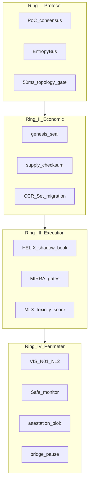

# CLRTY-1 MDA — Moniversion Defense Architecture

Layered defense model for **clrty-1** L1 launch. MDA sits above MSA-100 (Mass Security Architecture) and MSD-100 (Mass Security Defense nano tasks), mapping PoC consensus, CCR Sets, HELIX, and VIS perimeter into a single operational frame.

**Related:** [CLRTY1_MSD.md](CLRTY1_MSD.md) · [MASS_SECURITY_ARCHITECTURE.md](MASS_SECURITY_ARCHITECTURE.md) · [VIS_CLRITY_PROTOCOL_MAP.md](../compliance/VIS_CLRITY_PROTOCOL_MAP.md)

---

## Defense rings



---

## Ring I — Protocol integrity

| Control | Artifact | Verify |
|---------|----------|--------|
| Genesis immutability | `genesis_entropy.json` | `clrty node genesis-verify` |
| PoC commit latency | `poc_consensus/` | `cargo test -p clrty-substrate` |
| λ adaptive gate | `ccr_orchestrator.rs` | Pretest PT-001–025 |
| State root continuity | `state_manifold/` | L1 launch simulation |

**Threat model:** Invalid genesis, consensus partition, entropy spike without λ response.

---

## Ring II — Economic integrity

| Control | Artifact | Verify |
|---------|----------|--------|
| 16M supply cap | `tokenomics_manifest.json` | `immutability_audit` |
| Null mint authority | `genesis_entropy.json` | genesis-verify |
| Set tier bounds | CCR orchestrator | `listing_config` tests |
| Vesting / lock-up | `mainnet_listing_config.json` | compliance pack |

**Threat model:** Supply inflation, unauthorized mint, vesting bypass.

---

## Ring III — Execution integrity

| Control | Artifact | Verify |
|---------|----------|--------|
| HELIX net settlement | `settlement/` | HELIX status endpoint |
| MIRRA volatility gate | `mirra/` | Partial — dry-run |
| MLX toxicity scoring | `clrty-mlx` | Clarity Fortress simulate step |
| simulateTransaction | clrty-api RPC | Clarity Fortress smoke |

**Threat model:** MEV extraction, toxic flow, shadow book desync.

---

## Ring IV — Perimeter

| VIS node | MDA alignment | Status |
|----------|---------------|--------|
| N01 Gatekeeper | KYC webhook, identity | Partial |
| N05 Bridge Firewall | `bridge_pause`, dead-man | Partial (deferred bridge) |
| N07 Supply Oracle | `supply_checksum.rs` | Implemented |
| N08 Set-Ledger Guard | CCR tier bounds | Implemented |
| N25 Bridge Hash Registry | `bridge_connection_audit` | Audit artifact |

Detail: [VIS_CLRITY_PROTOCOL_MAP.md](../compliance/VIS_CLRITY_PROTOCOL_MAP.md)

---

## MSD nano task overlay

MDA rings map 1:4 to MSD zones (25 tasks each). Machine-readable:

[`CLRTY_SUBSTRATE/boot/msd_nano_tasks_manifest.json`](../../CLRTY_SUBSTRATE/boot/msd_nano_tasks_manifest.json)

```bash
bash scripts/audit/verify_security_layers.sh
python3 -c "import json; m=json.load(open('CLRTY_SUBSTRATE/boot/msd_nano_tasks_manifest.json')); assert len(m['tasks'])==100"
```

---

## Operational runbook

| Event | Response |
|-------|----------|
| λ spike > threshold | Entropy sink throttle; sentinel alert |
| Supply checksum drift | Halt listing ops; run immutability audit |
| Bridge pause active | Expected at L1 launch — verify `bridge status` |
| Capital flight signal | `capital_flight_guard` + Safe monitor |
| Black swan | `panic_stabilizer` + governance timelock |

Launch readiness: `bash scripts/launch/launch_readiness.sh`

---

## Honesty rules

| Status | Meaning |
|--------|---------|
| **implemented** | Code + tests; pretest passes |
| **partial** | Scaffold / dry-run; gap documented |
| **planned** | Spec only; no production path |

Rings III–IV are predominantly **partial** at L1 launch — documented in [CLRTY1_ONLY_SCOPE.md](../chain/CLRTY1_ONLY_SCOPE.md).
