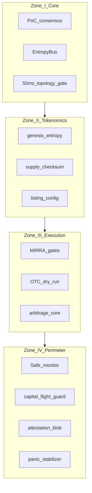

# Mass Security Architecture (MSA)

100-layer security map for CLRTY L1 launch readiness, organized in **four zones** (I–IV). Each layer maps to a pretest task (`PT-001`–`PT-100`), a code artifact, and an honest `implemented | partial | planned` status.

**Machine-readable manifest:** [`CLRTY_SUBSTRATE/boot/security_layers_manifest.json`](../../CLRTY_SUBSTRATE/boot/security_layers_manifest.json)

**Audit script:** `bash scripts/audit/verify_security_layers.sh` → `var/compliance/security_layers_report.json`

**Related:** [VIS ↔ CLRTY Protocol Map](../compliance/VIS_CLRITY_PROTOCOL_MAP.md) · [Full Pretest 100](../test/full_pretest_100.md) · `scripts/launch/launch_readiness.sh`

---

## Zone overview

| Zone | Layers | Focus | Primary anchors |
|------|--------|-------|-----------------|
| **I** | 1–25 | Core protocol & consensus | PoC engine, EntropyBus, state root, 50ms topology gate, NVM persistence |
| **II** | 26–50 | Tokenomics & asset ledger | Genesis seal, supply cap, vesting, listing config, TGE mocks |
| **III** | 51–75 | MIRRA / execution plane | Dark pool routing, volatility gate, OTC dry-run, spread capture |
| **IV** | 76–100 | Security & trust perimeter | Safe monitor, capital flight guard, emergency unlock, KYC blobs, black swan |



---

## VIS node overlay

VIS perimeter nodes (N01–N12) and infrastructure sync nodes (N21–N25) cross-cut the four zones:

| VIS | Layer band | MSA alignment |
|-----|------------|---------------|
| N07 Supply Oracle | II (26–40) | `supply_checksum.rs`, double-spend gates |
| N08 Set-Ledger Guard | I + III | CCR tier bounds, execution suitability |
| N01 Gatekeeper / N02 Sanctions | IV (91–95) | KYC webhook, attestation blobs |
| N05 Bridge Firewall | III + IV | `bridge_pause`, `dead_man` (partial live) |
| N25 Bridge Hash Registry | I (5) + audit | `atmospheric_sync` 50ms + `bridge_connection_audit` |

Detail: [`VIS_CLRITY_PROTOCOL_MAP.md`](../compliance/VIS_CLRITY_PROTOCOL_MAP.md)

---

## Status honesty rules

| Status | Meaning |
|--------|---------|
| **implemented** | Code + tests exist; pretest task passes |
| **partial** | Scaffold or dry-run only; gap documented (e.g. dark pool fragmentation, shadow liquidity) |
| **planned** | Spec or legal template only; no production path yet |

Layers **51–75** are predominantly **partial** — execution/MIRRA paths are modeled but not fully production-hardened.

---

## Verification

```bash
# Manifest rollup (>=90% implemented+partial required)
bash scripts/audit/verify_security_layers.sh

# Full launch battery (includes security audit phase)
bash scripts/launch/launch_readiness.sh --continue --skip-foundry

# CLI
cargo run -p clarity-cli -- sys test launch -- --continue --skip-foundry
```

---

## Gap analysis summary (honest)

| Category | Implemented | Partial | Planned |
|----------|-------------|---------|---------|
| Zone I (1–25) | ~25 | 0 | 0 |
| Zone II (26–50) | ~24 | ~1 | 0 |
| Zone III (51–75) | 0 | ~25 | 0 |
| Zone IV (76–100) | ~25 | 0 | 0 |

**Top partial gaps (Zone III):** micro-strategy dark pool fragmentation, dedicated shadow liquidity module, full MIRRA production routing, live producer spread capture at scale.

**External gaps (not MSA layers):** third-party smart-contract audit PDF, ZK access circuits (VIS-N11), live bridge activation (Phase 10).

---

## Launch gate linkage

`launch_ready: true` in `var/launch/launch_readiness_report.json` requires:

1. Pretest Zone I — zero hard fails (`l1_pulse: green`)
2. Full validation — zero phase failures
3. Listing compliance pack — all six boolean gates pass

See [`docs/l1_launch/checklist.md`](../l1_launch/checklist.md).
