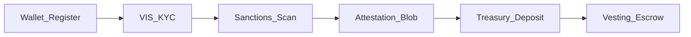

# Tokenomics & Compliance Integration

Regulatory safety controls embedded in the tokenomics model — not a separate legal appendix.

**Locked parameters:** [`TOKENOMICS_LOCKED.md`](TOKENOMICS_LOCKED.md) · **Data room:** [`compliance/data_room/INDEX.md`](../compliance/data_room/INDEX.md) · **Listing config:** [`infrastructure/mainnet_listing_config.md`](../infrastructure/mainnet_listing_config.md)

---

## §1 Supply invariants

| Parameter | Value | Enforcement |
|-----------|-------|---------------|
| Total supply | 16,000,000 CLRTY | `boot/genesis_entropy.json`, `TOKENOMICS_LOCKED.md` |
| Decimals | 9 (`uclrty`) | `global_manifold_state.rs` |
| Mint authority | `null` (immutable) | Genesis seal |
| Freeze authority | `null` | Genesis seal |
| Post-genesis expansion | **None** | Fee burn + redistribution only |

Verify: `cargo run -p clarity-cli -- chain genesis-verify`

---

## §2 Genesis buckets & vesting

| Bucket | CLRTY | % | Vesting / lock notes |
|--------|-------|---|----------------------|
| Treasury | 4,000,000 | 25% | Team 1.6M (12/48 cliff/vest); reserve 800K discretionary |
| Validators | 3,000,000 | 18.75% | Bonding + unbonding |
| Liquidity | 4,000,000 | 25% | TGE pool seed — not investor lock-up |
| Ecosystem | 3,000,000 | 18.75% | Programmatic grants |
| Public | 2,000,000 | 12.5% | Backlog tranches |

**Genesis participation tiers** (settlement path):

| Tier | USD min | Multiplier | Cliff / vest |
|------|---------|------------|--------------|
| Seed Genesis | $100K | 1.5× | 6 mo / 24 mo |
| Strategic Round | $500K | 1.75× | 6 mo / 24 mo |
| Hardware Node Partner | compute ≥80 | 2.0× | 12 mo / 36 mo |

Machine-readable: [`CLRTY_SUBSTRATE/boot/mainnet_listing_config.json`](../../CLRTY_SUBSTRATE/boot/mainnet_listing_config.json)

---

## §3 Adaptive tokenomics phases

Fee policy only — **no supply minting**.

| Phase | Period | Burn share of fees |
|-------|--------|-------------------|
| Bootstrap | Mo 0–3 | 2% |
| Stabilization | Mo 3–6 | 5% |
| Mature | Mo 6+ | 10% |

Reference model: `simulators/tokenomics/simulate.py`

---

## §4 Embedded compliance controls

| Control | Module | Status |
|---------|--------|--------|
| KYC → attestation | `settlement/kyc_webhook.rs` | **Implemented** |
| Sanctions pre-block | `compliance/sanctions_scanner.rs` | **Implemented** |
| Wallet registry + SAFT fields | `settlement/wallet_registry.rs` | **Implemented** |
| Deposit confirm + flag unauthorized | `settlement/deposit_confirm.rs`, `commit_payment.rs` | **Implemented** |
| Vesting escrow | `treasury_sink/ecosystem_vesting_escrow.rs` | **Implemented** |
| Bot / sybil resistance | `identity_layer/automated_bot_blocker.rs` | Stub |
| Wallet reputation | `identity_layer/wallet_reputation_index.rs` | Stub |
| Bridge firewall | `bridge_perimeter/edge_security_firewall.rs` | Stub |
| Treasury multisig 3-of-5 | `bridge_perimeter/multisig_config.rs` | Config |
| Governance timelock 48h | `governance_substrate/upgrade_timelock_controller.rs` | **Implemented** |
| Immutability audit | `bridge_perimeter/fma/immutability_audit.rs` | **Implemented** |

Ops runbook: [`compliance/data_room/technical/vis_identity_gatekeeper_ops.md`](../compliance/data_room/technical/vis_identity_gatekeeper_ops.md)

**Security audit synthesis:** [`investor/security_audit_report.md`](../investor/security_audit_report.md) — MSA-100 + Sovereign-600 verification, vulnerability mapping, external audit status.

---

## §5 Regulatory posture

| Topic | Artifact | Status |
|-------|----------|--------|
| Regulatory opinion memo | [`regulatory_opinion_memo.md`](../investor/regulatory_opinion_memo.md) | Internal analysis — counsel review |
| Howey risk ledger | [`howey_risk_ledger.md`](../compliance/data_room/legal_templates/howey_risk_ledger.md) | Template — counsel review |
| Reg D / Reg S | [`reg_d_reg_s_memo.md`](../compliance/data_room/legal_templates/reg_d_reg_s_memo.md) | Template |
| SAFT | [`saft_term_sheet.md`](../compliance/data_room/legal_templates/saft_term_sheet.md) | Template |
| Risk disclosure | [`risk_disclosure_statement.md`](../compliance/data_room/legal_templates/risk_disclosure_statement.md) | Template |
| Exchange listing pack | `scripts/audit/generate_listing_compliance_pack.sh` | **Automated** |
| External legal sign-off | Phase 2 Tasks 21–28 | External pending |

**Important:** Templates are DRAFT — counsel review required before any offer or solicitation.
