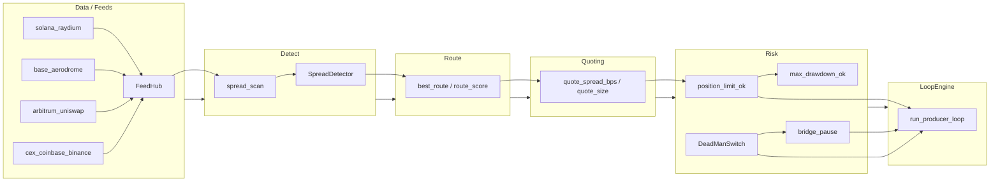

# Arbitrage Program Guide

Comprehensive reference for the **`arbitrage_core`** Rust crate and its integration with the **clrty/clarity** CLI, Quantum Skills (MCA), and the FMA producer relayer.

Related: [`producer_engine.md`](producer_engine.md) · [`../investor/quantum_skills_trading_suite.md`](../investor/quantum_skills_trading_suite.md) · [`../protocol/clarity-skills.md`](../protocol/clarity-skills.md) · [`../cli/execution_funnel.md`](../cli/execution_funnel.md) · [`../monetization/API_FIRST_B2B_INFRASTRUCTURE.md`](../monetization/API_FIRST_B2B_INFRASTRUCTURE.md) (sniper REST API)

---

## 1. Executive summary

The CLRTY arbitrage program is a **producer-side cross-venue spread engine** that sits between live order-book feeds (`quant_stack`) and institutional execution paths (FMA relayer, signal bridge, MIRRA dark pool). **HELIX (L0.5)** is the upstream hidden exchange layer — HELIX-05 arb mesh extends the producer loop; HELIX-03 nets flows before canonical commit. See [`../protocol/helix_hidden_exchange_layer.md`](../protocol/helix_hidden_exchange_layer.md).

It:

1. **Polls** multi-venue order books (Solana Raydium, Base Aerodrome, Arbitrum Uniswap, CEX Coinbase/Binance).
2. **Detects** net-positive spreads via `SpreadDetector` (ΔP_net gate).
3. **Gates** execution through risk controls (position limits, dead-man switch, bridge pause).
4. **Exposes** the same detection path to operators via CLI (`arb`, `producer`) and Quantum Skills (`metric-collapse-arbitrage`).

In the stack, `arbitrage_core` is the **deterministic arb kernel**; `fma-relayer --mode producer` is the **long-running execution monitor** that shares dead-man and spread logic; the CLI wraps one-shot scans and skill orchestration under dual-lock account/IP gates.

---

## 2. Architecture overview



**Runtime surfaces:**

| Surface | Entry | Role |
|---------|-------|------|
| Producer loop | `arbitrage_core::run_producer_loop` | Short async tick cycle (3 iterations in current impl) |
| FMA relayer | `fma-relayer --mode producer` | Continuous producer with bridge settlement |
| CLI scan | `clrty arb [venue_a] [venue_b]` | One-shot spread scan |
| Quantum Skill | `clrty skill run metric-collapse-arbitrage` | MCA collapse-distance + net-edge filter |

---

## 3. `arbitrage_core` crate structure

Crate root: `arbitrage_core/src/lib.rs` — re-exports bridge pause, dead-man, producer loop, and shadow liquidity.

### Core loop & safety

| Module | Path | Purpose |
|--------|------|---------|
| **loop_engine** | `loop_engine.rs` | `ProducerConfig`, `run_producer_loop` — poll feeds, dead-man beat, spread scan, position check |
| **dead_man** | `dead_man.rs` | `DeadManSwitch` (60s default timeout), ATU **800** (`DEAD_MAN_ATU_ID`), sets global `BRIDGE_PAUSE` on timeout |
| **bridge_pause** | `bridge_pause.rs` | `set_bridge_pause`, `bridge_pause_active`, `evaluate_dead_man` — links dead-man to global pause flag |

### Data layer (`data/`)

| Module | Path | Purpose |
|--------|------|---------|
| **feeds** | `data/feeds.rs` | `normalize_venue` — venue string normalization |
| **snapshot** | `data/snapshot.rs` | `VenueSnapshot` — venue, mid_price, depth struct |
| **mod** | `data/mod.rs` | Re-exports feeds + snapshot |

Live feed polling is delegated to **`quant_stack::fma::orderbook_feeds::FeedHub`** (not reimplemented in `arbitrage_core`).

### Detection (`detect/`)

| Function | Purpose |
|----------|---------|
| `spread_scan` | Wraps `SpreadDetector::analyze` on `OrderBookSnapshot` slice |
| `detect_toxic_flow` | Returns true when spread_bps > 500 |

### Routing (`route/`)

| Function | Purpose |
|----------|---------|
| `best_route` | Returns `"{buy}->{sell}"` string |
| `route_score` | 1.0 for cross-venue, 0.0 for same venue |

**Status:** scaffold — no live router integration in the producer loop yet.

### Quoting (`quoting/`)

| Function | Purpose |
|----------|---------|
| `quote_spread_bps` | Mid × edge_bps / 10_000 |
| `quote_size` | Depth × fraction (u64) |

**Status:** scaffold — not wired into `run_producer_loop`.

### Risk (`risk/`)

| Function | Purpose |
|----------|---------|
| `position_limit_ok` | `amount <= clrty_signal_bridge::MAX_TRADE_SIZE` (10B base units) |
| `max_drawdown_ok` | PnL floor check (pnl > -10_000) |

### Inventory (`inventory/`)

| Function | Purpose |
|----------|---------|
| `inventory_skew` | (base − quote) / (base + quote) |
| `rebalance_target` | Returns `(0, 0)` |

**Status:** scaffold.

### Latency (`latency/`)

| Type / fn | Purpose |
|-----------|---------|
| `LatencyTracker` | Elapsed ms since start |
| `latency_ok` | ms ≤ cap check |

**Status:** scaffold — MCA applies a fixed latency penalty in bps instead.

### Toxicity (`toxicity/`)

| Function | Purpose |
|----------|---------|
| `toxicity_score` | spread_bps × 0.01 + cancel_rate |
| `is_toxic` | score > 5.0 |

**Status:** scaffold — `detect_toxic_flow` is a separate bps threshold in `detect/`.

### Shadow liquidity

| Module | Path | Purpose |
|--------|------|---------|
| **shadow_liquidity** | `shadow_liquidity.rs` | `ShadowLiquidityMap` — infers hidden depth from bid-contract contraction (`BID_CONTRACT_DEPTH_FACTOR = 0.85`); used in pretest PT-061–065 |

---

## 4. Execution loop

### `LoopEngine` (`run_producer_loop`)

```rust
// arbitrage_core/src/loop_engine.rs (conceptual flow)
ProducerConfig { dry_run: true, poll_ms: 500 }
  → FeedHub::default()
  → for 3 cycles:
      1. check_dead_man + bridge_pause_active → abort if paused
      2. dead_man.beat()
      3. feeds.poll_all().await
      4. spread_scan(&books) → optional SpreadOpportunity
      5. if position_limit_ok && !dry_run → increment cycle counter
      6. sleep(poll_ms)
  → Ok(cycles)
```

**Producer / consumer model:**

| Mode | Binary | Behavior |
|------|--------|----------|
| **Producer** | `fma-relayer --mode producer` | Infinite loop: dead-man → poll → spread → harmonizer → bridge burn/transfer (when not dry-run) |
| **Consumer** | `fma-relayer --mode consumer` (default) | Same detection; logs opportunity only (`DRY/CONSUMER`) |
| **CLI producer** | `clrty producer start` | Reports `"producer armed"` — does not start async loop |
| **Core loop** | `run_producer_loop` | 3-tick sample loop for tests/integration |

The FMA relayer duplicates spread detection via `SpreadDetector::analyze` directly (not `run_producer_loop`) but shares **`DeadManSwitch`** and **`bridge_pause_active`** from `arbitrage_core`.

### Tick cycle timing

| Component | Interval |
|-----------|----------|
| `ProducerConfig::poll_ms` | 500 ms (default) |
| `quant_stack` `poll_interval()` | 250 ms (FMA relayer sleep) |

---

## 5. Integration with Quantum Skills — MCA

**Skill ID:** `metric-collapse-arbitrage` (`MCA_ID`)  
**Implementation:** `clrty-cli-core/src/skills/mca.rs`

MCA layers institutional filters on top of `arbitrage_core::detect::spread_scan`:

1. **Collapse distance** — `compute_collapse_distance(capital)` from ln-normalized capital vs 99-1 optimization target (`OPTIMIZATION_TARGET = 0.99`).
2. **Spread edge** — `FeedHub::poll_all` → `spread_scan`; profit scaled ×1000 for USD edge estimate.
3. **Costs** — fee (5 bps) + latency penalty (2 bps) on capital.
4. **Min edge** — risk-mode dependent threshold on capital.
5. **Decision** — `executed` | `filtered_noise` | `skipped_edge`.

Evidence block links substrate: `arbitrage_core`, `ccr_orchestrator`, `mirra_dark_pool`.

When feed poll fails, MCA returns `(0.0, scaffold: true)`.

See [`../investor/quantum_skills_trading_suite.md`](../investor/quantum_skills_trading_suite.md) for full skill suite context.

---

## 6. CLI commands

Binary names: **`clrty`** and **`clarity`** (same `main.rs`).

Global flags: `--plain`, `--json`, `--dry-run`.

### Arbitrage scan

```bash
# Default venues: base vs arbitrum
cargo run -p clarity-cli -- arb --plain

# Explicit venue pair (positional args)
cargo run -p clarity-cli -- arb base solana --json
```

Handler: `clrty-cli-core/src/handlers/arb.rs` → registry command **`arb.scan`**.

### Producer / dead-man

```bash
cargo run -p clarity-cli -- producer start --plain
cargo run -p clarity-cli -- producer pause --plain    # sets bridge_pause
cargo run -p clarity-cli -- producer deadman --plain  # beat + alive/pause status
```

Handler: `clrty-cli-core/src/handlers/producer.rs`.

### Quantum Skill — MCA

```bash
cargo run -p clarity-cli -- skill run metric-collapse-arbitrage \
  --account=0xINST \
  --capital=5000000 \
  --risk-mode=hard-kernel-strict \
  --plain

# Alias
cargo run -p clarity-cli -- skill run mca --account=0xABC --capital=1000000
```

Risk modes (from manifest): `standard`, `hard-kernel-strict`, `institutional-max`.

### Strategy pipeline (sequential arb-related steps)

```bash
cargo run -p clarity-cli -- strategy run \
  --steps="attestation-verify,metric-collapse-arbitrage,entropy-heartbeat-check" \
  --capital=10000000 \
  --risk-profile=institutional-max \
  --account=0xINST \
  --plain
```

Handler: `clrty-cli-core/src/skills/pipeline.rs` → `execute_skill` per step; prior step metrics can feed capital to next step.

### Supporting commands

```bash
cargo run -p clarity-cli -- skill status --account=0xINST
cargo run -p clarity-cli -- skill halt --account=0xINST
cargo run -p clarity-cli -- net ip-status --plain   # IP concurrency guard
cargo run -p clarity-cli -- exec market base       # execution funnel (separate from arb scan)
```

### FMA relayer (production producer)

```bash
cargo run -p fma-relayer -- --mode producer --dry-run \
  --signal-bridge ./signal-bridge.sock
```

See [`producer_engine.md`](producer_engine.md).

---

## 7. Dual-lock execution model

Implemented in `clrty-cli-core/src/skills/mod.rs` (`ExecutionGate`).

| Lock | Rule | Config source |
|------|------|---------------|
| **Account** | One active skill per account ID | `gates.one_skill_per_account: true` |
| **IP** | Max concurrent skills per IP (default **3**) | `gates.max_concurrent_per_ip` |
| **Halt** | Releases lock; blocks re-acquire | `skill halt --account=...` |
| **Pipeline** | Sequential only — no parallel steps | `gates.sequential_pipeline_only: true` |

Flow for `execute_skill`:

1. `gate.acquire(account, skill_id, ip)`
2. Run skill (`mca::run`, etc.)
3. `gate.release(account)`
4. `record_result` → `var/trading/quant_skills_table.json`

IP hint: `CLRTY_CLIENT_IP` env var (default `127.0.0.1`).

Unit tests: `dual_lock_blocks_parallel_account`, `ip_concurrency_limit_enforced`, `halt_releases_lock`.

---

## 8. Risk controls

| Control | Location | Behavior |
|---------|----------|----------|
| **Dead-man switch** | `dead_man.rs` | 60s heartbeat; timeout → `BRIDGE_PAUSE` |
| **Bridge pause** | `bridge_pause.rs` | Global atomic flag; `producer pause` sets manually |
| **Position limit** | `risk/mod.rs` | `MAX_TRADE_SIZE` from signal bridge (10_000_000_000) |
| **Toxicity** | `toxicity/mod.rs`, `detect_toxic_flow` | Score / bps thresholds (scaffold) |
| **Capital flight guard** | `CLRTY_SUBSTRATE/settlement/capital_flight_guard` | Used by EHL skill + pretest zone 4 — see [`../investor/security_audit_report.md`](../investor/security_audit_report.md) |
| **MCA min edge** | `mca.rs` | Risk-mode capital floors before execute |
| **FMA slippage gate** | `quant_stack/fma/execution_gate.rs` | Relayer queues transfer when impact > max slippage |

Cross-refs:

- Signal validation: [`../cli/execution_funnel.md`](../cli/execution_funnel.md)
- Security layers: [`../security/MASS_SECURITY_ARCHITECTURE.md`](../security/MASS_SECURITY_ARCHITECTURE.md) Zone IV

---

## 9. MIRRA dark pool / producer engine relationship

**MIRRA** is CLRTY's institutional execution layer (synthetic + live matching, slippage gates, dark-pool routing). Arbitrage connects at three points:

1. **MCA evidence** — skill declares substrate link `mirra_dark_pool`.
2. **Shadow liquidity** — `ShadowLiquidityMap::from_bid_contract("mirra", ...)` infers hidden depth after bid contraction (pretest PT-061–065).
3. **Substrate economic core** — `CLRTY_SUBSTRATE/token_core/blue_code/economic_core.rs`:
   - `route_dark_pool`, `producer_dark_pool_route` (ATU 555)
   - Block order fragmentation for dark-pool slices

The **producer engine** (`run_producer_loop` + FMA producer mode) is the **block-producer-facing** path that detects spreads and (when fully wired) routes large clips through MIRRA hidden liquidity rather than public AMM impact.

FMA relayer producer mode performs bridge burn/transfer after spread detection — the on-chain settlement leg; MIRRA handles venue-side execution semantics in substrate tests and launch milestones (see [`../investor/roadmap_milestone_tracker.md`](../investor/roadmap_milestone_tracker.md) M7).

---

## 10. Configuration & manifests

### `arbitrage_core/Cargo.toml` dependencies

| Dependency | Role |
|------------|------|
| `quant_stack` | FeedHub, SpreadDetector, order books |
| `clrty-substrate` | Substrate types / economic hooks |
| `clrty-signal-bridge` | `MAX_TRADE_SIZE` for position limits |
| `tokio` | Async producer loop |
| `serde` | Serialization |
| `thiserror` | Error types |

### `CLRTY_SUBSTRATE/boot/quant_skills_manifest.json`

- MCA skill definition, substrate links, risk modes
- Gates: `max_concurrent_per_ip`, `one_skill_per_account`, `sequential_pipeline_only`
- Risk profiles: `standard`, `hard-kernel-strict`, `institutional-max`

### Runtime table

| File | Purpose |
|------|---------|
| `var/trading/quant_skills_table.json` | Per-account skill results, IP usage, MCA metrics |

### Feed environment variables

| Variable | Default |
|----------|---------|
| `FMA_SOL_WS` | `wss://api.mainnet-beta.solana.com` |
| `FMA_BASE_IPC` | `/tmp/base.ipc` |
| `FMA_ARB_IPC` | `https://arb1.arbitrum.io/rpc` |

---

## 11. Operational runbook

### Local development

```bash
# Build workspace (includes arbitrage_core)
cargo build --workspace

# Unit tests — arbitrage_core
cargo test -p arbitrage_core

# Unit tests — CLI skills (dual-lock, MCA, pipeline)
cargo test -p clrty-cli-core

# Smoke — producer deadman
cargo test -p clarity-cli producer_deadman_dry_run
```

### One-shot arb scan

```bash
export CLRTY_ROOT=/path/to/$CLRTY_PROJECT
cargo run -p clarity-cli -- arb base arbitrum --plain --json
```

### Run MCA skill (dry-run safe)

```bash
cargo run -p clarity-cli -- skill run metric-collapse-arbitrage \
  --account=0xDEV --capital=1000000 --risk-mode=standard \
  --dry-run --json
```

### Monitor

```bash
# Skill lock + last result
cargo run -p clarity-cli -- skill status --account=0xDEV --json

# IP concurrency
cargo run -p clarity-cli -- net ip-status --json

# Quant table on disk
cat var/trading/quant_skills_table.json | jq .

# Dead-man / bridge pause
cargo run -p clarity-cli -- producer deadman --plain
```

### Production producer (FMA)

```bash
export FMA_FMA_SIGNATORY_KEY=...   # required for live attestations
cargo run -p fma-relayer -- --mode producer --dry-run
# Remove --dry-run only after signal-bridge + HSM validation
```

### Investor dashboard sync

```bash
bash scripts/investor/build_treasury_data.sh
```

---

## 12. Code references

| Path | Purpose |
|------|---------|
| `arbitrage_core/src/lib.rs` | Crate exports |
| `arbitrage_core/src/loop_engine.rs` | Producer tick loop |
| `arbitrage_core/src/dead_man.rs` | ATU 800 dead-man switch |
| `arbitrage_core/src/bridge_pause.rs` | Global pause flag |
| `arbitrage_core/src/detect/mod.rs` | Spread scan wrapper |
| `arbitrage_core/src/route/mod.rs` | Route scoring (scaffold) |
| `arbitrage_core/src/quoting/mod.rs` | Quote helpers (scaffold) |
| `arbitrage_core/src/risk/mod.rs` | Position / drawdown gates |
| `arbitrage_core/src/inventory/mod.rs` | Skew helpers (scaffold) |
| `arbitrage_core/src/latency/mod.rs` | Latency tracker (scaffold) |
| `arbitrage_core/src/toxicity/mod.rs` | Toxicity score (scaffold) |
| `arbitrage_core/src/shadow_liquidity.rs` | MIRRA shadow depth map |
| `arbitrage_core/src/data/` | Venue snapshot + normalize |
| `quant_stack/fma/spread_detector.rs` | ΔP_net spread detection |
| `quant_stack/fma/orderbook_feeds/mod.rs` | Multi-venue FeedHub |
| `fma-relayer/src/main.rs` | Long-running producer/consumer relayer |
| `clrty-cli-core/src/handlers/arb.rs` | `arb.scan` CLI handler |
| `clrty-cli-core/src/handlers/producer.rs` | Producer start/pause/deadman |
| `clrty-cli-core/src/handlers/exec.rs` | Execution funnel handler |
| `clrty-cli-core/src/skills/mca.rs` | Metric-Collapse Arbitrage skill |
| `clrty-cli-core/src/skills/pipeline.rs` | Sequential strategy runner |
| `clrty-cli-core/src/skills/mod.rs` | Dual-lock gate + manifest |
| `clarity-cli/src/main.rs` | CLI dispatch (arb, producer, skill, strategy) |
| `clrty-signal-bridge/src/validator.rs` | `MAX_TRADE_SIZE` constant |
| `CLRTY_SUBSTRATE/boot/quant_skills_manifest.json` | Skill + gate config |
| `CLRTY_SUBSTRATE/token_core/blue_code/economic_core.rs` | Dark-pool routing |

Registry IDs: **`arb.scan` (19)**, **`arb.route` (20)** — route handler not yet implemented in handlers.

---

## 13. Status — implemented vs scaffold

| Component | Status | Notes |
|-----------|--------|-------|
| FeedHub multi-venue poll | **Implemented** | `quant_stack`; env-configurable endpoints |
| Spread detection (ΔP_net) | **Implemented** | `SpreadDetector::analyze`, MIN_NET_PROFIT_USDC |
| `spread_scan` CLI / MCA | **Implemented** | One-shot + skill integration |
| Dead-man + bridge pause | **Implemented** | Unit tested; FMA relayer wired |
| `run_producer_loop` | **Partial** | 3-cycle sample; no live order submission |
| FMA producer settlement | **Implemented** | Bridge burn/transfer when not dry-run/consumer |
| `producer start` CLI | **Scaffold** | Arms only; does not spawn loop |
| Route / quote / inventory / latency modules | **Scaffold** | Functions exist; not in producer loop |
| Toxicity module | **Scaffold** | Separate from `detect_toxic_flow` threshold |
| Shadow liquidity map | **Implemented** | Tested; pretest integration |
| MCA collapse filter | **Implemented** | Deterministic; CCR/MIRRA depth scaffold |
| Dual-lock skills gate | **Implemented** | Account + IP; tested |
| Strategy pipeline | **Implemented** | Sequential steps; dry-run support |
| `arb.route` command | **Not wired** | Registry entry only |
| Live MIRRA order routing from arb loop | **External / partial** | Substrate + roadmap M7 |

---

*Last updated from workspace source — `arbitrage_core`, `clrty-cli-core`, `clarity-cli`, `fma-relayer`, `quant_stack`.*
