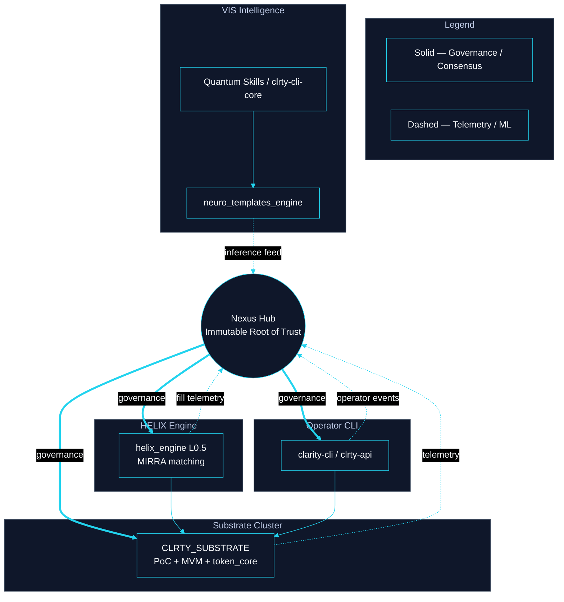
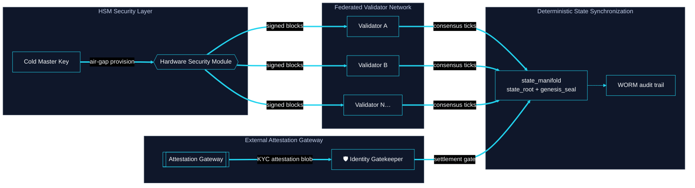

# Core Infrastructure Blueprints

**Classification:** Cognitive Architecture Blueprints  
**Legend:** `───` Hardened consensus · `- - -` ML inference / telemetry

---

## Cognitive Architecture Blueprint: Nexus Orchestrator

*Product: clrty-core-nexus · Prompt: [PROMPT_LIBRARY § Nexus](../PROMPT_LIBRARY.md#clrty-core-nexus--nexus-orchestrator)*

| Flow | Style | Description |
|------|-------|-------------|
| Nexus → clusters | Solid | Stage gates, manifests, integrity battery |
| Clusters → Nexus | Dashed | Compliance reports, SIM100 merkle, red flags |

**Repo:** `manifests/nexus_modules.json` · `docs/architecture/NEXUS_REPOSITORY.md`

---

## Cognitive Architecture Blueprint: L1 Substrate Topology

*Product: clrty-substrate · Prompt: [PROMPT_LIBRARY § Substrate](../PROMPT_LIBRARY.md#clrty-substrate--l1-deployment-topology)*

**Repo:** `CLRTY_SUBSTRATE/state_manifold/` · `CLRTY_SUBSTRATE/settlement/attestation_ledger.rs`
