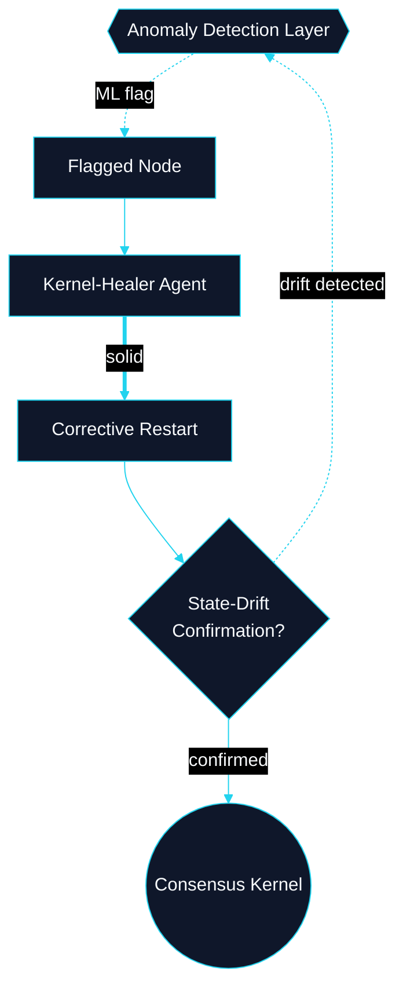
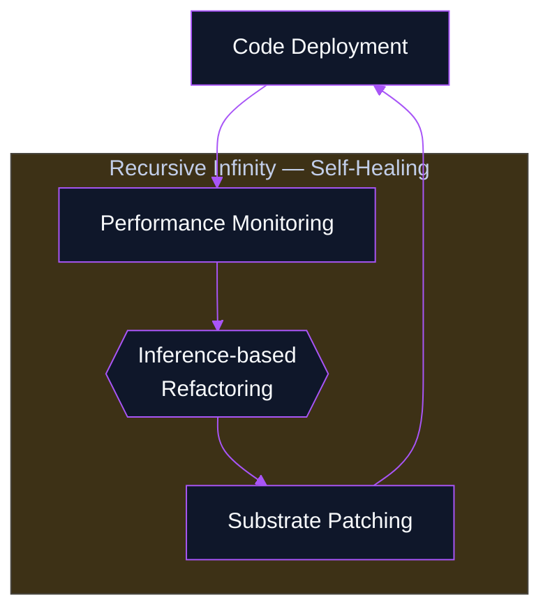

# Intelligence & Autonomy Blueprints

**Classification:** Cognitive Architecture Blueprints

---

## Cognitive Architecture Blueprint: NeuroTemplate Pipeline

*Product: VIS / NeuroTemplates*

```mermaid
%%{init: {"theme":"base","themeVariables":{"darkMode":true,"background":"#020617","primaryColor":"#0f172a","primaryTextColor":"#f8fafc","primaryBorderColor":"#a855f7","lineColor":"#a855f7","clusterBkg":"#0f172a","clusterBorder":"#334155"}}}%%
flowchart LR
    TEL[Live Network Telemetry] --> VIS[VIS Training Engine]
    VIS --> INF{{Model Inference<br/>hex gate}}
    INF --> PATCH[Autonomous Code Patch]
    PATCH -.->|self-healing loop| TEL
    PATCH ==>|solid deploy| SUB[CLRTY_SUBSTRATE kernel]

    style INF fill:#1e1b4b,stroke:#a855f7
```

---

## Cognitive Architecture Blueprint: Autonetic Mesh Control Flow

*Product: Autonetic Mesh · Steps 101–120 scaffold*

**Repo:** `scripts/autonetics/` · `docs/autonetics/AUTONETIC_MANIFEST.md`

---

## Cognitive Architecture Blueprint: NeuroTemplate Evolutionary Loop

*Expanded Prompt 3 — Autonomous Evolution*

**Repo:** `neuro_templates_engine/` · `CLRTY_SUBSTRATE/token_core/blue_code/`
