# Liquidity & Execution Blueprints

**Classification:** Cognitive Architecture Blueprints

---

## Cognitive Architecture Blueprint: MIRRA Dark Pool

*Product: HELIX Engine / MIRRA*

```mermaid
%%{init: {"theme":"base","themeVariables":{"darkMode":true,"background":"#020617","primaryColor":"#0f172a","primaryTextColor":"#f8fafc","primaryBorderColor":"#22d3ee","lineColor":"#22d3ee","clusterBkg":"#020617","clusterBorder":"#475569"}}}%%
flowchart TB
    subgraph darkpool [MIRRA Dark Pool — Obfuscated Matching]
        OG[Order Grid]
        MATCH{{Hidden Match Engine}}
        OG --> MATCH
    end

    SG[[Slippage-Gate Interface]]
    FF[Fee-Flywheel]
    BURN((Autonomous Token Burn))

    IN[Inbound Orders] --> SG
    SG ==>|approved| OG
    MATCH ==>|fills| FF
    FF ==>|fee slice| BURN
    MATCH -.->|telemetry| HELIX[HELIX-01..10]

    style darkpool fill:#020617,stroke:#334155,stroke-dasharray: 5 5
```

**Repo:** `helix_engine/` · `docs/investor/helix_engine_architecture.md`

---

## Cognitive Architecture Blueprint: CortexPay Transaction Flow

*Product: CortexPay*

```mermaid
%%{init: {"theme":"base","themeVariables":{"darkMode":true,"background":"#020617","primaryColor":"#0f172a","primaryTextColor":"#f8fafc","primaryBorderColor":"#22d3ee","lineColor":"#22d3ee"}}}%%
flowchart LR
    REQ[User Request] -.-> INF{{Intelligence Layer<br/>Predictive Inference}}
    INF -.-> ROUTE{Optimal Rail Selection}
    ROUTE -->|stablecoin| SC[Stablecoin Bridge]
    ROUTE -->|native| TK[CLRTY Native]
    ROUTE -->|fiat| FI[Fiat Rail]
    SC & TK & FI ==>|settlement| SET[Settlement + Receipt]

    style INF fill:#1e1b4b,stroke:#a855f7
```

**Repo:** `cortexpay_engine/` · `docs/products/COMMERCE_LAYER.md`

---

## Cognitive Architecture Blueprint: Predictive Liquidity Routing

*Expanded Prompt 4 — CortexPay × MIRRA*

```mermaid
%%{init: {"theme":"base","themeVariables":{"darkMode":true,"background":"#020617","primaryColor":"#0f172a","primaryTextColor":"#f8fafc","primaryBorderColor":"#a855f7","lineColor":"#a855f7"}}}%%
flowchart TB
    VOL[MIRRA Pool Volatility Feed] -.-> TREE{{Decision Tree Overlay}}
    TREE -.-> CP[CortexPay Inference Layer]
    CP -.-> R1[Route: CLRTY Native]
    CP -.-> R2[Route: Stablecoin]
    CP -.-> R3[Route: Defer / Queue]
    R1 & R2 ==>|solid settle| LEDGER[L1 Settlement]

    style TREE fill:#1e1b4b,stroke:#a855f7
    style CP fill:#1e1b4b,stroke:#a855f7
```

