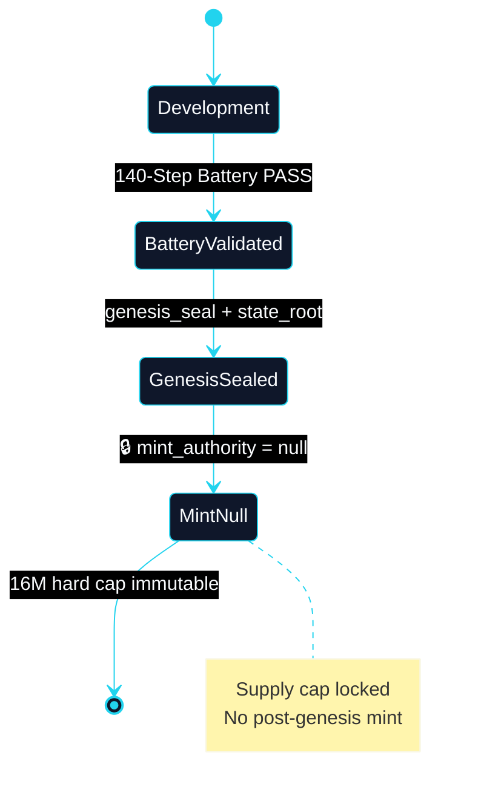
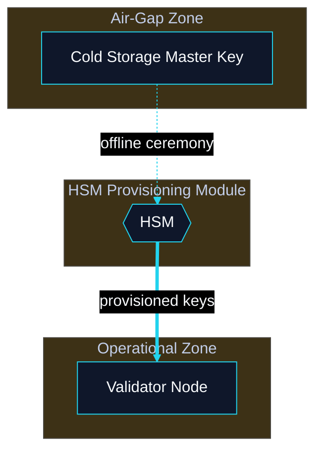

# Security & Genesis Blueprints

**Classification:** Cognitive Architecture Blueprints

---

## Cognitive Architecture Blueprint: Attestation Ledger

*Product: Settlement / Gatekeeper*

```mermaid
%%{init: {"theme":"base","themeVariables":{"darkMode":true,"background":"#020617","primaryColor":"#0f172a","primaryTextColor":"#f8fafc","primaryBorderColor":"#22d3ee","lineColor":"#22d3ee"}}}%%
flowchart TB
    TX[Inbound Transaction] --> GK[🛡 Identity Gatekeeper<br/>KYC / AML]
    GK --> MID[Regulatory Compliance Middleware]
    MID -->|pass| LEDGER[Attestation Ledger]
    MID -->|reject| AUDIT[Audit Trail — WORM]
    GK -->|reject| AUDIT
    LEDGER --> AUDIT

    style GK fill:#0f172a,stroke:#22d3ee,stroke-width:3px
```

**Repo:** `CLRTY_SUBSTRATE/settlement/` · `src/bin/clrty-gatekeeper.rs`

---

## Cognitive Architecture Blueprint: Genesis Ceremony

*State transition — 16M cap lock*

---

## Cognitive Architecture Blueprint: Institutional HSM Root-of-Trust

*Expanded Prompt 9*

---

## Cognitive Architecture Blueprint: Genesis Transition Lifecycle

*Expanded Prompt 10 — timeline*

```mermaid
%%{init: {"theme":"base","themeVariables":{"darkMode":true,"background":"#020617","primaryColor":"#0f172a","primaryTextColor":"#f8fafc","primaryBorderColor":"#22d3ee","lineColor":"#22d3ee"}}}%%
flowchart LR
    S1[Step 1<br/>Code Freeze] --> S2[Step 2<br/>140-Step Audit]
    S2 --> S3[Step 3<br/>State Seal]
    S3 --> S4[Step 4<br/>🔒 Mint Authority = Null]

    style S4 fill:#0f172a,stroke:#22d3ee,stroke-width:4px
```

**Verify:** `make verify-all-140-steps` · `CODE_FREEZE.md`
