# Governance & Compliance Blueprints

**Classification:** Cognitive Architecture Blueprints

---

## Cognitive Architecture Blueprint: Governance Override Hierarchy

*Expanded Prompt 1 — Safety Mode · 100-tier Sets*

```mermaid
%%{init: {"theme":"base","themeVariables":{"darkMode":true,"background":"#020617","primaryColor":"#0f172a","primaryTextColor":"#f8fafc","primaryBorderColor":"#ef4444","lineColor":"#22d3ee"}}}%%
flowchart TB
    ESTOP((Emergency Stop<br/>Center Signal))

    subgraph tiers [100-Tier Consensus Radiant]
        T1[Set Tier 1]
        T25[Set Tier 25]
        T50[Set Tier 50]
        T99[Set Tier 99]
    end

    ESTOP ==>|bypass latency| T1
    ESTOP ==>|lock ledger| T25
    ESTOP ==>|lock ledger| T50
    ESTOP ==>|lock ledger| T99
    T99 -.->|normal PoC| T1

    style ESTOP fill:#450a0a,stroke:#ef4444,stroke-width:3px
```

**Repo:** `CLRTY_SUBSTRATE/set_dynamics/` · `poc_consensus/`

---

## Cognitive Architecture Blueprint: Regulatory Compliance Middleware

*Expanded Prompt 2 — Compliance-as-Code*

```mermaid
%%{init: {"theme":"base","themeVariables":{"darkMode":true,"background":"#020617","primaryColor":"#0f172a","primaryTextColor":"#f8fafc","primaryBorderColor":"#22d3ee","lineColor":"#22d3ee"}}}%%
flowchart LR
    PAYLOAD[Transaction Payload] --> SCAN[Sanctions-Scanner Middleware]
    SCAN -->|pass| VIS[🛡 VIS Identity Gatekeeper]
    SCAN -->|reject| REJ1[Rejected — Audit Log]
    VIS -->|pass| KERNEL((Substrate Kernel))
    VIS -->|reject| REJ2[Rejected — Audit Log]

    style VIS fill:#0f172a,stroke:#22d3ee,stroke-width:2px
```

**Repo:** `clrty-cli-core/src/middleware.rs` · `CLRTY_SUBSTRATE/settlement/kyc_webhook.rs`
