# Network & Resilience Blueprints

**Classification:** Cognitive Architecture Blueprints

---

## Cognitive Architecture Blueprint: Autonetic Mesh Self-Healing

*Expanded Prompt 5*

```mermaid
%%{init: {"theme":"base","themeVariables":{"darkMode":true,"background":"#020617","primaryColor":"#0f172a","primaryTextColor":"#f8fafc","primaryBorderColor":"#22d3ee","lineColor":"#22d3ee"}}}%%
flowchart TB
    subgraph mesh [Federated Node Grid]
        N1[Node 1]
        N2[Node 2]
        NF[Node F — FAULT]
        N4[Node 4]
    end

    EW[Entropy-Watcher Agent]
    HEAL[Auto-Healing Reroute]

    NF -.->|red anomaly| EW
    EW -.->|detect| HEAL
    HEAL ==>|green bypass| N1
    HEAL ==>|green bypass| N4
    N1 & N4 ==>|consensus| SYNC[State Sync]

    style NF fill:#450a0a,stroke:#ef4444
    style HEAL fill:#052e16,stroke:#22c55e
```

**Repo:** `scripts/autonetics/entropy_watcher_stub.sh` · `scripts/autonetics/kernel_healer_stub.sh`

---

## Cognitive Architecture Blueprint: Deterministic Clock-Sync

*Expanded Prompt 6 — Micro-Tick Synchronization*

```mermaid
%%{init: {"theme":"base","themeVariables":{"darkMode":true,"background":"#020617","primaryColor":"#0f172a","primaryTextColor":"#f8fafc","primaryBorderColor":"#22d3ee","lineColor":"#22d3ee"}}}%%
flowchart LR
    subgraph geo [50 Nodes — Global Dispersion]
        NA[Americas]
        EU[Europe]
        APAC[APAC]
    end

    WAVE{{Clock Skew Tolerance<br/>Wave Sync}}
    ALIGN[Sub-Microsecond<br/>Consensus Alignment]

    NA & EU & APAC -.->|telemetry ticks| WAVE
    WAVE ==>|deterministic sync| ALIGN
    ALIGN ==>|state root| MANIFOLD[state_manifold]

    style WAVE fill:#0c4a6e,stroke:#22d3ee
```

**Repo:** `CLRTY_SUBSTRATE/l_dnet/` · `CLRTY_SUBSTRATE/poc_consensus/`
