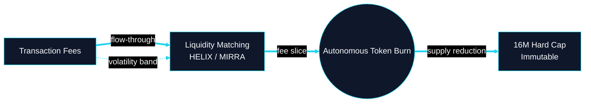
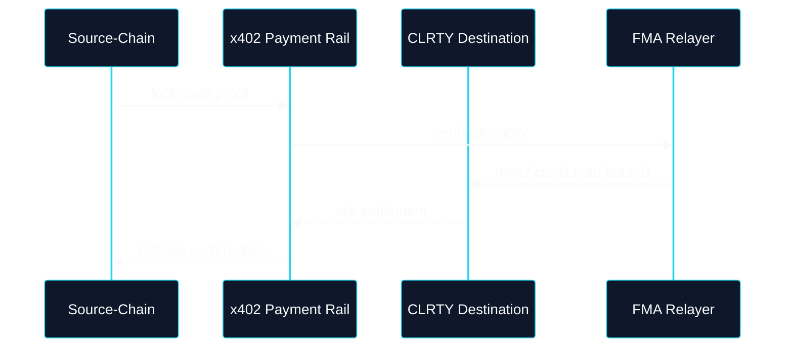

# Financial & Tokenomics Blueprints

**Classification:** Cognitive Architecture Blueprints

---

## Cognitive Architecture Blueprint: Fee-Flywheel Burn

*Expanded Prompt 7 — Circular Economics*

**Repo:** `CLRTY_SUBSTRATE/economic_engine/tokenomics/` · `mvm_execution/gas_deflation_matrix/`

---

## Cognitive Architecture Blueprint: Cross-Chain Bridge Atomicity

*Expanded Prompt 8 — x402 · Phase 10 deferred*

**Repo:** `fma-relayer/` · `docs/l1_launch/DEFERRED_BRIDGE.md`
