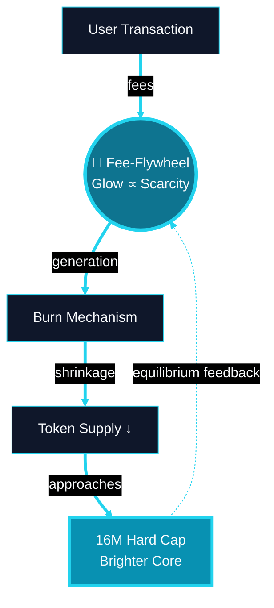
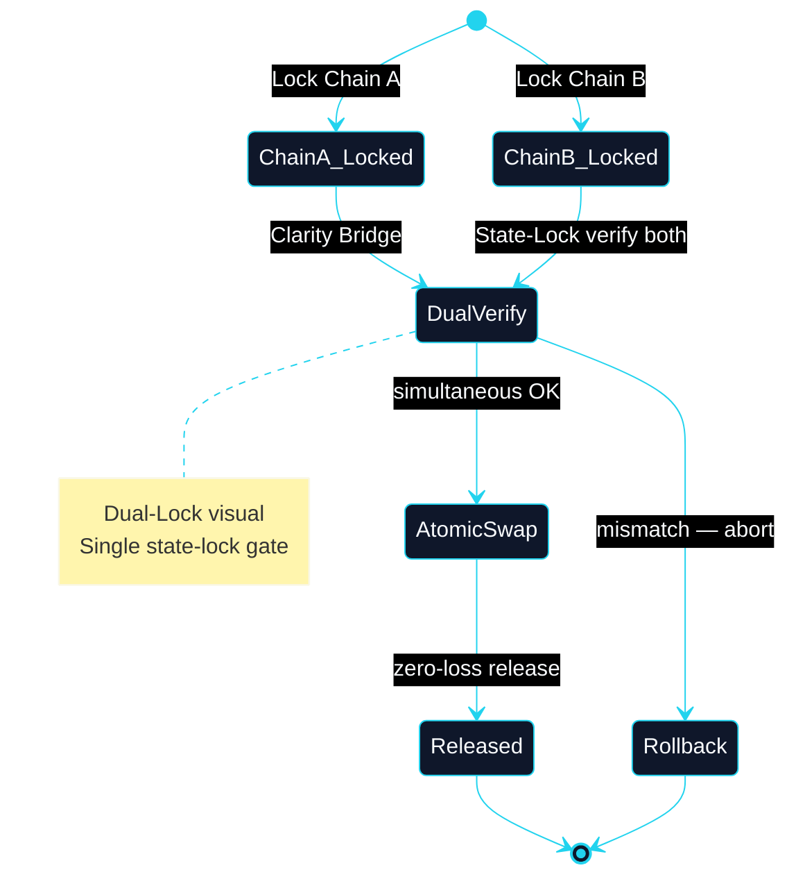

# Advanced Fintech-AI-Blockchain Blueprints (Final 10)

**Classification:** Cognitive Architecture Blueprints — Advanced Clarity Visual Constructs  
**Focus:** Fintech-AI-Blockchain nexus · industry-leading technical documentation

**Legend**

| Symbol | Meaning |
|--------|---------|
| **Solid line** | Deterministic path (consensus, settlement, audit) |
| **Dashed line** | Heuristic / inference path (ML, telemetry) |
| **Pulse glow** | Consensus / finality event |

---

## I. Advanced System Integrity

### Cognitive Architecture Blueprint: Deterministic Finality Heatmap

*Prompt 1 — State Convergence · 50+ validators · spherical grid*

```mermaid
%%{init: {"theme":"base","themeVariables":{"darkMode":true,"background":"#020617","primaryColor":"#0f172a","primaryTextColor":"#f8fafc","primaryBorderColor":"#22d3ee","lineColor":"#22d3ee","clusterBkg":"#020617","clusterBorder":"#334155"}}}%%
flowchart TB
    subgraph sphere [Spherical Validator Grid — State Sync Gradient]
        direction TB
        VN1[Node 01<br/>sync 98%]
        VN2[Node 02<br/>sync 99%]
        VN3[Node 03<br/>sync 97%]
        VELLIP["… 50+ validators<br/>navy → cyan gradient"]
        VN50[Node 50+<br/>sync 100%]
    end

    FINALITY((⚡ FINALITY<br/>Deterministic Lock<br/>Pulsating Core))

    VN1 & VN2 & VN3 -.->|sync wave| FINALITY
    VELLIP -.->|convergence| FINALITY
    VN50 ==>|100% aligned| FINALITY

    style FINALITY fill:#0891b2,stroke:#22d3ee,stroke-width:4px,color:#f8fafc
    style VN50 fill:#0e7490,stroke:#22d3ee
    style VN1 fill:#020617,stroke:#1e3a5f
```

| Gradient | Sync state |
|----------|------------|
| Deep navy `#020617` | Lagging validators |
| Bright cyan `#22d3ee` | Converged / finality-ready |

**Repo:** `CLRTY_SUBSTRATE/poc_consensus/` · `state_manifold/state_root.rs`

---

### Cognitive Architecture Blueprint: Cryptographic Audit Trail Tree

*Prompt 2 — Merkle-Audit · GPG-signed branches · tamper rejection*

```mermaid
%%{init: {"theme":"base","themeVariables":{"darkMode":true,"background":"#020617","primaryColor":"#0f172a","primaryTextColor":"#f8fafc","primaryBorderColor":"#22d3ee","lineColor":"#22d3ee"}}}%%
flowchart TB
    ROOT[Merkle Root<br/>GPG-signed audit hash]

    B1[Branch A<br/>sig ✓]
    B2[Branch B<br/>sig ✓]
    B3[Branch C<br/>sig ✓]

    L1[Leaf tx_001]
    L2[Leaf tx_002]
    LT[🔍 Leaf tx_TAMPER<br/>hash mismatch]
    L4[Leaf tx_004]

    ROOT --> B1 & B2 & B3
    B1 --> L1 & L2
    B2 --> LT
    B3 --> L4

    MESH{{Autonetic Mesh<br/>Instant Reject}}
    LT -.->|flag| MESH
    MESH ==>|reject block| ROOT

    style LT fill:#450a0a,stroke:#ef4444,stroke-width:3px
    style MESH fill:#052e16,stroke:#22c55e
```

**Repo:** `CLRTY_SUBSTRATE/token_core/merkle.rs` · `state_manifold/worm_audit.rs`

---

## II. Intelligence & Inference Pipelines

### Cognitive Architecture Blueprint: Multimodal Inference Manifold

*Prompt 3 — MoE transformer → CortexPay routing*

```mermaid
%%{init: {"theme":"base","themeVariables":{"darkMode":true,"background":"#020617","primaryColor":"#0f172a","primaryTextColor":"#f8fafc","primaryBorderColor":"#a855f7","lineColor":"#a855f7"}}}%%
flowchart LR
    MV[Market Volatility<br/>stream] -.-> MOE{{Mixture-of-Experts<br/>Transformer Block}}
    NL[Network Latency<br/>stream] -.-> MOE
    UB[User Behavior<br/>stream] -.-> MOE
    MOE -.->|single decision| ROUTE[Optimized Routing<br/>CortexPay Engine]

    style MOE fill:#1e1b4b,stroke:#a855f7,stroke-width:3px
```

**Repo:** `cortexpay_engine/` · `neuro_templates_engine/`

---

### Cognitive Architecture Blueprint: Autonomous Strategy Refactoring

*Prompt 4 — In-Situ ML Evolution · hot-swap while live*

```mermaid
%%{init: {"theme":"base","themeVariables":{"darkMode":true,"background":"#020617","primaryColor":"#0f172a","primaryTextColor":"#f8fafc","primaryBorderColor":"#a855f7","lineColor":"#22d3ee"}}}%%
flowchart TB
    subgraph codebase [Code-Base — Shifting Modular Structure]
        M1[Module A]
        BOT[⚠ Bottleneck Segment]
        M3[Module C]
    end

    AGENT{{AI Agent Scanner}}
    NT[NeuroTemplate Block<br/>optimized replacement]

    AGENT -.->|scan| BOT
    AGENT -.->|hot-swap| NT
    NT ==>|live replace| BOT
    M1 & M3 ==>|no downtime| LIVE((System Live))

    style BOT fill:#422006,stroke:#f59e0b
    style NT fill:#1e1b4b,stroke:#a855f7
```

**Repo:** `neuro_templates_engine/auto_refactor.rs` · `CLRTY_SUBSTRATE/token_core/blue_code/`

---

## III. Infrastructure & Resilience

### Cognitive Architecture Blueprint: Fault-Tolerant Mesh Topology

*Prompt 5 — Dynamic mesh · rupture · bridge-nodes*

```mermaid
%%{init: {"theme":"base","themeVariables":{"darkMode":true,"background":"#020617","primaryColor":"#0f172a","primaryTextColor":"#f8fafc","primaryBorderColor":"#22d3ee","lineColor":"#22d3ee"}}}%%
flowchart TB
    subgraph mesh [Non-Linear Node Swarm]
        N1 --- N2 --- N3
        N2 --- N4 --- N5
        N3 --- RUPTURE[💥 Mass Node Failure<br/>Digital Rupture]
        N5 --- N6
    end

    BN1[Bridge-Node α]
    BN2[Bridge-Node β]
    MESH{{Autonetic Mesh<br/>Spawn Bridges}}

    RUPTURE -.->|detect| MESH
    MESH ==>|instant| BN1 & BN2
    BN1 ==>|restore path| N1
    BN2 ==>|restore path| N6

    style RUPTURE fill:#450a0a,stroke:#ef4444,stroke-width:3px
    style BN1 fill:#052e16,stroke:#22c55e
    style BN2 fill:#052e16,stroke:#22c55e
```

**Repo:** `scripts/autonetics/` · `CLRTY_SUBSTRATE/l_dnet/`

---

### Cognitive Architecture Blueprint: Micro-Tick Latency Map

*Prompt 6 — Latency contour · HELIX on high-speed ridge*

```mermaid
%%{init: {"theme":"base","themeVariables":{"darkMode":true,"background":"#020617","primaryColor":"#0f172a","primaryTextColor":"#f8fafc","primaryBorderColor":"#22d3ee","lineColor":"#22d3ee"}}}%%
flowchart LR
    subgraph topo [Topographical Latency Landscape]
        VALLEY1[Deep Valley<br/>High Latency]
        RIDGE[⛰ Bright Ridge<br/>Sub-μs Pathway]
        VALLEY2[Deep Valley<br/>High Latency]
    end

    HELIX[HELIX Engine<br/>Traversing Ridge]

    VALLEY1 -.->|avoid| HELIX
    HELIX ==>|fast path| RIDGE
    RIDGE ==>|micro-tick| SETTLE[L0.5 Settlement]

    style RIDGE fill:#0891b2,stroke:#22d3ee,stroke-width:3px
    style VALLEY1 fill:#020617,stroke:#334155
    style VALLEY2 fill:#020617,stroke:#334155
```

**Repo:** `helix_engine/` · `CLRTY_SUBSTRATE/l_dnet/stress_runner.rs`

---

## IV. Institutional & Tokenomics

### Cognitive Architecture Blueprint: Fee-Flywheel Equilibrium Model

*Prompt 7 — Circular financial equilibrium · 16M cap glow*

**Repo:** `CLRTY_SUBSTRATE/economic_engine/tokenomics/` · `docs/investor/tokenomics_model.md`

---

### Cognitive Architecture Blueprint: Cross-Chain Settlement Atomicity

*Prompt 8 — Dual-Lock · Clarity Bridge · atomic swap*

**Repo:** `fma-relayer/` · `docs/l1_launch/DEFERRED_BRIDGE.md` *(Phase 10)*

---

## V. Security & Governance

### Cognitive Architecture Blueprint: HSM-Rooted Security Fortress

*Prompt 9 — Hardware security fortress · compliance shields*

```mermaid
%%{init: {"theme":"base","themeVariables":{"darkMode":true,"background":"#020617","primaryColor":"#0f172a","primaryTextColor":"#f8fafc","primaryBorderColor":"#22d3ee","lineColor":"#22d3ee"}}}%%
flowchart TB
    subgraph shields [Regulatory Compliance Ring]
        KYC[🛡 KYC]
        AML[🛡 AML]
        MICA[🛡 MiCA]
        ATT[🛡 Attestation]
    end

    subgraph hsm [HSM Shell]
        RK((Root-Key))
    end

    KYC & AML & MICA & ATT ==>|shield layer| hsm
    RK ==>|provision| VAL[Validator Operations]

    style hsm fill:#0f172a,stroke:#22d3ee,stroke-width:4px
```

**Repo:** `CLRTY_SUBSTRATE/settlement/` · `docs/investor/security_audit_report.md`

---

### Cognitive Architecture Blueprint: 140-Step Battery Validation Pipeline

*Prompt 10 — Systemic integrity progress · 99.9% · genesis lock*

```mermaid
%%{init: {"theme":"base","themeVariables":{"darkMode":true,"background":"#020617","primaryColor":"#0f172a","primaryTextColor":"#f8fafc","primaryBorderColor":"#22d3ee","lineColor":"#22d3ee"}}}%%
flowchart LR
    subgraph q1 [Quadrant I — Foundations]
        F[Steps 1–35]
    end
    subgraph q2 [Quadrant II — Intelligence]
        I[Steps 36–70]
    end
    subgraph q3 [Quadrant III — Execution]
        E[Steps 71–105]
    end
    subgraph q4 [Quadrant IV — Genesis]
        G[Steps 106–140]
    end

    F --> I --> E --> G

    BAR["Progress: 99.9% ████████████░"]
    LOCK[🔒 Final 0.1%<br/>Pending Genesis Seal]

    G --> BAR
    BAR --> LOCK

    style q1 fill:#0f172a,stroke:#64748b
    style q2 fill:#0f172a,stroke:#a855f7
    style q3 fill:#0f172a,stroke:#22d3ee
    style q4 fill:#0f172a,stroke:#22d3ee,stroke-width:3px
    style LOCK fill:#020617,stroke:#22d3ee,stroke-width:4px
```

**Verify:** `make verify-all-140-steps` · `manifests/system_integrity_battery.json`
