# CLRTY Launch Strategy
**Realistic market plan · 16M hard cap · Massively funded scenario**

> Copy this page into Notion. Numbers below assume a **well-capitalized launch** — treasury USD in the eight figures, professional market making, and CEX listing budget — while keeping the **on-chain supply fixed at 16M CLRTY**. Funding buys depth and runway; it does not mint tokens.

---

## Strategy in one paragraph

CLRTY launches as a **sovereign L1** (`clrty-1`) with a **fixed 16 million token cap** and no post-genesis minting. Capital is raised **before and at genesis** into a multisig treasury (USDC, USDT, ETH), mapped to **vested token allocations** — not a free float dump. At mainnet, the **4M liquidity bucket** seeds native pools and professional market-making quotes; the **backlog system** pre-qualifies demand so public float enters in tiers, not chaos. Trading fees feed **validators, LPs, and a rising burn schedule** — supply shrinks over time, it never expands. The goal is not a hype spike: it is a **capital-backed, stress-tolerant market** where price discovery happens on real depth, adversarial conditions widen spreads instead of breaking consensus, and long-term holders are rewarded by fee flow and scarcity.

---

## Investor Data Room — June 2026 Update

> **Additive layer** — June 19, 2026 session. Synthesizes six new investor data-room documents, Sovereign-600 registry, Quantum Skills CLI, and launch JSON artifacts. Status labels: **Confirmed (JSON)** = machine-readable artifact · **Modeled** = funded-scenario projection · **Blocked** = external dependency.

### Data room index (6 canonical docs)

| # | Document | Path | Focus |
|---|----------|------|-------|
| 1 | Technical Due Diligence | [`technical_due_diligence.md`](../investor/technical_due_diligence.md) | MVM, PoC consensus, CLARITY Skills, compliance-as-code |
| 2 | Tokenomics Model | [`tokenomics_model.md`](../investor/tokenomics_model.md) | 16M cap, vesting, burn, treasury, Set tiers, MIRRA |
| 3 | Security Audit Report | [`security_audit_report.md`](../investor/security_audit_report.md) | MSA-100, Sovereign-600, vulnerability map, external audit status |
| 4 | Regulatory Opinion Memo | [`regulatory_opinion_memo.md`](../investor/regulatory_opinion_memo.md) | Howey utility analysis, disclaimers |
| 5 | Roadmap & Milestone Tracker | [`roadmap_milestone_tracker.md`](../investor/roadmap_milestone_tracker.md) | TGE, MIRRA, compliance gates, launch readiness |
| 6 | Quantum Skills Trading Suite | [`quantum_skills_trading_suite.md`](../investor/quantum_skills_trading_suite.md) | MCA, TSR, AVR, EHL |

**Session commits** (`48b08b3` → `1856a79`): technical due diligence deep-dive · security audit report · regulatory opinion memo · tokenomics model · Quantum Skills CLI + manifest · roadmap milestone tracker.

### CLARITY Product Suite (additive · June 2026)

Public **Products** tab — 13 core systems, Sentinels (PoI), PRISM (PoR), DeSci, VIS, Tokenization, **NeuroStable (NSD)**, Commerce Intelligence (Synapse Commerce + CortexPay).

| Surface | Path |
|---------|------|
| Hub | [`frontend/products/index.html`](../../frontend/products/index.html) |
| HELIX Engine (P01) | [`helix-engine.html`](../../frontend/products/suite/category-i-execution/helix-engine.html) |
| NeuroStable (P14) | [`neurostable.html`](../../frontend/products/stablecoin/neurostable.html) |
| CortexPay (C02) | [`cortexpay.html`](../../frontend/products/commerce/cortexpay.html) |
| Spec | [`CLARITY_PRODUCT_SUITE.md`](../products/CLARITY_PRODUCT_SUITE.md) · [`NEUROSTABLE_NSD.md`](../products/NEUROSTABLE_NSD.md) |

Manifest: `CLRTY_SUBSTRATE/boot/products_suite_manifest.json` · `neurostable_manifest.json` · HELIX ATU gates: **2601–2610** · Treasury `#helixPanel` + `#nsdPanel` on launch dashboard · CLI: `clarity neurostable status`

### Launch readiness snapshot (2026-06-19)

| Metric | Value | Label | Source |
|--------|-------|-------|--------|
| Launch readiness | **92.3%** · `launch_ready: true` | **Confirmed (JSON)** | `var/launch/launch_readiness_report.json` |
| Pretest L1 pulse | **green** · Zone 1 fail: **false** | **Confirmed (JSON)** | same |
| Full pretest 100 | **100/100** tasks (25/25 per zone) | **Confirmed (JSON)** | `var/pretest/systemic_readiness.json` |
| Pretest campaign | **176 days remaining** (177-day window) | **Confirmed (JSON)** | `systemic_readiness.json` |
| Mainnet contract gates | **5/5 pass** (100%) | **Confirmed (JSON)** | `var/launch/mainnet_contract_gates.json` |
| MSA-100 documented | **100.0%** (100/100) · 8/8 live checks | **Confirmed (JSON)** | `var/compliance/security_layers_report.json` |
| Sovereign-600 documented | **83.3%** (500/600) | **Confirmed (JSON)** | `var/compliance/sovereign_protocols_report.json` |
| Sovereign atomic band (501–600) | **100.0%** (100/100) | **Confirmed (JSON)** | same |
| External third-party audit | Gates 2–5 **not started** | **Blocked** | [`EXTERNAL_AUDIT_REQUIRED.md`](../audit/EXTERNAL_AUDIT_REQUIRED.md) |
| `fork_swap_stress` | **fail** (open item) | **Partial** | `launch_readiness_report.json` |
| TGE depth @ Day 0 | $15M–$25M combined | **Modeled** | funded scenario |

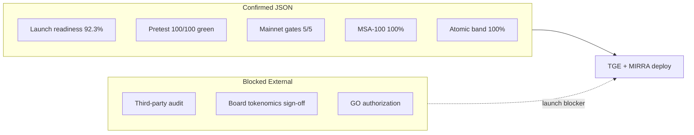
```mermaid
flowchart LR
  subgraph confirmed [Confirmed JSON]
    LR[Launch readiness 92.3%]
    PT[Pretest 100/100 green]
    MG[Mainnet gates 5/5]
    MSA[MSA-100 100%]
    ATOM[Atomic band 100%]
  end
  subgraph blocked [Blocked External]
    EXT[Third-party audit]
    BOARD[Board tokenomics sign-off]
    GO[GO authorization]
  end
  confirmed --> TGE[TGE + MIRRA deploy]
  blocked -.->|launch blocker| TGE
```

---

### Technical Due Diligence — summary

CLARITY is **institutional-grade circulatory capital infrastructure** on sovereign L1 `clrty-1` — compliance, execution quality, and wallet behavior encoded at the protocol layer.

| Gap | CLARITY response | Status |
|-----|------------------|--------|
| Fragmentation | Hard-kernel L1 + supply checksum + WORM logs | **Implemented** |
| Compliance friction | **Compliance-as-Code** — Attestation Blob at execution | **Partial** |
| Execution risk | Serialized dual-lock + PoC `argmax(E − λR)` + MIRRA gates | **Partial** |

**MVM hard-kernel:** Moniverse Virtual Machine execution plane — `incoming_tx_validator` → mempool → `non_interfering_graph` → `deterministic_committer` → state root. Set-tier gas via `gas_deflation_matrix`; Set-1 zero-gas routing when `TransferResult.zero_gas == true`.

**PoC consensus:** Validators maximize **E(x) − λR(x)** — execution efficiency minus λ-weighted structural risk. EntropyBus λ-heartbeat is the audit anchor for regulators.

**Dual-lock execution:** Account lock (one skill per account) + IP guard (concurrency ceiling). CLI funnel: `AtomicStateLock` → handler → `LogVerify`. Production gaps: per-account Map and `clrty network ip-status` — **planned**.

**Three-tier security model:**

```
MSA-100 (PT-001–100)  →  Sovereign SP-001–500 (perimeter)  →  SP-501–600 (atomic)
```

Full detail: [`technical_due_diligence.md`](../investor/technical_due_diligence.md)

---

### Tokenomics Model — summary

Three non-negotiable invariants: **16M hard cap** · **no post-genesis inflation** · **capital-before-float** (~64% locked at TGE funded scenario).

#### Genesis allocation (100% = 16M)

| Bucket | CLRTY | % | Role |
|--------|-------|---|------|
| Treasury | 4,000,000 | 25.0% | Team vesting carve-out, reserve, strategic ops |
| Validators | 3,000,000 | 18.75% | PoC bonding, staking rewards |
| Liquidity | 4,000,000 | 25.0% | MIRRA book + AMM seed at TGE |
| Ecosystem | 3,000,000 | 18.75% | Programmatic grants |
| Public | 2,000,000 | 12.5% | Backlog tranches 0–4 |
| **Total** | **16,000,000** | **100%** | `mint_authority: null` |

**Supply checksum:** `df3f767fecd60974c517d954ed0e28b92728c21b507dc54139025f09075f2e61` — **Confirmed (JSON)** in `tokenomics_manifest.json`

#### SAFT vesting tiers

| Tier | USD min | Multiplier | Cliff | Vest |
|------|---------|------------|-------|------|
| Seed Genesis | $100K | 1.5× | 6 mo | 24 mo |
| Strategic Round | $500K | 1.75× | 6 mo | 24 mo |
| Hardware Node Partner | Compute ≥ 80 | 2.0× | 12 mo | 36 mo |

#### Adaptive burn phases (fee policy — not supply expansion)

| Phase | Period | Burn share | Label |
|-------|--------|------------|-------|
| Bootstrap | Days 0–90 | **2%** | Recycle-heavy |
| Stabilization | Days 91–180 | **5%** | Post-TGE ramp |
| Mature | Day 180+ | **10%** | Full deflationary leg |

**TGE supply snapshot (funded — Modeled):** ~3.2M circulating · ~9.0M locked · ~2.4M staked · 0 burned.

Full detail: [`tokenomics_model.md`](../investor/tokenomics_model.md)

---

### Security Audit Report — summary

| Registry | Documented | Implemented | Partial | Gate |
|----------|------------|-------------|---------|------|
| **MSA-100** | **100.0%** (100/100) | 74 | 26 | **PASS** (≥90%) |
| **Sovereign perimeter** (001–500) | **80.0%** | ~45 | ~355 | **PASS** (≥80%) |
| **Sovereign atomic** (501–600) | **100.0%** (100/100) | 40 | 60 | **PASS** (≥80%) |
| **Sovereign combined** | **83.3%** (500/600) | 65 | 435 | **PASS** |

**Zone III honesty:** MSA layers 51–75 (MIRRA/execution) are **100% partial** — scaffolds pass pretest; production matching engine gaps documented.

**External audit — Blocked:**

| Gate | Status |
|------|--------|
| Gate 1 — Code freeze | **Partial** |
| Gates 2–5 — Tier-1 firm → certificate → publish | **Not started** |

**Mainnet contract gates (5/5 — Confirmed JSON):** token_mainnet_final · vesting_saft_linked · multisig_custody_verified · distribution_schedule_tested · onchain_layers_verified.

**Key vulnerability mitigations:** null-mint verification (SP-026) · supply checksum · 48h timelock · attestation blob · capital flight guard · genesis seal SP-600.

Full detail: [`security_audit_report.md`](../investor/security_audit_report.md)

---

### Regulatory Opinion Memo — summary

> **Not legal advice.** Internal Howey Test analysis supporting **utility instrument design intent** — counsel sign-off **pending**.

| Howey prong | Risk (ledger) | Mitigation |
|-------------|---------------|------------|
| Investment of money | Medium | Reg D 506(b) scaffold · SAFT · attestation binding |
| Common enterprise | Medium | Heterogeneous roles (validators, executors, consumers) |
| Expectation of profits | **High** | No yield guarantees · comms doctrine · vesting escrow |
| Efforts of others | Medium–High | Decentralization roadmap · active utility consumption |

**Utility framing (design intent):** $CLRTY as **computational fuel** — MVM gas, validator bonding, governance, CLARITY Skills metering, compliance gate. Consumptive: tokens spent or bonded for network services, not passive profit share.

**Four disclaimers (mandatory):** not legal advice · no SEC approval claimed · design intent ≠ regulatory determination · counsel review required before any offering.

Full detail: [`regulatory_opinion_memo.md`](../investor/regulatory_opinion_memo.md)

---

### Roadmap & Milestone Tracker — summary

**176 days remaining** in the 177-day pretest campaign window. Engineering gates largely **Done**; GO authorization **Blocked** (external).

| Milestone | Target | In-repo status |
|-----------|--------|----------------|
| M1 Tokenomics locked | Pre-TGE | **Done** (frozen) · board sign-off **External** |
| M2 Genesis verify | Pre-TGE / Day 0 | **Done** |
| M4 SIM100 (seed 42) | Day 0+ | **Done** · merkle `94e73f18…732e` |
| M5 ATU 10001 | Day 0+ | **Done** |
| M6 TGE one-time mint | Day 0 | **Partial** · GO **External** |
| M7 MIRRA dark pool seed | Day 0 | **Partial** · live deploy **External** |
| M9 Full pretest 100 | Pre-CEX | **Done** · 100/100 |
| M10 Launch readiness | Pre-GO | **Partial** · 92.3% · `fork_swap_stress` open |
| M11 Mainnet contract gates | Pre-GO | **Done** · 5/5 |
| M12 External substrate audit | Pre-mainnet | **Blocked** |

**MIRRA TGE checklist (Day 0–14):** liquidity bucket release · AMM + MIRRA seed · treasury USD depth · MM quotes · `/v1/orderbook` + WebSocket · mirror-trades live switch.

Full detail: [`roadmap_milestone_tracker.md`](../investor/roadmap_milestone_tracker.md)

---

### Quantum Skills / CLARITY Skills — summary

> **Install intelligence. Execute instantly.** One skill per context; dual-lock enforced.

#### The 4 Quantum Skills

| ID | Name | Tag | Function | Substrate links |
|----|------|-----|----------|-----------------|
| `metric-collapse-arbitrage` | **MCA** | quant | Distance from 99→1 optimization; net-edge filter after fees/latency | `arbitrage_core/`, CCR, MIRRA |
| `topological-state-rebalance` | **TSR** | quant | Set tier migration; fee-priority / Set-1 privilege buff | `user_profile`, CCR, `lane_enforcer` |
| `attestation-verify` | **AVR** | compliance | Attestation Blob routing; FATF/Travel Rule at kernel | `attestation_blob.rs`, gatekeeper |
| `entropy-heartbeat-check` | **EHL** | risk | Black swan circuit breaker; lane lock on extreme λ | EntropyBus, `panic_stabilizer` |

**Execution gates (manifest — Confirmed JSON):** `one_skill_per_account: true` · `max_concurrent_per_ip: 3` · `sequential_pipeline_only: true`

#### CLI commands

```bash
# Single skill (dual-lock: account + IP)
clarity skill run metric-collapse-arbitrage --account=0xINST --capital=5000000 --risk-mode=hard-kernel-strict

# Account lock + quant table snapshot
clarity skill status --account=0xINST

# Halt active execution
clarity skill halt --account=0xINST

# Sequential pipeline (no parallel skills)
clarity strategy run --steps="attestation-verify,metric-collapse-arbitrage,entropy-heartbeat-check" \
  --capital=10000000 --risk-profile=institutional-max

# IP concurrency guard
clarity network ip-status
```

Alias: `clrty` ≡ `clarity`. Modules: `clrty-cli-core/src/skills/{mca,tsr,avr,ehl,pipeline}.rs` · manifest: `CLRTY_SUBSTRATE/boot/quant_skills_manifest.json`

Full detail: [`quantum_skills_trading_suite.md`](../investor/quantum_skills_trading_suite.md) · [`protocol/clarity-skills.md`](../protocol/clarity-skills.md)

---

### Sovereign-600 registry — atomic defense band (SP-501–600)

Canonical titles: `CLRTY_SUBSTRATE/boot/sovereign_canonical_titles.json` · 600 protocols total · cross-links: `sovereign_protocol_map.json`

| Zone | SP range | Theme | Documented |
|------|----------|-------|------------|
| **U** | 501–520 | Cryptographic Token Integrity | 20/20 |
| **V** | 521–540 | Consensus & Byzantine Defense | 20/20 |
| **W** | 541–560 | Cryptographic Ledger Hardening | 20/20 |
| **X** | 561–580 | Protocol-Logic Defense | 20/20 |
| **Y** | 581–600 | Finality Singularity | 20/20 |

**Terminal seals:**

| Protocol | Title | Status | Artifact |
|----------|-------|--------|----------|
| **SP-500** | Deterministic Immutable State Lockdown (perimeter) | partial | `token_core/blue_code/resilience.rs` |
| **SP-600** | Deterministic Immutable Ledger (atomic) | **implemented** | `state_manifold/genesis_seal.rs` |

> SP-600 supersedes as authoritative genesis/ATU anchor. Atomic band **100% documented** does not imply 100% production-hardened — 40 implemented + 60 partial in band.

```bash
python3 scripts/investor/generate_sovereign_protocols.py
bash scripts/audit/verify_sovereign_protocols.sh
```

Architecture: [`SOVEREIGN_600_ARCHITECTURE.md`](../security/SOVEREIGN_600_ARCHITECTURE.md)

---

### Notion topic → repo doc cross-links

| Notion topic (this page) | Repo document |
|--------------------------|---------------|
| 554-day launch timeline | This file · [`roadmap_milestone_tracker.md`](../investor/roadmap_milestone_tracker.md) |
| Genesis allocation / vesting | [`tokenomics_model.md`](../investor/tokenomics_model.md) · `TOKENOMICS_LOCKED.md` |
| MIRRA dark pool | [`technical_due_diligence.md`](../investor/technical_due_diligence.md) §7 · tokenomics §8 |
| PoC / EntropyBus λ | [`technical_due_diligence.md`](../investor/technical_due_diligence.md) §4 |
| MVM / Sets 99→1 | [`technical_due_diligence.md`](../investor/technical_due_diligence.md) §3 |
| Security / MSA-100 | [`security_audit_report.md`](../investor/security_audit_report.md) |
| Sovereign-600 / SP-600 | [`security_audit_report.md`](../investor/security_audit_report.md) §3 · `SOVEREIGN_600_ARCHITECTURE.md` |
| Howey / utility framing | [`regulatory_opinion_memo.md`](../investor/regulatory_opinion_memo.md) |
| Quantum Skills CLI | [`quantum_skills_trading_suite.md`](../investor/quantum_skills_trading_suite.md) |
| VIS Genesis Gateway | [`genesis_participation_protocol.md`](../investor/genesis_participation_protocol.md) |
| SIM100 / ATU 10001 | [`events_100_catalog.md`](events_100_catalog.md) · `atu_master_ledger.md` |
| Launch readiness JSON | `var/launch/launch_readiness_report.json` |
| Pretest 100 | `var/pretest/systemic_readiness.json` · `full_pretest_100.md` |

---

## Less Is More — 50-Year Plan (First 554 Days)

> **Less is more.** Sixteen million tokens — ever. A small tradable float. No inflation, no emergency mint, no bridge-first supply drift. Capital arrives **before** float; burns ramp slowly; vesting cliffs gate insider supply. The strategy optimizes for **scarcity and structure**, not hype volume. Massive treasury funding buys depth and runway; it does not dilute the cap.

### Why 50 years — and why detail the first 554 days

CLRTY is designed as a **long-lived coordination layer**, not a launch-week narrative. Over decades:

- **Deflationary fee burns** compound: bootstrap 2% → stabilization 5% → mature 10% of entropy fees — meaningful at scale, invisible at TGE.
- **CCR Set tiers (99→1)** mature with on-chain behavior: holding half-life, spread thickness, and (post–Phase 10) bridge velocity reclassify wallets continuously.
- **Set ledger + PoC consensus** (`argmax(E − λR)`) deepen as validator set and fee volume grow.
- **Cross-chain mirrors** stay **deferred Phase 10** — L1 remains sole supply authority for years, not days.

The **first 554 days (~18.2 months)** are the critical launch window because they contain:

| Milestone | Approx. day | Why it matters |
|-----------|-------------|----------------|
| TGE + liquidity seed | Day 0 | One-time mint; float fraction of cap |
| Burn phase 1 → 2 | ~Day 90 | Bootstrap 2% → stabilization 5% |
| **First strategic vest cliff** | ~Day 180 | 6-month cliff on Seed/Strategic tiers |
| Burn phase 2 → 3 | ~Day 180 | Stabilization 5% → mature 10% |
| CEX + institutional ramp | Days 180–554 | Secondary venues; B2B API; correlation risk |
| SIM100-scale stress cycle | Ongoing | ~30% adversarial regime — treasury must survive it |
| Year-1 vest unlock cadence | ~Day 365 | Linear vest continues; scheduled supply events |

After day 554, the network enters **Phase 5 (mature coordination layer)** — governance, ecosystem grants, and optional bridge work — with supply, vesting, and fee policy already proven on-chain.

> **Charts:** [554-day timeline (Chart 19)](#chart-19--554-day-launch-timeline) · [Burn ramp (Chart 20)](#chart-20--burn-phase-ramp-25410510) · [Vesting curve (Chart 21)](#chart-21--vesting-unlock-curve-funded)

### Timeline — day ranges → phase → supply → market → mechanisms

| Day range | Repo phase | Supply state (funded scenario) | Market focus | Key mechanisms active |
|-----------|------------|--------------------------------|--------------|------------------------|
| **Pre-TGE** (backlog) | Phase 0 | 0 circulating; allocations scored | Demand intelligence; APS funnel; sybil filter | Register binding · genesis attestation · backlog tiers 0–4 |
| **Pre-TGE** (genesis) | Phase 1 | Escrowed register rights; ~9M locked at binding | Capital lock; VIS Safe settlement (L1-only) | `ecosystem_vesting_escrow` · 6/24 or 12/36 vest · allocation multipliers |
| **Day 0** | Phase 2 | ~3.2M circulating · ~2.4M staked · ~9M locked · 0 burned | TGE; MIRRA + AMM seed; MM quotes live | Genesis verify · supply checksum · MIRRA book · liquidity bootstrap |
| **Days 1–90** | Phase 3 (bootstrap) | Float ~3.2–4.5M; burn negligible | Price discovery; validator set hardening | EntropyBus λ heartbeat · PoC blocks · **2% fee burn** · ABM agents · `book_inject` |
| **Days 91–180** | Phase 3 (stabilization) | Float ~4.5–5.0M; ~45K burned by M6 | Fee flywheel; depth targets $15–25M | **5% fee burn** · CCR re-solve on transfer · gas deflation matrix · long-term holder bid depth |
| **Day ~180** | Phase 3→4 transition | **First cliff unlock** (Seed/Strategic) | Absorb scheduled supply; MM + treasury buffer | Vesting escrow release · slippage gate · toxicity filter |
| **Days 181–365** | Phase 4 (early) | ~5.0–5.8M circulating; ~45–120K burned | CEX listing; B2B panel; REST/WS API | **10% fee burn** · cross-venue arb (consumer) · dead-man ATU 800 · regime-adaptive latency |
| **Days 366–554** | Phase 4 (institutional) | ~5.8M circulating; ~120–180K burned | Allocator access; Set migration visible | CCR M₀–M₃ features · institutional spread/holding signals · `clrty-api` reporting |
| **Day 555+** | Phase 5 | Slow burn compounding; vesting tail | Mature coordination; governance timelock | Set-1-weighted voting · 48h timelock · bridge **still** Phase 10 |

**Reference supply snapshots** (funded scenario, from tokenomics model):

| | M0 (~Day 0) | M6 (~Day 180) | M12 (~Day 365) |
|--|-------------|---------------|----------------|
| Circulating | ~3.2M | ~5.0M | ~5.8M |
| Staked | ~2.4M | ~2.6M | ~2.8M |
| Locked (vesting) | ~9.0M | ~7.2M | ~5.8M |
| Burned (cumulative) | 0 | ~45K | ~180K |

### Gantt — days 0–554 (launch window)

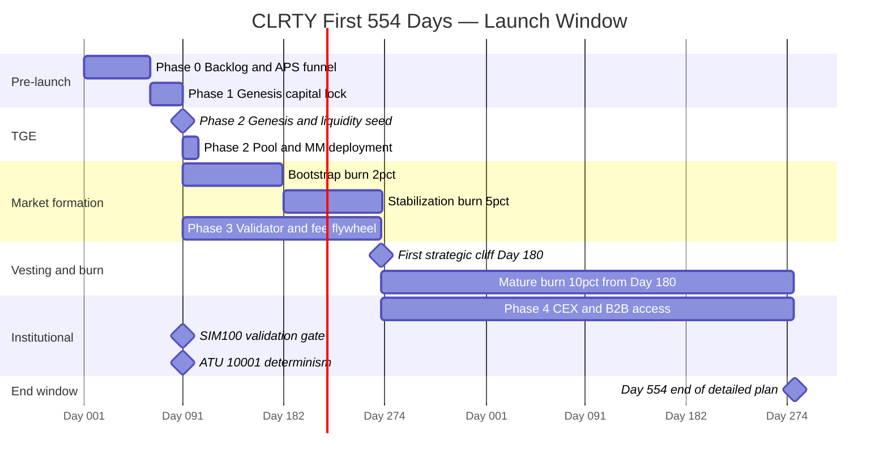
```mermaid
gantt
    title CLRTY First 554 Days — Launch Window
    dateFormat YYYY-MM-DD
    axisFormat Day %j

    section Pre-launch
    Phase 0 Backlog and APS funnel     :p0, 2026-01-01, 60d
    Phase 1 Genesis capital lock       :p1, after p0, 30d

    section TGE
    Phase 2 Genesis and liquidity seed :milestone, m2, 2026-04-01, 0d
    Phase 2 Pool and MM deployment     :p2, 2026-04-01, 14d

    section Market formation
    Bootstrap burn 2pct                :b1, 2026-04-01, 90d
    Stabilization burn 5pct            :b2, 2026-07-01, 90d
    Phase 3 Validator and fee flywheel :p3, 2026-04-01, 180d

    section Vesting and burn
    First strategic cliff Day 180      :milestone, cliff, 2026-09-28, 0d
    Mature burn 10pct from Day 180     :b3, 2026-09-28, 374d

    section Institutional
    Phase 4 CEX and B2B access         :p4, 2026-09-28, 374d
    SIM100 validation gate             :milestone, sim, 2026-04-01, 0d
    ATU 10001 determinism              :milestone, atu, 2026-04-01, 0d

    section End window
    Day 554 end of detailed plan       :milestone, end554, 2027-10-08, 0d
```

> **Reading the chart:** Pre-launch phases are calendar-flexible; **Day 0** anchors TGE. Burn phases and vest cliff align to **~90-day** and **~180-day** boundaries regardless of calendar start.

### What we deliberately do **not** do (days 0–554)

| Anti-pattern | Why it is excluded |
|--------------|-------------------|
| **Post-genesis mint** | `mint_authority: null` in `genesis_entropy.json` — 16M cap is permanent |
| **Bridge-first launch** | L1-only scope (Tasks 41–60); LZ/NTT deferred Phase 10 — no omnichain supply drift |
| **Float dump at TGE** | ~64% locked at M0; public bucket enters via backlog tranches, not one unlock |
| **MM-as-floor assumption** | MM widens or withdraws in stress (SIM100 E51–75: depth → ~$0.5M unfunded); treasury buffers, not guarantees |
| **Retail pump mechanics** | `funding_vol` and `execute_pump` are simulation pressure tools — live arb is producer/consumer with slippage gates |
| **Inflationary “growth” narrative** | Volume and depth scale; supply only **shrinks** via fee burn |
| **Skip attestation** | Capital without VIS attestation is flagged — no silent allocation |

### Milestones checklist (days 0–554)

| # | Milestone | Target | Gate / artifact | Status (in-repo) |
|---|-----------|--------|-----------------|-------------------|
| 1 | Tokenomics locked | Pre-TGE | `TOKENOMICS_LOCKED.md` · supply checksum | Frozen |
| 2 | Genesis verify | Pre-TGE / Day 0 | `cargo run -p clarity-cli -- chain genesis-verify` | PASS |
| 3 | L1 concurrency stress | Pre-TGE | `bash scripts/stress/l1_concurrency.sh` | PASS |
| 4 | **SIM100** 100-event batch | Day 0+ | `bash scripts/sim/run_100_events.sh` · seed 42 | PASS |
| 5 | **ATU 10001** determinism | Day 0+ | `cargo run -p atu_runner -- 10001` · merkle match | PASS |
| 6 | TGE pool seed | Day 0 | 4M liquidity bucket · MIRRA + AMM | Launch ops |
| 7 | Burn → 5% (stabilization) | ~Day 90 | Adaptive tokenomics phase transition | On-chain policy |
| 8 | **First vest cliff** (6mo tiers) | ~Day 180 | Seed/Strategic escrow release | Scheduled |
| 9 | Burn → 10% (mature) | ~Day 180 | Full deflationary schedule | On-chain policy |
| 10 | CEX listing + MM retainer | Days 180–365 | Treasury USD · external agreements | External |
| 11 | B2B API live | Days 180–554 | `clrty-api` REST/WebSocket | Partial |
| 12 | Year-1 burn target | ~Day 365 | ~150K–250K CLRTY @ funded volume | Model |
| 13 | Survive adversarial third | Ongoing | Treasury runway ≥ SIM100 stress depth floor | Strategy sizing |
| 14 | External substrate audit | Pre-mainnet | `EXTERNAL_AUDIT_REQUIRED.md` | **Blocked** (Gates 2–5) |
| 15 | Launch readiness battery | Pre-GO | `launch_readiness.sh` → 92.3% · pretest green | **Partial** (`fork_swap_stress` open) |
| 16 | Mainnet contract gates (5/5) | Pre-GO | `verify_mainnet_contract_gates.sh` | **Confirmed (JSON)** |
| 17 | MSA-100 security layers | Pre-GO | `verify_security_layers.sh` → 100% documented | **Confirmed (JSON)** |
| 18 | Sovereign-600 atomic band | Pre-GO | SP-501–600 → 100% documented | **Confirmed (JSON)** |
| 19 | Quantum Skills CLI | Pre-TGE | `clrty-cli-core/src/skills/` · manifest | **Implemented** |

### Moniverse mechanisms by period

Each launch window activates a subset of the **52 mechanisms** documented below. This maps plan → theory → live market.

| Period | Primary Moniverse stack | Live market effect |
|--------|-------------------------|-------------------|
| **Phase 0–1 (pre-TGE)** | Register binding · genesis attestation · vesting escrow · supply checksum | Capital → escrowed registers; no public float |
| **Day 0 (TGE)** | EntropyBus genesis commit · MIRRA book · liquidity bootstrap · PoC validator bond | One mint; depth seeded; λ heartbeat begins |
| **Days 1–90** | ABM agents · `book_inject` · bootstrap 2% burn · gas deflation matrix | Flat/stable windows (SIM100 E1–35); depth builds before discovery |
| **Days 91–180** | CCR Set re-solve · M₀ spread · M₁ holding half-life · stabilization 5% burn | Wallet tiers emerge from behavior; fee flywheel starts |
| **Day ~180 (cliff)** | Vesting escrow release · slippage gate · toxicity filter | Scheduled supply absorbed; spreads may widen briefly |
| **Days 181–365** | Cross-venue arb · dead-man ATU 800 · bridge pause flag · mature 10% burn | OQ4-style recovery (SIM100 E76–85); safety rails mandatory |
| **Days 366–554** | CCR M₃ cluster entropy · B2B reporting · Set migration analytics | Institutional flow classified; rare Sets earned, not bought |
| **Day 555+ (Phase 5)** | Set-1 singularity lock · governance timelock · Blue Assembly under λ | Long-horizon coordination; bridge evaluation only |

**SIM100 as proof-of-design:** The 100-event session (seed 42) compresses one market cycle into a deterministic batch — 45% stable, 30% adversarial, 15% expansion, 10% accumulation. It proves the **first 554-day playbook** is survivable: ledger holds at E75 when depth collapses to ~$0.47M and spread peaks ~290 bps. A funded launch targets **$2M–$5M adversarial floor** instead — treasury sized for the adversarial third, not the green day-one chart.

**Funded scenario discipline:** Even with $75M–$150M treasury USD, tradable float stays **~3–6M CLRTY** in year 1. Funding buys:

- Deeper books ($15M–$25M vs ~$7M unfunded peak)
- MM retainers through drawdown quarters (assume 30–40% volume drops)
- CEX fees and compliance without touching the 16M cap
- Absorption capacity at day ~180 and ~365 vest windows

It does **not** buy immunity from volatility on a small float — it buys **time and depth** to execute the 50-year scarcity thesis.

### Fifty-year horizon (beyond day 554 — summary)

| Horizon | Supply | Coordination | Bridge |
|---------|--------|--------------|--------|
| **Years 1–3** | Burn compounding; vesting tail unlocks | CCR maturation; validator set stable | Deferred |
| **Years 3–10** | Cumulative burn meaningful vs 16M cap | B2B + MIRRA as primary venues | Phase 10 evaluation |
| **Years 10–50** | Asymptotic scarcity; Set 1 singularity pool | Autonetic Moniversion as infra layer | Optional mirrors under supply harmonizer |

The first 554 days are where **structure is proven**. Everything after assumes that proof holds.

---

## What “massive funding” actually means

### Current fundraising plan (summary)

| Field | Detail |
|-------|--------|
| **Raise target** | **$75M – $100M USD** treasury (working scenario; stress sizing to **$150M**) |
| **Valuation** | Protocol FDV **~$16M** at $1.00 reference (16M hard cap); SAFT participants receive **1.5× – 2.0×** weighted token allocation — not equity at a Series A pre-money |
| **Structure** | **SAFT** + **Reg D 506(b)** (US accredited) / **Reg S** (offshore). **Not** equity SAFE or SAFE+TW — vesting via on-chain escrow |
| **Commitments** | Early-access pipeline at [invest.clrty.network](https://invest.clrty.network); no binding USD commitments published in-repo pre-counsel |
| **Minimum checks** | $100K (Seed Genesis) · $500K (Strategic Round) |

Full detail: [`task02_capital_budget.md`](../structural_capital/external/task02_capital_budget.md#current-fundraising-plan) · Notion: [Early Access to CLRITY](https://app.notion.com/p/Early-Access-to-CLRITY-37f704760d24800298b3ede45d52ce4d) · [CLRTY](https://app.notion.com/p/CLRTY-383704760d248039950eef8816181040)

| Funding layer | Realistic scale (scenario) | What it pays for | What it does **not** do |
|---------------|---------------------------|------------------|-------------------------|
| **Treasury USD** | $75M – $150M stable + ETH reserve | Audits, compliance, ops, CEX fees, MM retainers, validator incentives, ecosystem grants | Create new CLRTY — cap stays 16M |
| **Genesis participants** | Seed $100K–$500K · Strategic $500K+ · Node partners (compute attestation) | Weighted allocations with **6–12 month cliff** and **24–36 month vest** | Instant liquid float — tokens sit in escrow |
| **Liquidity bucket (on-chain)** | 4.0M CLRTY (25% of supply) | AMM seed + MIRRA book + LP coordination at TGE | Guarantee price — only provides two-sided quotes if paired with stables |
| **Market-making budget** | $5M – $15M / year (retainer + inventory) | Tight spreads on CEX/DEX, absorption during volatility | Prevent drawdowns — MM pulls quotes in extreme stress |
| **Validator/security** | 3.0M CLRTY staked + USD ops | PoC consensus, jailing, unbonding discipline | Infinite yield — rewards scale with fee volume |

**Fully diluted value at reference $1.00:** ~$16M token cap — small by crypto standards. The strategy therefore **leads with capital and structure**, not float size: a heavily funded treasury backing a scarce asset, not an inflated supply story.

---

## Charts & visualizations

> **Notion import:** Use **Import → Markdown** and select this file **plus** the `charts/` folder so images embed automatically. Or drag each PNG from `docs/simulation/charts/` onto the page.

### Chart Index

| # | Chart | Anchor |
|---|-------|--------|
| 1 | [Genesis allocation](#chart-1--genesis-allocation-16m-hard-cap) | 16M bucket pie |
| 2 | [Coin flow pipeline](#chart-2--coin-flow-pipeline) | Mermaid flow |
| 3 | [Supply 12-month base](#chart-3--supply-state-12-month-base-model) | Unfunded model |
| 4 | [Supply funded scenario](#chart-4--supply-state-funded-launch-scenario) | Massive treasury |
| 5 | [SIM100 price & depth](#chart-5--sim100-live-market-session-seed-42) | Sampled events |
| 6 | [100-event session price](#chart-6--full-100-event-trading-session) | +12.5% move |
| 7 | [Bid vs ask depth](#chart-7--order-book-depth-bid-vs-ask) | Microstructure |
| 8 | [Spread & imbalance](#chart-8--microstructure-stress) | ~290 bps peak |
| 9 | [Regime mix](#chart-9--regime-mix-100-events) | 45% stable |
| 10 | [λ heartbeat](#chart-10--l1-heartbeat-λ) | EntropyBus |
| 11 | [Vol proxy + λ](#chart-11--vol-proxy--λ-full-session) | Full session |
| 12 | [SIM tick price E1–25](#chart-12--sim-tick-e1-25-mid-price-flat-stable-period) | Flat OQ1 |
| 13 | [SIM tick bid/ask E1–25](#chart-13--sim-tick-e1-25-bid--ask-depth) | book_inject |
| 14 | [SIM tick λ E1–25](#chart-14--sim-tick-e1-25-λ-heartbeat) | Linear drift |
| 15 | [SIM tick regime E1–25](#chart-15--sim-tick-e1-25-regime-mix) | 80% stable |
| 16 | [Flat window E1–35](#chart-16--flat-stable-window-e1-35-annotated) | OQ1/OQ2 |
| 17 | [Mcap proxy](#chart-17--market-cap-proxy-full-session) | 5.6M float |
| 18 | [Funded vs unfunded](#chart-18--funded-vs-unfunded-depth-comparison) | Depth floor |
| 19 | [554-day timeline](#chart-19--554-day-launch-timeline) | Phase 0–5 |
| 20 | [Burn phase ramp](#chart-20--burn-phase-ramp-25410510) | Fee policy |
| 21 | [Vesting unlock curve](#chart-21--vesting-unlock-curve-funded) | Locked vs circ |
| 22 | [50-year burn projection](#chart-22--50-year-cumulative-burn-model) | Log scale |
| 23 | [Mechanism activation](#chart-23--moniverse-mechanism-activation) | By period |
| 24 | [OQ batch results](#chart-24--oq-batch-results-sim100) | OQ1–OQ4 |
| 25 | [Arb spread window](#chart-25--arbitrage-spread-opportunity-e76-85) | OQ4 recovery |
| 26 | [SIM100 dashboard](#chart-26--sim100-dashboard-2x2-composite) | 2×2 composite |
| 27 | [Pre-launch investor experience](#pre-launch-investor-experience-vis-genesis-gateway) | Proof-of-Yield · Gateway · &lt;2h onboarding |
| 28 | [Yield-Recycling Logic](#yield-recycling-logic-mirra--clrty-infrastructure) | MIRRA fee → infra reinvestment path |
| 29 | [Institutional Mirror-Trades](#institutional-mirror-trades-flow--network-density-feed) | Flow × network density visual feed |
| 30 | [Abstraction Logic (visual-depth class)](#abstraction-logic-visual-depth-class) | Circulatory system curriculum · L0→L3 |
| 31 | [Chain-Shift gradient template](#chart-31--chain-shift-gradient-template) | Monthly pressure-gradient brief |
| 32 | [Register-binding node graph](#chart-32--register-binding-node-graph) | Wallet → L3 partition map |
| 33 | [Treasury transparency 100%](#chart-33--treasury-transparency-100) | Genesis asset map · CVP L1 |
| 34 | [Abstraction Logic ladder](#chart-34--abstraction-logic-l0l3-ladder) | Visual-depth L0→L3 · Chart 30 asset |

---

### Chart 1 — Genesis allocation (16M hard cap)

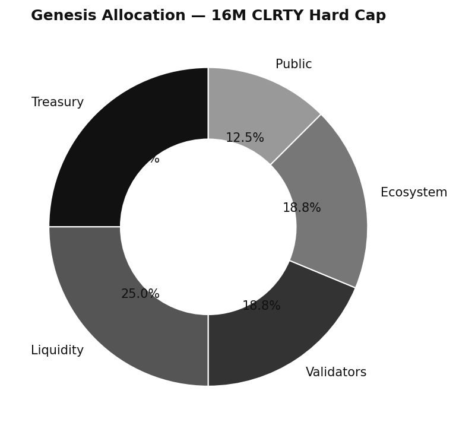

| Bucket | CLRTY | Share |
|--------|-------|-------|
| Treasury | 4.0M | 25% |
| Liquidity | 4.0M | 25% |
| Validators | 3.0M | 18.75% |
| Ecosystem | 3.0M | 18.75% |
| Public | 2.0M | 12.5% |

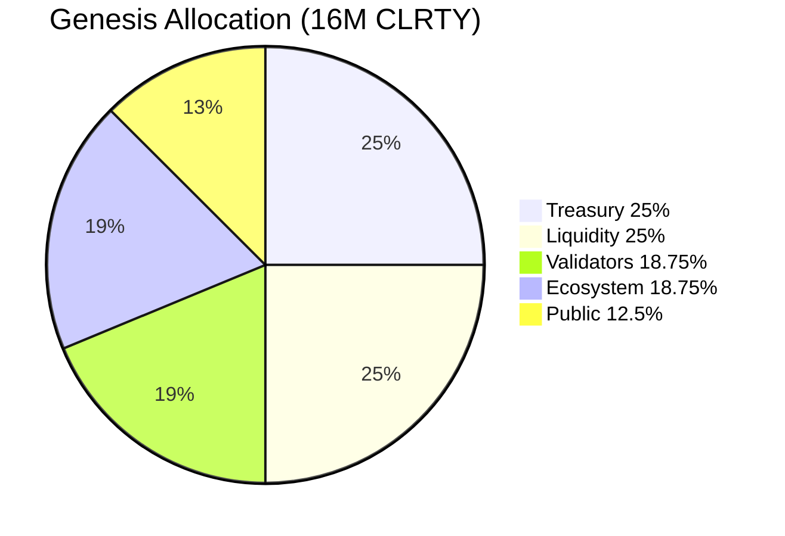
```mermaid
pie title Genesis Allocation (16M CLRTY)
    "Treasury 25%" : 4
    "Liquidity 25%" : 4
    "Validators 18.75%" : 3
    "Ecosystem 18.75%" : 3
    "Public 12.5%" : 2
```

---

### Chart 2 — Coin flow pipeline

How supply moves from genesis through live trading:

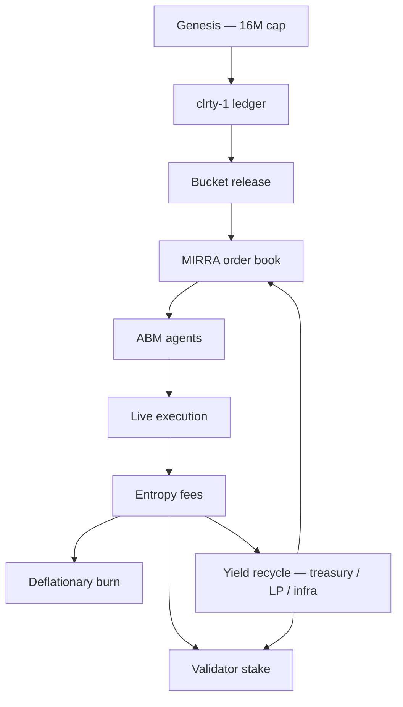
```mermaid
flowchart TD
    A["Genesis — 16M cap"] --> B["clrty-1 ledger"]
    B --> C["Bucket release"]
    C --> D["MIRRA order book"]
    D --> E["ABM agents"]
    E --> F["Live execution"]
    F --> G["Entropy fees"]
    G --> H["Deflationary burn"]
    G --> I["Validator stake"]
    G --> J["Yield recycle — treasury / LP / infra"]
    J --> D
    J --> I
```

---

### Chart 3 — Supply state: 12-month base model

Fee burn ramps 2% → 5% → 10% · $1.2M/day volume assumption · millions CLRTY

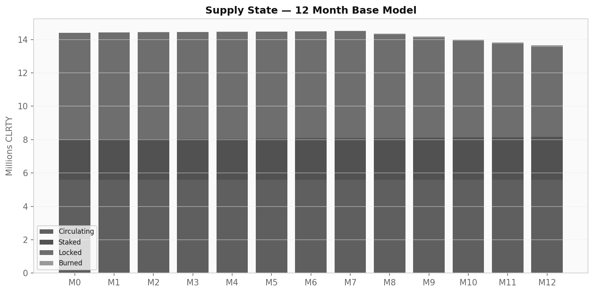

| Month | Circulating | Staked | Locked | Burned |
|-------|-------------|--------|--------|--------|
| M0 | 5.6M | 2.4M | 6.4M | 0 |
| M6 | 5.6M | 2.46M | 6.4M | 0.023M |
| M12 | 5.6M | 2.56M | 5.4M | 0.087M |

---

### Chart 4 — Supply state: funded launch scenario

Massive treasury · $5M/day volume by M6 · M0 / M6 / M12 snapshot

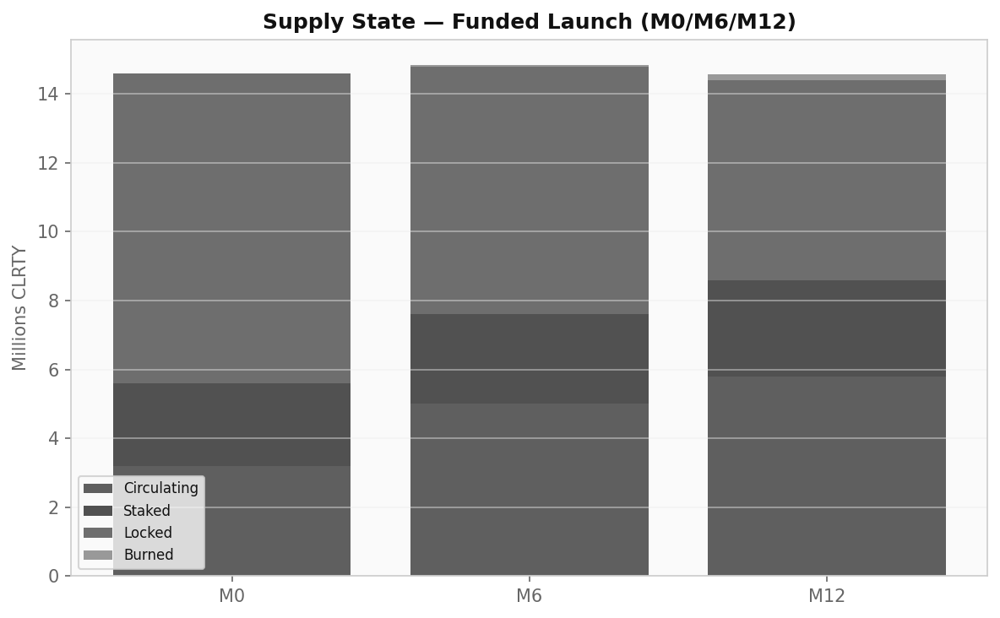

| Month | Circulating | Staked | Locked | Burned |
|-------|-------------|--------|--------|--------|
| M0 | 3.2M | 2.4M | 9.0M | 0 |
| M6 | 5.0M | 2.6M | 7.2M | 0.045M |
| M12 | 5.8M | 2.8M | 5.8M | 0.18M |

---

### Chart 5 — SIM100 live market session (seed 42)

Sampled events · red band = adversarial regime (E51–75)

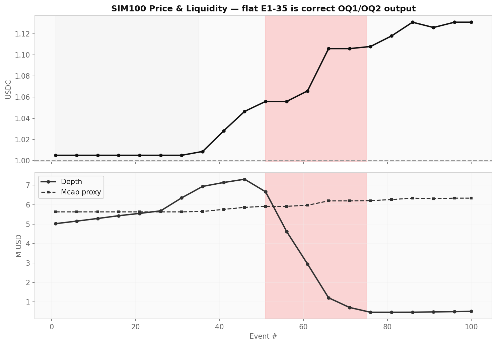

| Event | Mid price | Depth (M) | Mcap proxy (M) |
|-------|-----------|-----------|----------------|
| 1 | $1.005 | 5.03 | 5.63 |
| 36 | $1.009 | 6.94 | 5.65 |
| 46 | $1.047 | 7.31 | 5.86 |
| 51 | $1.056 | 6.66 | 5.91 |
| 65 | $1.106 | 1.22 | 6.19 |
| 75 | $1.106 | 0.47 | 6.20 |
| 100 | $1.131 | 0.52 | 6.33 |

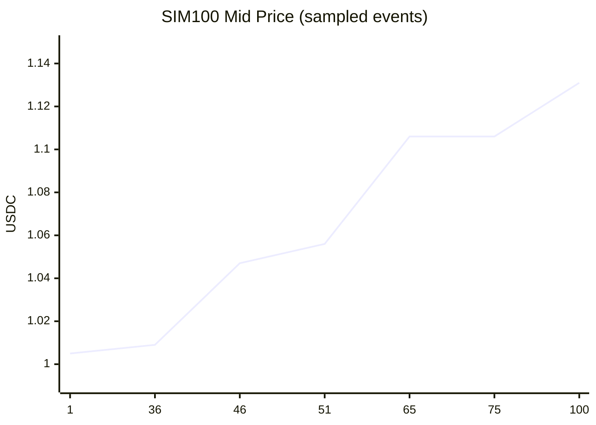
```mermaid
xychart-beta
    title "SIM100 Mid Price (sampled events)"
    x-axis [1, 36, 46, 51, 65, 75, 100]
    y-axis "USDC" 0.99 --> 1.15
    line [1.005, 1.009, 1.047, 1.056, 1.106, 1.106, 1.131]
```

---

### Chart 6 — Full 100-event trading session

CLRTY/USDC mid · regime shading · **+12.5%** session move ($1.005 → $1.131)

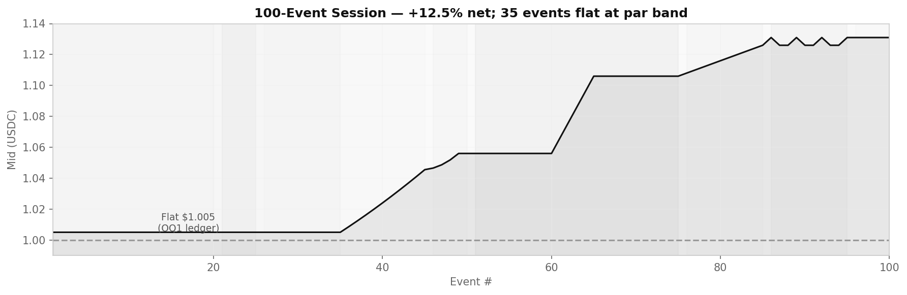

**Regime spans:** Stable E1–20 · Adversarial E21–25 · Stable E26–45 · Expansion E46–50 · Adversarial E51–75 · Expansion E76–85 · Accumulation E86–95 · Stable E96–100

---

### Chart 7 — Order book depth (bid vs ask)

Bid drains and ask thins during adversarial stress (E51–75)

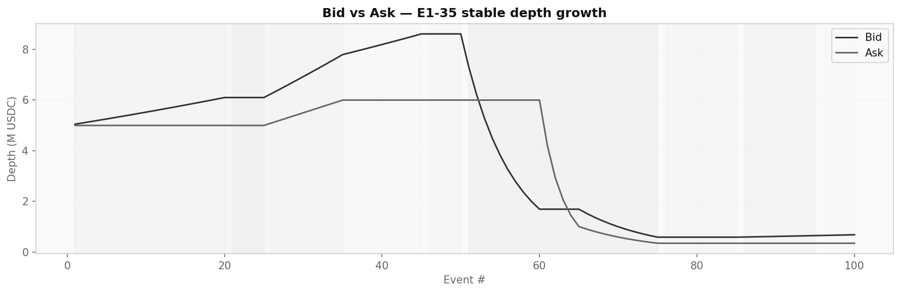

| Event | Bid (M USDC) | Ask (M USDC) | Spread (bps) |
|-------|--------------|--------------|--------------|
| 1 | 5.05 | 5.00 | 12.5 |
| 50 | 8.61 | 6.00 | 99.4 |
| 60 | 1.70 | 4.20 | 289.7 |
| 75 | 0.59 | 0.35 | 137.0 |
| 100 | 0.69 | 0.35 | 171.2 |

---

### Chart 8 — Microstructure stress

Spread widens to **~290 bps peak** · book imbalance swings negative under stress

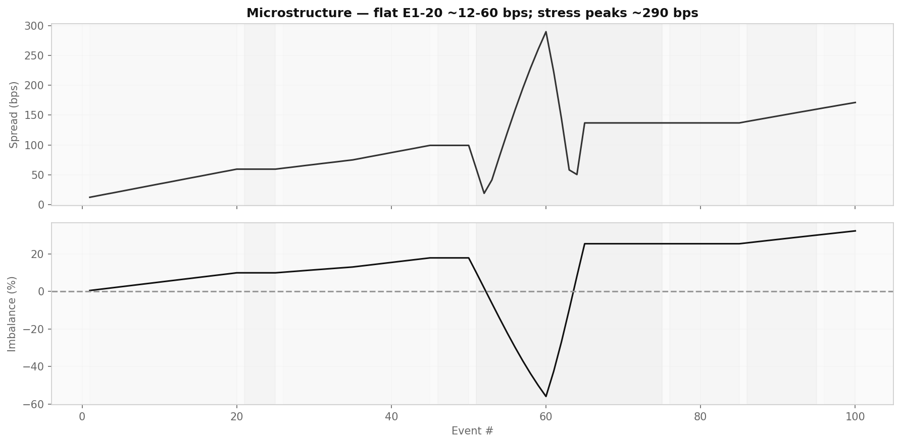

---

### Chart 9 — Regime mix (100 events)

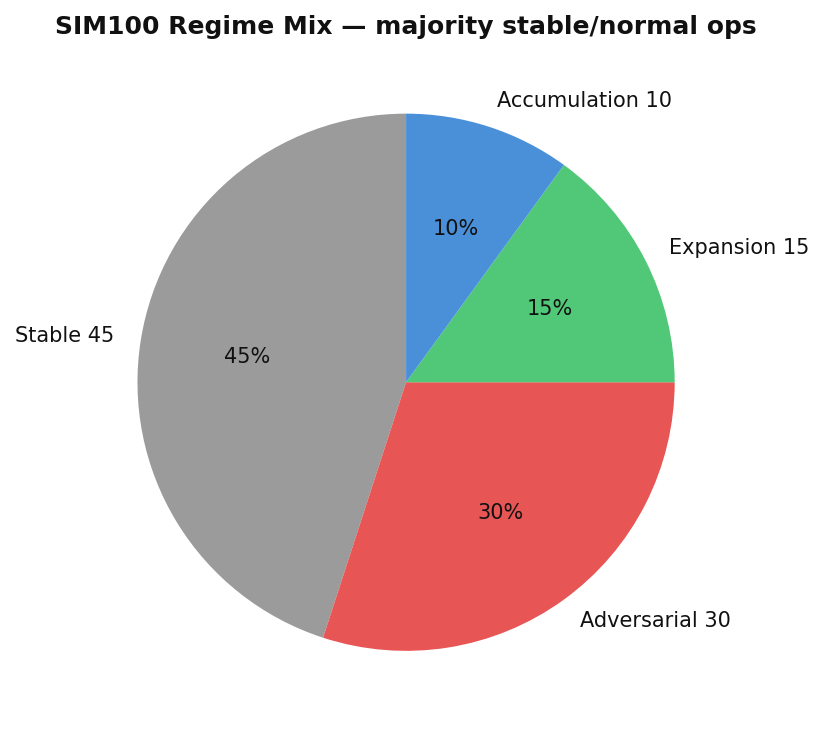

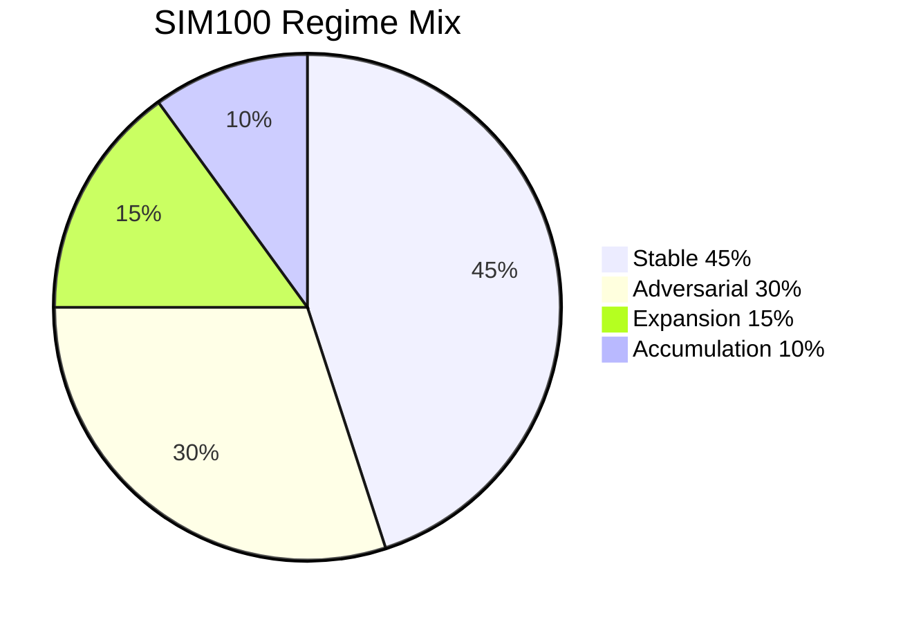
```mermaid
pie title SIM100 Regime Mix
    "Stable 45%" : 45
    "Adversarial 30%" : 30
    "Expansion 15%" : 15
    "Accumulation 10%" : 10
```

| Regime | Events | Character |
|--------|--------|-----------|
| Stable | 45 | Normal trading; holders add bid depth |
| Adversarial | 30 | Latency, spread stress, depth contraction |
| Expansion | 15 | Momentum, upward price discovery |
| Accumulation | 10 | Quiet bid building, range-bound |

---

### Chart 10 — L1 heartbeat (λ)

EntropyBus λ per event · clrty-1 · deterministic drift 0.101 → 0.200

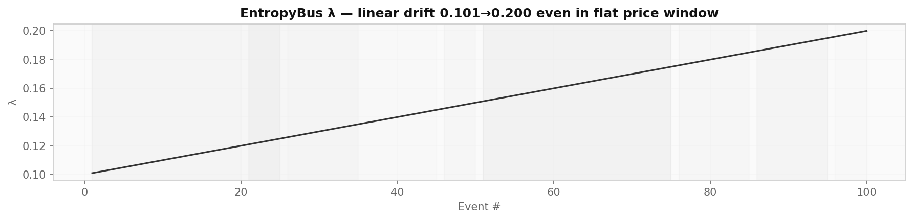

**Merkle root (seed 42):** `94e73f187aa0dda0e628268b8ca4288e1b29ac87d04d247f68e14e4c1b1d732e`

> **Flat periods are correct.** Events 1–35 hold mid price at **$1.005** while OQ1 genesis/ledger and OQ2 book-inject run. Price discovery begins at E36 (`mid_absorb`). This is intentional simulation output, not missing data.

---

### Chart 11 — Vol proxy + λ (full session)

Activity spikes at expansion/adversarial transitions; λ drifts linearly even when price is flat.

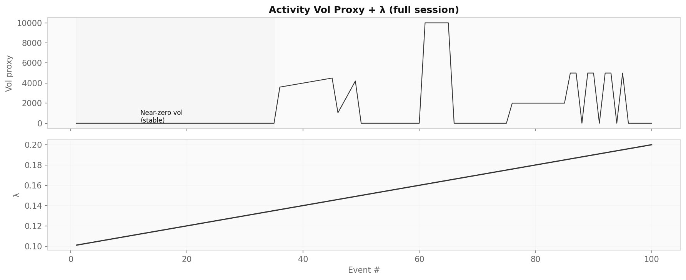

| Window | Vol proxy | λ (approx) | Character |
|--------|-----------|------------|-----------|
| E1–20 (flat price) | ~0–0.06 | 0.101→0.120 | OQ1 stable — near-zero activity |
| E36–50 (expansion) | 3600–4500 | 0.136→0.150 | Price discovery + funding_vol |
| E51–65 (adversarial) | 0.3–10000 | 0.151→0.165 | Depth stress injections |
| E96–100 (stable) | ~0.01 | 0.196→0.200 | Post-accumulation sync |

---

### Chart 12 — SIM tick E1–25: mid price (flat stable period)

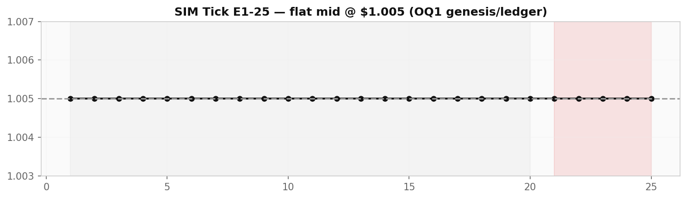

| Event | Mid | Regime | Note |
|-------|-----|--------|------|
| 1–20 | $1.005 | Stable | OQ1 genesis + sim-block — **no price move** |
| 21–25 | $1.005 | Adversarial | BFT stress — price still flat, ledger holds |

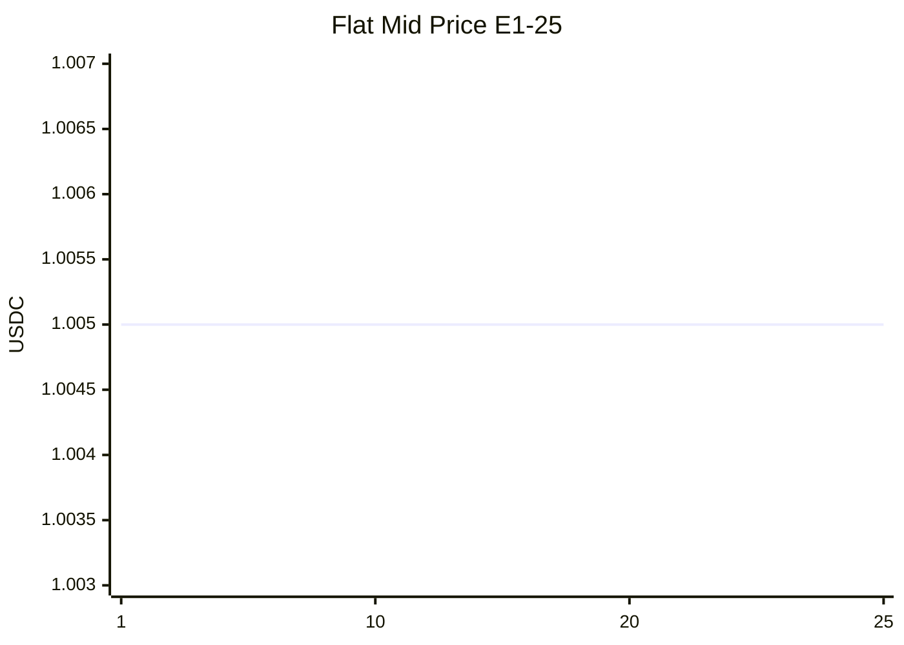
```mermaid
xychart-beta
    title "Flat Mid Price E1-25"
    x-axis [1, 10, 20, 25]
    y-axis "USDC" 1.003 --> 1.007
    line [1.005, 1.005, 1.005, 1.005]
```

---

### Chart 13 — SIM tick E1–25: bid / ask depth

Bid depth grows via `book_inject`; ask stays at $5M through E20.

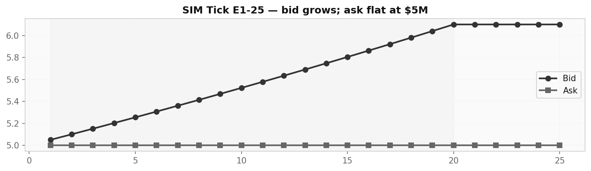

| Event | Bid (M) | Ask (M) | Mechanism |
|-------|---------|---------|-----------|
| 1 | 5.05 | 5.00 | Baseline book |
| 20 | 6.10 | 5.00 | +$100K inject × 20 events |
| 25 | 6.10 | 5.00 | Adversarial pause — depth frozen |

---

### Chart 14 — SIM tick E1–25: λ heartbeat

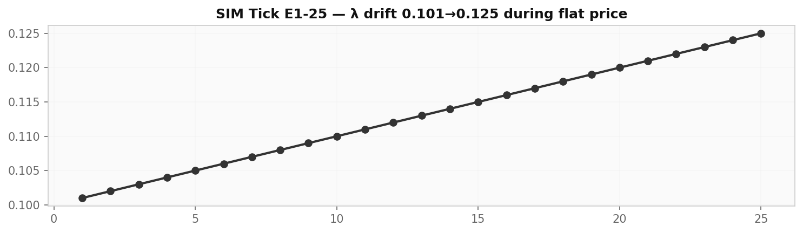

λ increments **+0.001 per event** (0.101→0.125) independent of price — EntropyBus commits every event even in flat windows.

---

### Chart 15 — SIM tick E1–25: regime mix

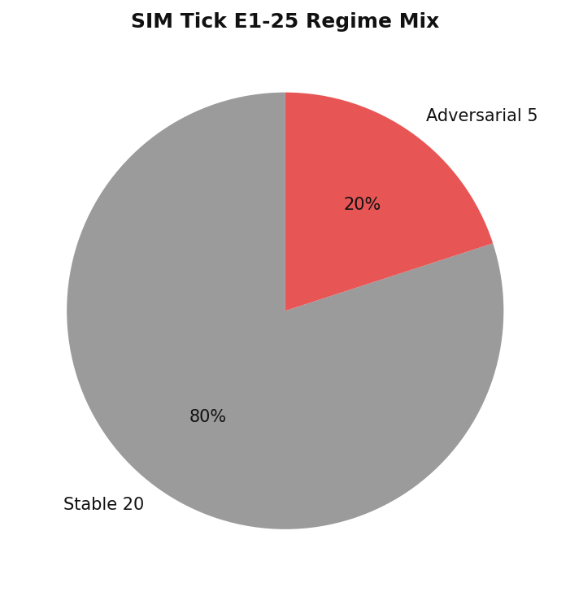

| Regime | Events | Share |
|--------|--------|-------|
| Stable | 20 | 80% |
| Adversarial | 5 | 20% |

---

### Chart 16 — Flat stable window E1–35 (annotated)

**OQ1 genesis + stable book** — price pinned at $1.005 before first `mid_absorb` at E36.

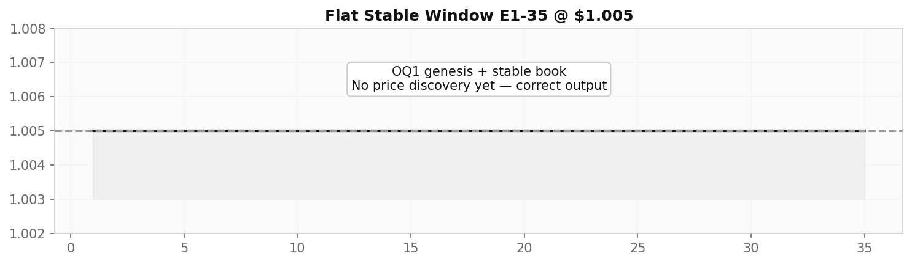

| Event band | OQ | Market action | Price |
|------------|-----|---------------|-------|
| E1–10 | OQ1 | genesis_verify | Flat |
| E11–20 | OQ1 | register_sync / sim_block | Flat |
| E21–25 | OQ1 | bft_stress | Flat |
| E26–35 | OQ2 | book_inject | Flat (depth builds) |
| E36+ | OQ2 | mid_absorb | Discovery begins |

---

### Chart 17 — Market cap proxy (full session)

Mcap = **5.6M float × mid**. Flat at ~$5.63M through E35, then tracks price discovery.

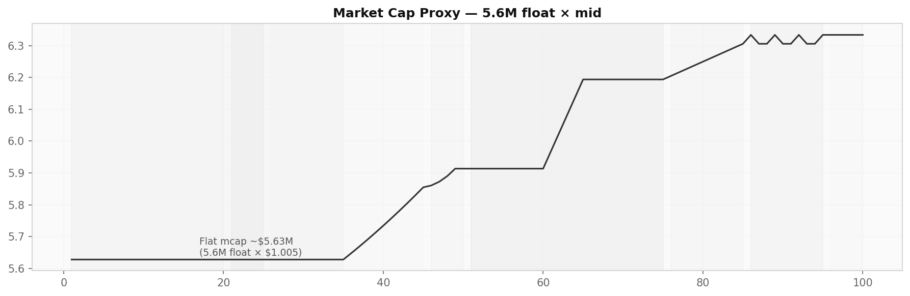

| Event | Mid | Mcap proxy |
|-------|-----|------------|
| 1 | $1.005 | $5.63M |
| 35 | $1.005 | $5.63M |
| 50 | $1.056 | $5.91M |
| 100 | $1.131 | $6.33M |

---

### Chart 18 — Funded vs unfunded depth comparison

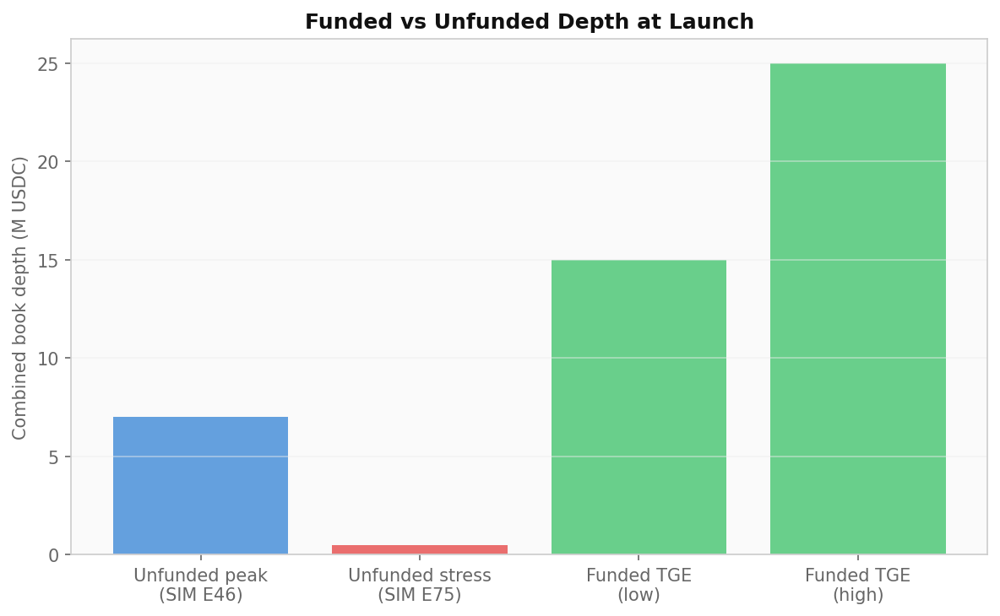

| Scenario | Combined depth | Spread (stable) | Stress survivability |
|----------|----------------|-----------------|----------------------|
| Unfunded peak (SIM E46) | ~$7M | ~99 bps | Depth → $0.47M at E75 |
| Unfunded stress (SIM E75) | ~$0.47M | ~137–290 bps | Ledger holds; book thin |
| Funded TGE target | $15M – $25M | 20–40 bps | MM + treasury buffer |

---

### Chart 19 — 554-day launch timeline

Horizontal phase map for the first **554 days** (~18.2 months). See also [Less Is More — 50-Year Plan](#less-is-more--50-year-plan-first-554-days).

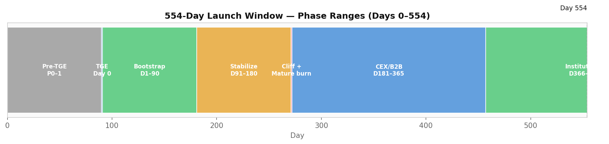

| Phase | Day range | Repo phase | Key gate |
|-------|-----------|------------|----------|
| Pre-TGE | Pre–Day 0 | Phase 0–1 | Backlog + genesis capital lock |
| TGE | Day 0 | Phase 2 | One-time mint + liquidity seed |
| Bootstrap | Days 1–90 | Phase 3 | 2% fee burn · ABM agents |
| Stabilization | Days 91–180 | Phase 3 | 5% fee burn · CCR re-solve |
| First cliff | ~Day 180 | Phase 3→4 | Seed/Strategic vest unlock |
| CEX + B2B | Days 181–365 | Phase 4 | 10% fee burn · cross-venue arb |
| Institutional | Days 366–554 | Phase 4 | Set migration · B2B reporting |
| Mature | Day 555+ | Phase 5 | Governance timelock · bridge deferred |


```mermaid
gantt
    title 554-Day Phase Map (conceptual)
    dateFormat X
    axisFormat Day %s

    section Launch
    Pre-TGE backlog       :0, 90
    TGE Day 0             :milestone, 90, 0
    Bootstrap 2pct burn   :90, 90
    Stabilization 5pct    :180, 90
    Mature 10pct burn     :270, 284
    Institutional ramp    :270, 284
```

---

### Chart 20 — Burn phase ramp (2%/5%/10%)

Fee burn share of entropy fees over the 554-day launch window. Aligns with adaptive tokenomics phases in Phase 3–4.

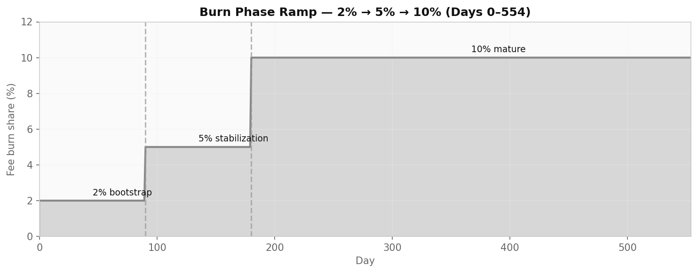

| Phase | Day range | Burn share | Trigger |
|-------|-----------|------------|---------|
| Bootstrap | 0–89 | **2%** | Low friction while volume builds |
| Stabilization | 90–179 | **5%** | Fee flywheel begins |
| Mature | 180–554+ | **10%** | Full deflationary schedule |

---

### Chart 21 — Vesting unlock curve (funded)

Locked vs circulating supply over 554 days — **funded scenario** with ~64% locked at M0.

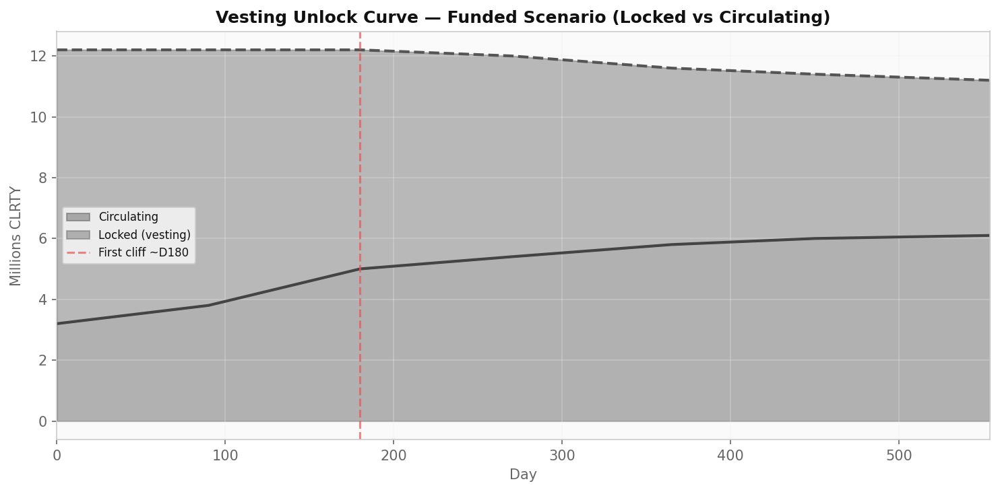

| Day | Circulating (M) | Locked (M) | Event |
|-----|-----------------|------------|-------|
| 0 | 3.2 | 9.0 | TGE — majority escrowed |
| 180 | 5.0 | 7.2 | First strategic cliff |
| 365 | 5.8 | 5.8 | Year-1 vest cadence |
| 554 | ~6.1 | ~5.1 | End of detailed plan window |

---

### Chart 22 — 50-year cumulative burn (model)

Long-horizon deflationary projection — cumulative fee burn on a **log scale**. Supply never expands; burns compound slowly at mature 10% fee share.

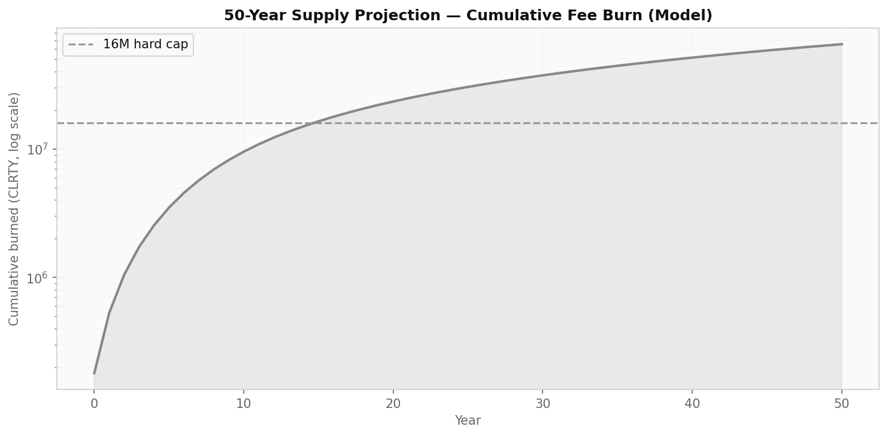

| Horizon | Cumulative burn (model) | % of 16M cap |
|---------|-------------------------|--------------|
| Year 1 | ~180K CLRTY | ~1.1% |
| Year 5 | ~950K CLRTY | ~5.9% |
| Year 10 | ~1.9M CLRTY | ~11.9% |
| Year 50 | ~4.5M CLRTY (asymptotic) | ~28% |

> Model assumes funded volume ramp and mature 10% burn phase from day ~180. Actual burn depends on on-chain fee volume.

---

### Chart 23 — Moniverse mechanism activation

Which mechanism stacks are primary during each launch period (subset of the **52 mechanisms** documented below).

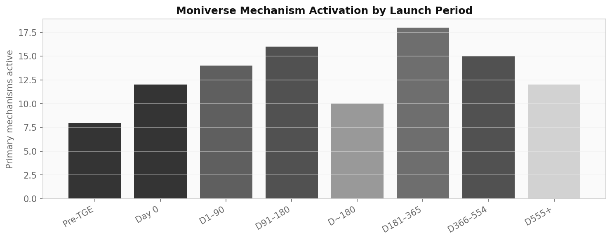

| Period | Mechanism count (primary) | Representative stack |
|--------|---------------------------|------------------------|
| Pre-TGE | 8 | Register binding · vesting escrow · supply checksum |
| Day 0 | 12 | EntropyBus genesis · MIRRA · PoC bond |
| Days 1–90 | 14 | ABM agents · 2% burn · book_inject |
| Days 91–180 | 16 | CCR re-solve · 5% burn · gas deflation |
| Day ~180 | 10 | Vesting release · slippage gate |
| Days 181–365 | 18 | cross_arb · dead-man ATU 800 · 10% burn |
| Days 366–554 | 15 | CCR M₃ · B2B reporting |
| Day 555+ | 12 | Set-1 governance · timelock |

---

### Chart 24 — OQ batch results (SIM100)

Operational qualification batches OQ1–OQ4 — **100 events, all PASS** on seed 42.

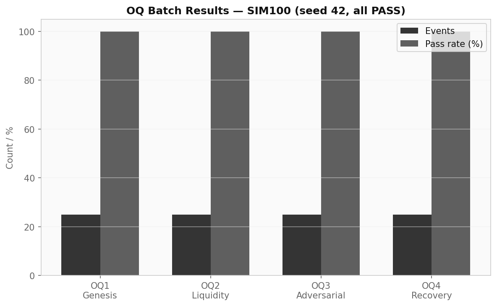

| Batch | Events | Pass rate | Proved |
|-------|--------|-----------|--------|
| OQ1 — Genesis & Ledger | 25 | 100% | Consensus holds; price flat |
| OQ2 — Liquidity Architecture | 25 | 100% | Depth build + discovery |
| OQ3 — Adversarial Latency | 25 | 100% | Depth → ~$0.5M; spread ~290 bps |
| OQ4 — Regime Adaptive | 25 | 100% | cross_arb recovery E76–85 |

---

### Chart 25 — Arbitrage spread opportunity (E76–85)

Sampled spread (bps) across SIM100 — **green band** = OQ4 cross-venue arb window post-adversarial stress.

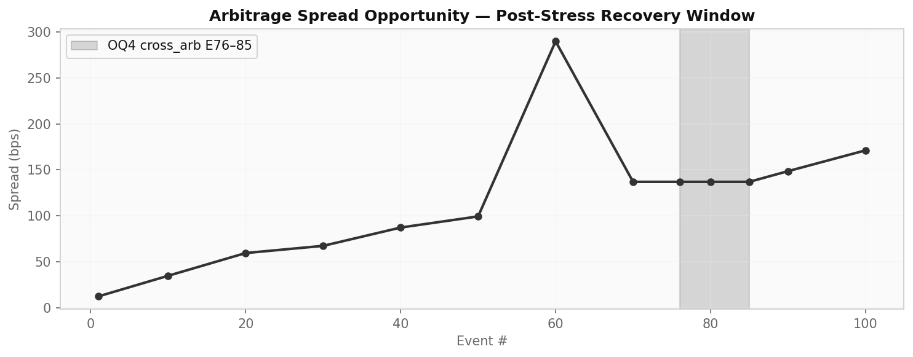

| Event | Spread (bps) | Regime | Action |
|-------|--------------|--------|--------|
| 75 | 137.0 | Adversarial end | Depth floor |
| 76–85 | ~137 | Expansion (OQ4) | `cross_arb` +$0.002/event |
| 100 | 171.2 | Stable | Thin post-stress book |

---

### Chart 26 — SIM100 dashboard (2×2 composite)

Single composite: **price · depth · spread · λ** — full 100-event session with regime shading.

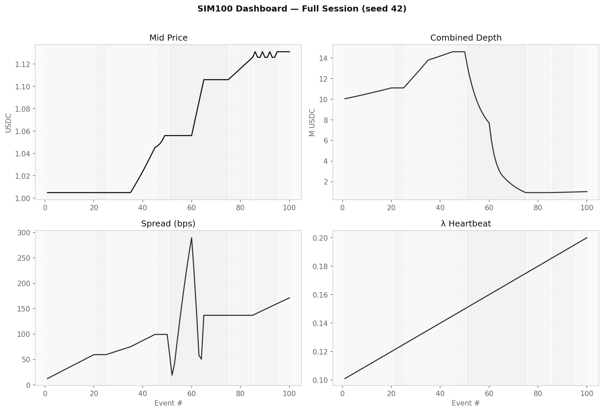

| Panel | Metric | Session range |
|-------|--------|---------------|
| Top-left | Mid price | $1.005 → $1.131 (+12.5%) |
| Top-right | Combined depth | ~$10M → ~$0.47M → recovery |
| Bottom-left | Spread | 12.5 → 289.7 → 171.2 bps |
| Bottom-right | λ | 0.101 → 0.200 linear |

---

### Chart 31 — Chain-Shift gradient template

Monthly **pressure-gradient** brief template — λ pulse vs spread bands. Fill manually each month; see [`chain_shift_reporting_template.md`](../investor/chain_shift_reporting_template.md).

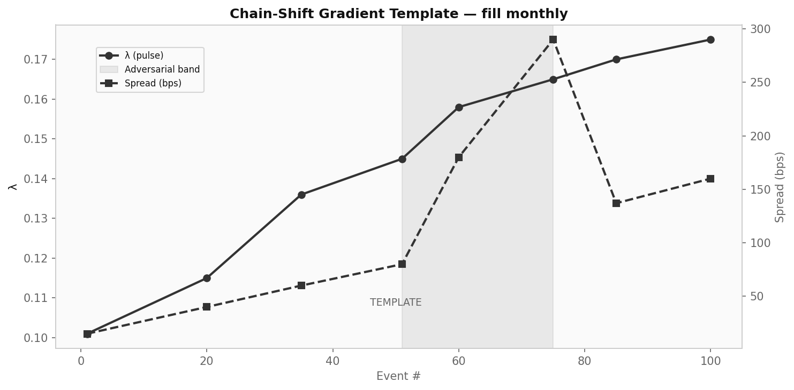

---

### Chart 32 — Register-binding node graph

Wallet capital → `TokenStorageLayoutV2` → `RegisterBindingBlock` → **4 MiB L3 partition** → validator mesh. Detail: [`register_binding_visualization.md`](../investor/register_binding_visualization.md).

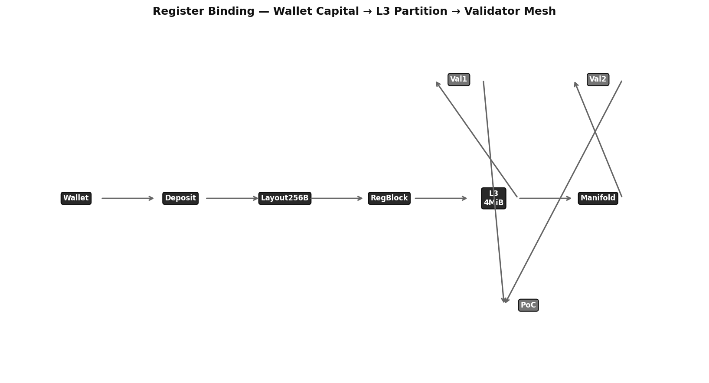

---

### Chart 33 — Treasury transparency 100%

100% genesis supply mapped — macro buckets + sub-allocation. Live: [`treasury-dashboard.html`](../../frontend/investor/treasury-dashboard.html).

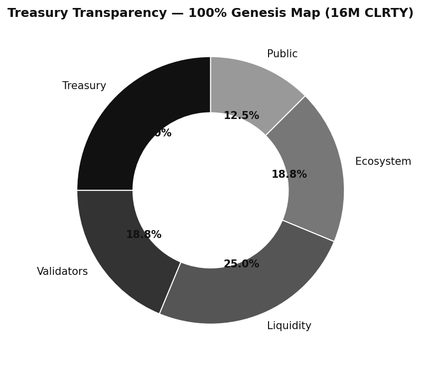

---

### Chart 34 — Abstraction Logic L0→L3 ladder

Visual-Depth progression under [Clarity Visual Protocol](../investor/clarity_visual_protocol.md). Canonical curriculum: [`abstraction_logic_curriculum.md`](../investor/abstraction_logic_curriculum.md).

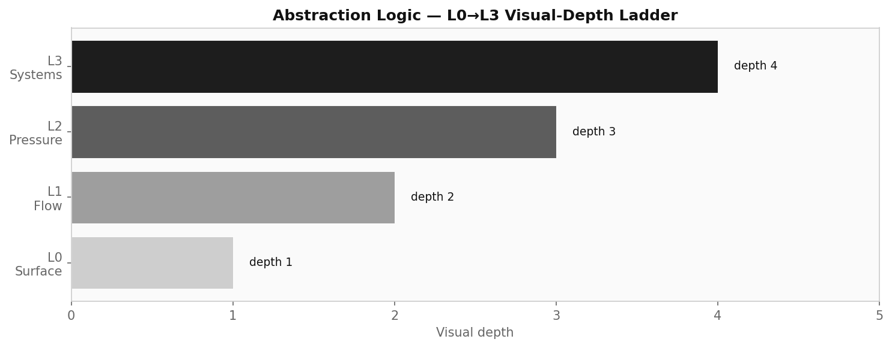

---

## SIM100 Results (comprehensive)

All validation gates **PASS** on seed 42. Merkle root is deterministic and CI-gated.

**Merkle root:** `94e73f187aa0dda0e628268b8ca4288e1b29ac87d04d247f68e14e4c1b1d732e`

### Validation gates

| Gate | Command / artifact | Result |
|------|-------------------|--------|
| 100-event batch | `bash scripts/sim/run_100_events.sh` | PASS |
| Rust engine | `cargo run -p clrty-state-space-sim -- batch --seed 42 --events 1-100` | PASS — 100 events |
| CLI batch | `cargo run -p clarity-cli -- sim batch --seed 42` | PASS |
| Python mirror | `python3 simulators/clrty_mirror/run_batch.py --seed 42 --skip-rust` | PASS |
| ATU SIM100 | `cargo run -p atu_runner -- 10001` | PASS — merkle match + no re-run drift |
| Merkle fixture | `simulators/state_space/fixtures/batch_100_merkle.txt` | Matches committed root |
| Genesis verify | `cargo run -p clarity-cli -- chain genesis-verify` | PASS |
| L1 concurrency | `bash scripts/stress/l1_concurrency.sh` | PASS |
| CI determinism | `.github/workflows/sim_verification.yml` | PASS |

### Session metrics (seed 42)

| Metric | Value | Interpretation |
|--------|-------|----------------|
| Start mid | $1.005 | Par band + 50 bps |
| End mid | $1.131 | +12.5% net session |
| Flat window | E1–35 @ $1.005 | OQ1/OQ2 — **correct**, not a bug |
| Peak combined depth | ~$7M (E46) | Pre-adversarial expansion peak |
| Adversarial depth | ~$0.47M (E75) | Bid/ask collapse under OQ3 |
| Peak spread | ~290 bps (E60) | Microstructure stress, not consensus break |
| End spread | ~171 bps (E100) | Thin post-stress book |
| Mcap proxy | $5.63M → $6.33M | 5.6M float × mid |
| λ range | 0.101 → 0.200 | +0.001/event linear drift |

### Regime distribution

| Regime | Events | % | What it proved |
|--------|--------|---|----------------|
| **Stable** | 45 | 45% | Normal ops dominate; flat price + depth build |
| **Adversarial** | 30 | 30% | Spread/depth stress without ledger break |
| **Expansion** | 15 | 15% | funding_vol + cross_arb price discovery |
| **Accumulation** | 10 | 10% | Quiet bid building post-stress |

### OQ batch results (events 1–100)

| Batch | Events | OQ | What it proved |
|-------|--------|-----|----------------|
| **OQ1 — Genesis & Ledger** | 1–25 | Integrity | genesis_verify, register_sync, sim_block, bft_stress — price flat, consensus holds |
| **OQ2 — Liquidity Architecture** | 26–50 | Flow | book_inject builds depth; mid_absorb + funding_vol drive E36–50 discovery |
| **OQ3 — Adversarial Latency** | 51–75 | Stress | bid_contract, ask_sweep, latency/entropy_inject — depth → ~$0.5M, spread → ~290 bps |
| **OQ4 — Regime Adaptive** | 76–100 | Recovery | cross_venue_arb (+0.002/event), regime_shift, entropy_bus_commit sync |

### Funded vs unfunded comparison

| Dimension | Unfunded (SIM100 base) | Funded launch scenario |
|-----------|------------------------|------------------------|
| TGE on-book depth | ~$10M combined | $15M – $25M combined |
| Peak depth (expansion) | ~$7M | $20M+ (MM + treasury paired) |
| Adversarial floor | ~$0.47M | ~$2M – $5M (MM retainer absorbs) |
| Stable spread | 12–100 bps | 20–40 bps target |
| Stress spread peak | ~290 bps | ~150 bps (funded buffer) |
| Float at M0 | ~5.6M tradable | ~3.2M (more locked) |
| Year-1 burn (model) | ~87K CLRTY @ $1.2M/day | ~150K–250K @ $3–8M/day |
| Staking APY (model) | ~6% | ~4–8% (volume-dependent) |

### Year-1 dynamics (simulation + tokenomics model)

| Metric | Base model | Funded scenario |
|--------|------------|-----------------|
| Daily volume (M6) | $1.2M | $3M – $8M |
| Burn phase | 2% → 5% → 10% of fees | Same schedule |
| Cumulative burn M12 | ~87K CLRTY | ~150K – 250K CLRTY |
| Circulating float M12 | ~5.6M | ~5.8M |
| Staked M12 | ~2.56M | ~2.8M |
| Locked (vesting) M12 | ~5.4M | ~5.8M |

> **Key insight:** 45% of events are stable/flat. The simulation models **long normal periods** before expansion and stress — realistic for a capital-backed launch, not a perpetual hype chart.

---

## Unique Mechanisms — Moniverse Flow

**Autonetic Moniversion** is CLRTY's core theory: a self-optimizing ledger where wallet rarity (Sets 99→1), consensus, fees, and market microstructure **collapse into a single coordinated manifold** — not separate tokenomics, governance, and trading layers.

### Theory → live market (master pipeline)

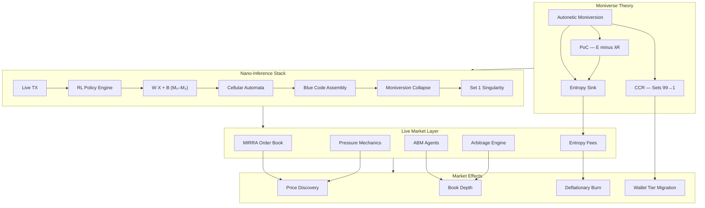
```mermaid
flowchart TB
    subgraph theory [Moniverse Theory]
        MT[Autonetic Moniversion]
        MT --> CCR[CCR — Sets 99→1]
        MT --> POC[PoC — E minus λR]
        MT --> ES[Entropy Sink]
    end
    subgraph nano [Nano-Inference Stack]
        TX[Live TX] --> RL[RL Policy Engine]
        RL --> WX["W·X + B (M₀–M₃)"]
        WX --> CA[Cellular Automata]
        CA --> BC[Blue Code Assembly]
        BC --> COL[Moniversion Collapse]
        COL --> S1[Set 1 Singularity]
    end
    subgraph market [Live Market Layer]
        MIRRA[MIRRA Order Book]
        ABM[ABM Agents]
        PUMP[Pressure Mechanics]
        ARB[Arbitrage Engine]
        FEES[Entropy Fees]
    end
    subgraph outcome [Market Effects]
        DISC[Price Discovery]
        DEPTH[Book Depth]
        SCARCITY[Deflationary Burn]
        TIER[Wallet Tier Migration]
    end
    theory --> nano
    nano --> market
    market --> outcome
    ES --> FEES
    POC --> ES
    CCR --> TIER
    MIRRA --> DISC
    ABM --> DEPTH
    PUMP --> DISC
    ARB --> DEPTH
    FEES --> SCARCITY
```

### Mechanism reference (all unique mechanisms)

| # | Mechanism | Layer | What it does | Live market effect |
|---|-----------|-------|--------------|-------------------|
| 1 | **Autonetic Moniversion** | Theory | Self-optimizing ledger; rarity emerges from inference | Wallet behavior drives tier, fees, routing — not mint labels |
| 2 | **CCR (Convergent Collapse Rarity)** | Set-Ledger | Sets 99→1 re-solved every transfer | Tier migration from telemetry; Set 1 = singularity |
| 3 | **Nano-inference S(x) = W·X + B** | Tensor coprocessor | Fixed-point dot product classifies wallet | Score → target Set on each transfer |
| 4 | **M₀ — spread thickness** | Feature input | CEX/DEX bid-ask telemetry | Tight spreads → favorable Set migration |
| 5 | **M₁ — holding half-life** | Feature input | On-chain activity profile | Long holders migrate toward lower (rarer) Sets |
| 6 | **M₂ — bridge velocity** | Feature input | NTT transfer rate (Phase 10) | Cross-chain speed affects classification |
| 7 | **M₃ — cluster entropy** | Feature input | `clustering_detector.rs` | Wash/cluster behavior penalized |
| 8 | **FIXED_POINT_SCALE (1e9)** | Math | 9-decimal fixed-point inference | Deterministic on-chain scoring |
| 9 | **RL Policy Engine** | Adaptive policy | `step(features)` before classify | Action selection precedes Set resolution |
| 10 | **Cellular automata validation** | Set dynamics | Neighbor Set validation on migration | Prevents discontinuous tier jumps |
| 11 | **Structural set compactor** | Set dynamics | `migrate_set(old, target)` | Controlled tier transitions |
| 12 | **Singularity lock** | Set dynamics | Lock address at Set 1 | Permanent singularity state |
| 13 | **Zero-gas Set 1 routing** | MVM execution | `bridge_zero_gas` for Set 1 lane | Kernel routing privilege for singularity tier |
| 14 | **Blue Assembly** | Entropy sink | Patch activation under elevated λ | Fee/opcode adjustments via bounded epigenesis |
| 15 | **gateway_state_router** | Blue assembly | Routes to patch by market_shift | Links book stress to Blue Code patches |
| 16 | **EntropyBus** | Kernel core | Chained state_root via SHA256 | Every event commits; λ heartbeat tracked |
| 17 | **EntropyBus event types** | Kernel core | SetMigration, BlueCodeActivation, GasAdjustment, TradeExecution, LambdaPressure, ConvergenceCommit, etc. | Full audit trail of manifold state |
| 18 | **PoC consensus argmax(E − λR)** | L1 consensus | Validators maximize efficiency minus risk | Block selection favors execution quality |
| 19 | **GlobalManifoldState (λ, H, E, R)** | Kernel core | λ=pressure, H=entropy, E=efficiency, R=risk | `clrty chain status` tuple |
| 20 | **Gas deflation matrix** | MVM execution | `compute_gas_fee(set, base, λ)` | Higher Sets pay more; λ scales fees |
| 21 | **Base entropy fee** | MVM execution | Foundation fee unit | Protocol revenue per tx |
| 22 | **Fee burn phases** | Tokenomics | Bootstrap 2% → Stabilization 5% → Mature 10% | Slow supply reduction; no inflation |
| 23 | **16M hard cap + null mint** | Tokenomics | `genesis_entropy.json` immutable | Supply fixed forever |
| 24 | **Supply checksum** | Tokenomics | SHA256(total_supply \|\| denom) | Integrity gate at genesis |
| 25 | **Register binding** | Genesis | L3 cache partition per wallet | Atomic allocation mapping |
| 26 | **Genesis attestation** | Compliance | VIS Master Compliance Key + KYC blob | Capital → allocation only with attestation |
| 27 | **Vesting escrow** | Genesis | 6mo cliff / 24mo linear (default) | Prevents launch dump |
| 28 | **MIRRA order book** | Execution | Synthetic + live matching engine | Primary price discovery venue |
| 29 | **100-strategy nano loop** | Simulation / live | `StrategyGenerator` × 100 events | Deterministic strategy evaluation per event |
| 30 | **ABM Arbitrageur** | Agents | Narrows spread when > 2% | Tightens book in stable/expansion |
| 31 | **ABM FOMO User** | Agents | Momentum buy on +0.1% move | Expansion regime buying pressure |
| 32 | **ABM Long-Term Holder** | Agents | Adds bid depth in Stable/Accumulation | Supports flat/stable windows |
| 33 | **ABM Panic seller** | Agents | Contracts ask on drawdowns | Adversarial depth thinning |
| 34 | **funding_vol** | Pressure (NOT retail pump) | `mid *= 1 + 0.001 × (event % 5)` | Expansion regime funding-rate-driven drift |
| 35 | **mid_absorb** | Pressure | `mid += 0.001 × event × 0.1` | Liquidity absorption price steps (E36+) |
| 36 | **execute_pump** | Mirror layer | Bounded iterative `apply_pump` (max 50 iter) | Target-price pressure with decay — not infinite loop |
| 37 | **maintenance_band** | Mirror layer | Keeps mid within [low, high] band | Range maintenance, not hype spike |
| 38 | **book_inject** | Market action | +$100K bid/ask per event | Depth builds during E26–35 flat window |
| 39 | **bid_contract / ask_sweep** | Adversarial | Bid ×0.85 / ask ×0.7 per event | OQ3 stress — depth collapse |
| 40 | **entropy_inject / latency_inject** | Adversarial | Depth ×0.9; latency 2–50ms | Spread widening under stress |
| 41 | **cross_arb** | OQ4 E76–85 | `mid += 0.002` per event | Cross-venue arbitrage price discovery |
| 42 | **regime_shift** | OQ4 E86–95 | Bounded mid oscillation | Accumulation regime |
| 43 | **Spread detect (ΔP_net)** | Arbitrage | `sell.bid − buy.ask > MIN_NET_PROFIT` | Identifies cross-venue opportunities |
| 44 | **Dead-man switch (ATU 800)** | Safety | 60s heartbeat timeout → bridge pause | Halts arb if producer stops |
| 45 | **Bridge pause flag** | Safety | Global atomic pause | No settlement during fault |
| 46 | **Slippage gate** | Execution | `calculate_impact` vs 0.05% max | Queues transfer if depth insufficient |
| 47 | **Supply harmonizer** | Bridge (Phase 10) | `assert_mint_allowed` before arb | No supply inflation from arb |
| 48 | **Position limit** | Risk | `amount ≤ MAX_TRADE_SIZE` | Caps per-trade exposure |
| 49 | **Toxicity score** | Risk | spread_bps × 0.01 + cancel_rate | Flags toxic flow (>5.0) |
| 50 | **RegimeManager** | Simulation | Stable / Expansion / Adversarial / Accumulation | Adaptive latency + behavior per regime |
| 51 | **Merkle batch root** | Determinism | SHA256 chain of 100 event hashes | Reproducible proof of full session |
| 52 | **Adaptive tokenomics phases** | Fee policy | Bootstrap / Stabilization / Mature | Burn ramp without supply expansion |

**Mechanism count: 52** unique mechanisms mapped from Moniverse theory to live market effect.

> The on-chain embodiment of this theory is the **256-byte layout v2** account structure — see [Blockchain Custom Layout](#blockchain-custom-layout).

---

## Blockchain Custom Layout

CLRTY is **not** an ERC-20 or SPL default token. Native asset **`uclrty`** on sovereign L1 **`clrty-1`** uses a fixed **`TokenStorageLayoutV2`** — exactly **256 bytes** per account — embedding supply invariants, register–token duality, Set-Ledger partition, and Blue Code hard-kernel hooks. The layout **is** the on-chain embodiment of [Autonetic Moniversion](#unique-mechanisms--moniverse-flow): wallet rarity, fee policy, and hardware register mapping collapse into one account record, not a generic `{mint, owner, amount}` tuple.

### What “custom layout” means

| Dimension | ERC-20 / SPL default | CLRTY `uclrty` on `clrty-1` |
|-----------|----------------------|------------------------------|
| Account model | Contract storage slot or SPL token account (~165 B) | Fixed `#[repr(C)]` **256-byte** native layout |
| Supply authority | Often upgradeable / mintable | **`mint_authority: null`** at genesis — 16M cap permanent |
| Wallet semantics | Balance only | Balance + **Set tier (99→1)** + **register slots** + lane bandwidth |
| Transfer side-effects | Balance debit/credit | Balance delta → **CCR re-solve** → register sync → EntropyBus commit |
| Audit trail | Event logs | **WORM** transaction log + state root manifold + genesis seal |
| Denom | Contract-defined | **`uclrty`** · 9 decimals · magic `0x434C5254` ("CLRT") |

Genesis source: `CLRTY_SUBSTRATE/boot/genesis_entropy.json` — chain_id `clrty-1`, allocations locked to 16M, distribution tiers mapped in `docs/distribution_mapping.md`.

### Layout v2 structure — field-by-field

**v1 header (bytes 0x00–0x7F, 128 bytes)** — `TokenStorageLayout`:

| Offset | Field | Size | Value / notes |
|--------|-------|------|---------------|
| 0x00 | `magic` | 4 | `0x434C5254` ("CLRT") |
| 0x04 | `version` | 4 | `2` at genesis v2 |
| 0x08 | `total_supply` | 8 | 16M × 10⁹ nano-units |
| 0x10 | `minted` | 8 | Cumulative minted (0 at genesis) |
| 0x18 | `decimals` | 1 | `9` |
| 0x19 | `flags` | 1 | Bitmask — see below |
| 0x1A | `_pad0` | 6 | Alignment |
| 0x20 | `mint_authority` | 32 | **NULL** — no post-genesis mint |
| 0x40 | `freeze_authority` | 32 | **NULL** |
| 0x60 | `merkle_root` | 32 | Genesis allocation merkle root |

**v2 hardware extension (bytes 0x80–0xFF, 128 bytes)** — `TokenStorageLayoutV2`:

| Offset | Field | Size | Purpose |
|--------|-------|------|---------|
| 0x80 | `physical_register_allocation_slots` | 32 | L3 register capacity — 1 CLRTY = 1 slot |
| 0xA0 | `zero_entropy_data_lane_volume` | 32 | Lane bandwidth weight (50 MB/s per CLRTY) |
| 0xC0 | `bare_metal_execution_priority_weight` | 32 | Bare-metal execution priority |
| 0xE0 | `inter_shard_propagation_flags` | 16 | Cross-shard propagation bitmask |
| 0xF0 | `last_verified_codebase_commit_block` | 8 | Last verified commit block height |
| 0xF8 | `execution_sequence_nonce` | 8 | Monotonic nonce per balance mutation |

**Routing anchors** (constants, not stored inline): `BURN_ADDRESS` (zero pubkey), `SEED_ADDRESS`, `VIS_ADDRESS` — resolved via `layout_v2.rs` accessors. Escrow state merkle root via `escrow_root()`.

**Feature flags** (`bitmask.rs`):

| Bit | Flag | Meaning |
|-----|------|---------|
| 4 | `FLAG_ESCROW_LOCKED` | Escrow manifold locked at genesis |
| 5 | `FLAG_BURN_SYNC` | Burn-sync lane active |
| 6 | `FLAG_BLUE_SEALED` | Blue-code final seal applied (requires escrow lock) |

Compile-time size proof: `build.rs` asserts v1 = 128 B, v2 = 256 B.

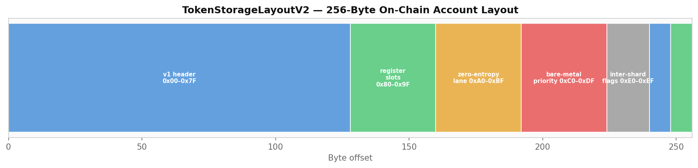

### Set-Ledger integration

All wallets start **Set 99** (most common); CCR migrates toward **Set 1** (singularity) based on on-chain behavior — not genesis labels (`docs/distribution_mapping.md`).

| Set range | Meaning | Live effect |
|-----------|---------|-------------|
| 99 → 50 | Common tiers | Standard fee routing |
| 49 → 10 | Earned rarity | Improved spread/holding signals |
| 9 → 1 | Singularity approach | Zero-gas Set-1 routing privilege |
| 1 | Singularity lock | Permanent tier — governance weight |

Set tier lives in the **register/account partition** (`UserProfile.set_tier`), re-solved on every transfer via CCR nano-inference `S(x) = W·X + B` using M₀–M₃ features (spread, holding half-life, bridge velocity, cluster entropy).

### CCR + register binding

**Register–token duality:** every balance mutation calls `apply_balance_delta()` → `sync_register_capacity_from_balance()`:

- `register_slot_count = liquid_balance / REGISTER_SLOT_UNIT` (1 CLRTY = 10⁹ nano = 1 slot)
- Lane volume = balance × 50 MB/s per CLRTY
- Priority weight = slots × 1,000
- `execution_sequence_nonce` increments on each mutation

**L3 cache partition** (`register_binding.rs`): `RegisterBindingBlock` (0x100 bytes) binds layout fields to physical CPU registers:

- `lane_keys[4]` — AES-GCM lane encryption envelopes
- `slot_bitmap` — active register slots (max 64)
- `CACHE_PARTITION_BYTES` = 4 MiB L3 reserved for CLRTY

Production path: `mutate_balance_h2tb()` → L3 flush + CPU pin via `H2tbDriver` (`hard_kernel.rs`).

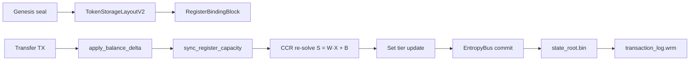
```mermaid
flowchart LR
    GEN[Genesis seal] --> LAY[TokenStorageLayoutV2]
    LAY --> REG[RegisterBindingBlock]
    TX[Transfer TX] --> DELTA[apply_balance_delta]
    DELTA --> SYNC[sync_register_capacity]
    SYNC --> CCR[CCR re-solve S = W·X + B]
    CCR --> SET[Set tier update]
    SET --> EB[EntropyBus commit]
    EB --> ROOT[state_root.bin]
    ROOT --> WORM[transaction_log.wrm]
```

### Genesis seal + state root

**Moniversion sync** chains three flat-file manifolds under `state_manifold/`:

| Artifact | Module | Role |
|----------|--------|------|
| `state_root.bin` | `state_root.rs` | Cache-line records `[CPU_ID: 16b][Balance: 64b]` — mmap balance map |
| `GenesisSeal` | `genesis_seal.rs` | 128 B anchor — magic `#0A192F`, root hash, node registry |
| `transaction_log.wrm` | `transaction_log.rs` | Append-only WORM — `[Hash:32][ATU_ID:2][Sig:64]` per record |
| `stress_audit.wrm` | `worm_audit.rs` | L-DNET / ATU stress results — JSON lines, append-only |

Genesis seal derives from `seal_all_atu_milestones()` — hashes ATU validation band 1–600. Every EntropyBus event commits to chained `state_root` via SHA256 — the λ heartbeat tracked in SIM100 is this manifold sync.

### Blue Code hard kernel

Blue Code modules (`token_core/blue_code/`) enforce crypto and hardware invariants on the layout:

| Module | ATU band | Function |
|--------|----------|----------|
| `crypto_invariants` | 326–350 | `#0A192F` salt, Ed25519, WORM scrub |
| `lane_enforcer` | — | Zero-entropy lane bandwidth caps |
| `hardware_integrity` | 426–450 | Header magic verify, RDRAND, lock-step |
| `hard_kernel` | 501–525 | CPU register pinning, L3 flush, boot checksum |
| `genesis_hardening` | 376–400 | Sink lockdown, panic gate, WORM final seal |
| `register_binding` | 301–325, 401–425 | 0x100 register block, thermal throttle @ 85°C |
| `resilience` | 476–500 | Regenesis, zstd compression, master seal |

At genesis, `TokenStorageLayoutV2::genesis()` sets `version = 2` and `FLAG_ESCROW_LOCKED`. Blue seal (`FLAG_BLUE_SEALED`) requires escrow lock — enforced by `validate_structural_combo()`.

### Comparison — custom layout vs standard token account

| Property | ERC-20 balance | SPL token account | CLRTY layout v2 |
|----------|----------------|-------------------|-----------------|
| Size | 32 B (mapping) | ~165 B | **256 B fixed** |
| Mintable | Often yes | Often yes | **Never** (`null` authority) |
| Set tier / rarity | No | No | **CCR Sets 99→1** |
| Hardware registers | No | No | **Register slots + lane volume** |
| Fee burn phases | No | No | **2% / 5% / 10%** bitmask-gated |
| WORM audit | No | No | **transaction_log.wrm** |
| Genesis seal | No | No | **128 B GenesisSeal + ATU merkle** |
| Cross-shard flags | No | No | **u128 propagation bitmask** |

### Layout byte map (mermaid)

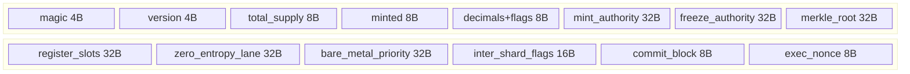
```mermaid
block-beta
    columns 8
    block:header:8
        magic["magic 4B"]
        version["version 4B"]
        supply["total_supply 8B"]
        minted["minted 8B"]
        meta["decimals+flags 8B"]
        mint_auth["mint_authority 32B"]
        freeze["freeze_authority 32B"]
        merkle["merkle_root 32B"]
    end
    block:hw:8
        reg["register_slots 32B"]
        lane["zero_entropy_lane 32B"]
        prio["bare_metal_priority 32B"]
        shard["inter_shard_flags 16B"]
        commit["commit_block 8B"]
        nonce["exec_nonce 8B"]
    end
```

### Link to Moniverse theory

The [52 mechanisms](#mechanism-reference-all-unique-mechanisms) above describe **what** the network does; layout v2 describes **where** that state lives on-chain:

- **CCR Sets 99→1** → `UserProfile.set_tier` + register partition
- **EntropyBus λ** → `execution_sequence_nonce` + state root chain
- **Fee burn phases** → routing via `ROUTE_BURN_SYNC` + `FLAG_BURN_SYNC`
- **Register binding** → `physical_register_allocation_slots` ↔ L3 cache
- **Genesis attestation** → `VIS_ADDRESS` + escrow merkle root

Without this layout, CLRTY would be a standard fungible token — indistinguishable from ERC-20 on behavior. The custom layout makes **Autonetic Moniversion** enforceable at the account layer.

**References:** `CLRTY_SUBSTRATE/token_core/layout_v2.rs` · `docs/token/structural_layout.md` · `docs/token/structural_tasks_201_400.md` · `docs/distribution_mapping.md`

---

## Cross-Venue Arbitrage Architecture

CLRTY arbitrage is **not a retail pump** — it is a **producer/consumer execution monitor** that detects cross-venue spreads, gates on slippage and supply integrity, and settles only when safety rails pass.

### Architecture flow

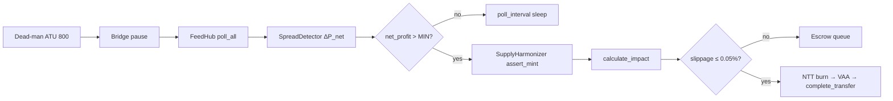
```mermaid
flowchart LR
    FEEDS[FeedHub poll_all] --> DETECT[SpreadDetector ΔP_net]
    DETECT --> PROFIT{net_profit > MIN?}
    PROFIT -->|no| WAIT[poll_interval sleep]
    PROFIT -->|yes| HARM[SupplyHarmonizer assert_mint]
    HARM --> IMPACT[calculate_impact]
    IMPACT --> GATE{slippage ≤ 0.05%?}
    GATE -->|no| QUEUE[Escrow queue]
    GATE -->|yes| SETTLE[NTT burn → VAA → complete_transfer]
    DM[Dead-man ATU 800] --> PAUSE[Bridge pause]
    PAUSE --> FEEDS
```

### Safety rails

| Rail | Module | Trigger | Effect |
|------|--------|---------|--------|
| **Dead-man switch** | `dead_man.rs` (ATU 800) | No heartbeat for 60s | `BRIDGE_PAUSE = true` |
| **Bridge pause** | `bridge_pause.rs` | Dead-man or manual | Relayer loops but does not settle |
| **Min net profit** | `spread_detector.rs` | ΔP_net ≤ $0.0015 | Skip opportunity |
| **Slippage gate** | `execution_gate.rs` | Impact > 0.05% (dynamic max) | Queue transfer in escrow |
| **Supply harmonizer** | `supply_harmonizer.rs` | Mint would exceed 16M cap | Reject arb entry |
| **Gas oracle cap** | `gas_oracle.rs` | Gas exceeds cap | Pause loop 5s |
| **Position limit** | `risk/mod.rs` | amount > MAX_TRADE_SIZE | Skip execution |
| **Toxicity filter** | `toxicity/mod.rs` | score > 5.0 (spread + cancel rate) | Flag toxic flow |

### Producer vs consumer modes

| Mode | Command | Behavior |
|------|---------|----------|
| **Consumer (default)** | `fma-relayer --mode consumer --dry-run` | Detect + log opportunities; no on-chain settlement |
| **Producer** | `fma-relayer --mode producer --signal-bridge ./signal-bridge.sock` | Full settlement path when rails pass |
| **Dry-run** | `--dry-run` flag | Log buy/sell/profit/impact/queue only |
| **Producer loop** | `arbitrage_core::run_producer_loop` | Poll → detect → risk check → execute (if not dry) |

### Module map

| Module | Path | Role |
|--------|------|------|
| Loop engine | `arbitrage_core/src/loop_engine.rs` | Producer poll cycle |
| Detect | `arbitrage_core/src/detect/mod.rs` | `spread_scan` wrapper |
| Spread detector | `quant_stack/fma/spread_detector.rs` | ΔP_net = sell.bid − buy.ask |
| Execution gate | `quant_stack/fma/execution_gate.rs` | Slippage impact + queue decision |
| Dead-man | `arbitrage_core/src/dead_man.rs` | ATU 800 heartbeat |
| Bridge pause | `arbitrage_core/src/bridge_pause.rs` | Global pause flag |
| Risk | `arbitrage_core/src/risk/mod.rs` | Position limits, drawdown |
| Toxicity | `arbitrage_core/src/toxicity/mod.rs` | Toxic flow scoring |
| Quoting | `arbitrage_core/src/quoting/mod.rs` | Spread/size helpers |
| Inventory | `arbitrage_core/src/inventory/mod.rs` | Skew + rebalance target |
| Latency | `arbitrage_core/src/latency/mod.rs` | LatencyTracker + cap check |
| Route | `arbitrage_core/src/route/mod.rs` | Venue routing scores |
| Feeds | `arbitrage_core/src/data/feeds.rs` | Venue normalization |
| Snapshot | `arbitrage_core/src/data/snapshot.rs` | VenueSnapshot from book |
| FMA relayer | `fma-relayer/src/main.rs` | Unified execution monitor |
| CLI scan | `clrty-cli-core/src/handlers/arb.rs` | `arb.scan` command |

### SIM100 cross-venue arb (E76–85)

| Event | Regime | Action | Effect per event |
|-------|--------|--------|------------------|
| 76–85 | Expansion (OQ4) | `cross_arb` | mid += $0.002 |

10 consecutive cross-venue arb events drive **+$0.02** mid recovery post-adversarial stress — modeled arbitrage tightening, not retail FOMO.

### CLI commands

```bash
# Scan cross-venue spread (default base vs arbitrum)
cargo run -p clarity-cli -- arb base arbitrum

# Full SIM100 batch
cargo run -p clarity-cli -- sim batch --seed 42

# FMA relayer dry-run (consumer)
fma-relayer --dry-run --mode consumer

# FMA relayer producer (requires signal bridge + keys)
fma-relayer --mode producer --signal-bridge ./signal-bridge.sock

# ATU SIM100 determinism gate
cargo run -p atu_runner -- 10001
```

### Funded scenario implications

- **More venues** (CEX + MIRRA + AMM) → more arb opportunities but also more correlation risk.
- **Deeper books** ($15–25M) → slippage gate passes more often; fewer escrow queues.
- **MM retainer** acts as passive arb — professional quotes narrow ΔP_net before producer engine fires.
- **Dead-man + pause** remain mandatory regardless of funding — safety rails do not scale away with capital.

---

## Investor Positioning Pack

Sixteen canonical docs codify how investors **read** $CLRTY structurally — mechanism physics, not promotional narrative. Hub: [`investor_kit.md` §16b](../investor_kit.md#16b-investor-positioning-pack).

| # | Doc | Purpose |
|---|-----|---------|
| 1 | [`moniverse_economic_engine.md`](../investor/moniverse_economic_engine.md) | Moniverse Theory as **economic engine** — why CLRTY gains value |
| 2 | [`abstraction_logic_curriculum.md`](../investor/abstraction_logic_curriculum.md) | Visual-depth class — blockchain as circulatory system (L0→L3) |
| 3 | [`chain_shift_reporting_template.md`](../investor/chain_shift_reporting_template.md) | Monthly Chain-Shift brief — pressure gradients + CLRTY exploit path |
| 4 | [`cognitive_edge_training.md`](../investor/cognitive_edge_training.md) | Private institutional **Decision Intelligence** mini-class (NDA) |
| 5 | [`register_binding_visualization.md`](../investor/register_binding_visualization.md) | Node graph — wallet capital → L3 cache partition |
| 6 | [`comms_doctrine.md`](../investor/comms_doctrine.md) | **Narrative ownership** — structural vs promotional investor comms |
| 7 | [`clarity_visual_protocol.md`](../investor/clarity_visual_protocol.md) | **Clarity Visual Protocol** — institutional reporting aesthetic |
| 8 | [`treasury_transparency_dashboard.md`](../investor/treasury_transparency_dashboard.md) | 100% treasury map · Visual-Depth integration |
| 9 | [`signal_normalization.md`](../investor/signal_normalization.md) | High-impact signal allowlist · noise removal |
| 10 | [`technical_due_diligence.md`](../investor/technical_due_diligence.md) | **Data room** — MVM, PoC, dual-lock, compliance-as-code |
| 11 | [`tokenomics_model.md`](../investor/tokenomics_model.md) | **Data room** — allocations, vesting, burn, treasury, MIRRA |
| 12 | [`security_audit_report.md`](../investor/security_audit_report.md) | **Data room** — MSA-100 + Sovereign-600 synthesis |
| 13 | [`regulatory_opinion_memo.md`](../investor/regulatory_opinion_memo.md) | **Data room** — Howey utility analysis (not legal advice) |
| 14 | [`roadmap_milestone_tracker.md`](../investor/roadmap_milestone_tracker.md) | **Data room** — TGE, MIRRA, GO gates, accountability |
| 15 | [`quantum_skills_trading_suite.md`](../investor/quantum_skills_trading_suite.md) | **Data room** — MCA, TSR, AVR, EHL Quantum Skills |
| 16 | [`genesis_participation_protocol.md`](../investor/genesis_participation_protocol.md) | SAFT onboarding · attestation · register binding |

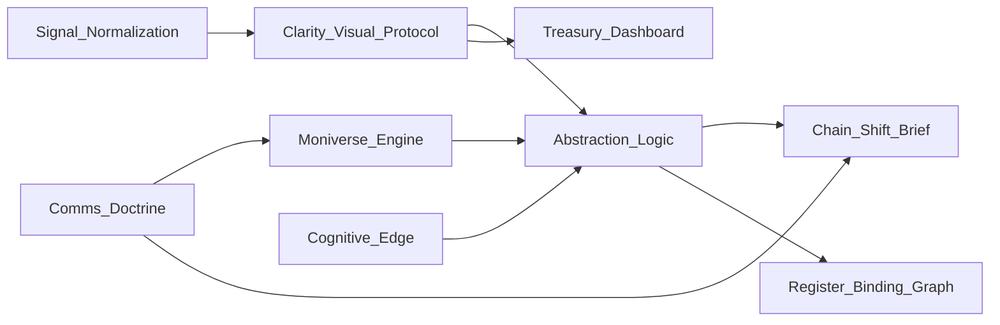
```mermaid
flowchart LR
  CVP[Clarity_Visual_Protocol] --> AL[Abstraction_Logic]
  CVP --> TD[Treasury_Dashboard]
  SN[Signal_Normalization] --> CVP
  ME[Moniverse_Engine] --> AL
  AL --> CS[Chain_Shift_Brief]
  AL --> RB[Register_Binding_Graph]
  CE[Cognitive_Edge] --> AL
  NO[Comms_Doctrine] --> ME
  NO --> CS
```

---

## Pre-launch investor experience (VIS Genesis Gateway)

Five product surfaces ship **before TGE** on [invest.clrty.network](https://invest.clrty.network): passive-yield visibility in the portfolio, sub-two-hour onboarding via the Attestation Blob protocol, an institutional gateway with full token-lifecycle depth, an **Institutional Mirror-Trades** feed that visualizes allocator flow against **network density** on `clrty-1`, and an **Abstraction Logic** visual-depth class that teaches investors to read `clrty-1` as a living circulatory system — not a static ledger.

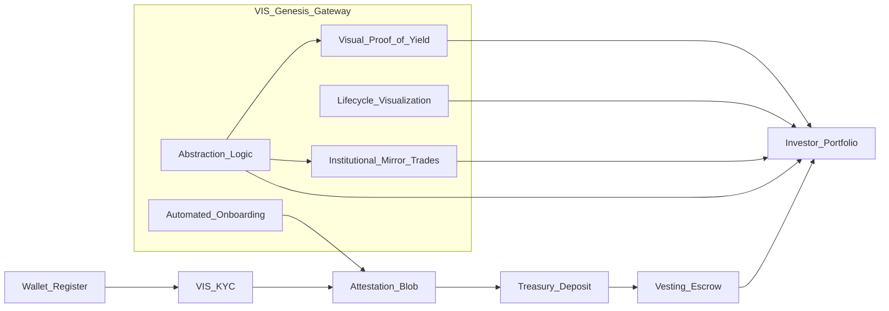
```mermaid
flowchart LR
  subgraph gateway [VIS_Genesis_Gateway]
    POY[Visual_Proof_of_Yield]
    ONB[Automated_Onboarding]
    LIFE[Lifecycle_Visualization]
    MIRROR[Institutional_Mirror_Trades]
    ABS[Abstraction_Logic]
  end
  register[Wallet_Register] --> kyc[VIS_KYC]
  kyc --> blob[Attestation_Blob]
  blob --> deposit[Treasury_Deposit]
  deposit --> escrow[Vesting_Escrow]
  POY --> portfolio[Investor_Portfolio]
  ONB --> blob
  LIFE --> portfolio
  MIRROR --> portfolio
  ABS --> portfolio
  ABS --> MIRROR
  ABS --> POY
  escrow --> portfolio
```

### Visual Proof-of-Yield (pre-launch portfolio)

**Objective:** Give every genesis participant a **real-time tracking element** in the portfolio that visualizes **passive earning from MIRRA-linked fee flow** — even before public trading goes live.

| Element | What it shows | Data source (pre-launch) |
|---------|---------------|--------------------------|
| **Accrued register yield** | Weighted allocation × reference fee share on modeled volume | `GET /v1/compliance/allocation-preview?usd_cents=…` |
| **MIRRA yield meter** | Projected passive accrual from entropy-fee split (validator + LP + holder lanes) | SIM100 telemetry + `/v1/sim/ticks` |
| **Phase indicator** | Bootstrap 2% → Stabilization 5% → Mature 10% burn context | Adaptive tokenomics phases |
| **Escrow status** | Locked vs. vested vs. cliff countdown | `GET /v1/compliance/wallet/:wallet/status` |

**Portfolio UI behavior (Notion / portal):**

- Live-updating **yield curve** and **cumulative accrual bar** refresh on wallet status poll (recommended 30s pre-launch, 5s post-TGE).
- **Reference scenario** defaults to funded SIM100 volume band ($3M–$8M/day by M6) — user can toggle **conservative / base / funded** projection.
- Pre-launch yield is **modeled and illustrative** — tied to register binding and fee-policy math, **not** a guarantee of returns or live MIRRA fills until TGE.

> **Notion callout:** *Proof-of-Yield pre-TGE = transparent math on your escrowed register rights. Post-TGE the same widget switches to live entropy-fee attribution from MIRRA + validator lanes. See [Abstraction Logic](#abstraction-logic-visual-depth-class) — yield is the **oxygen** leg of the circulatory map.*

**Honest bounds:** Modeled staking/LP yield in the funded scenario is **4%–8% APY** on bonded supply at mature volume — scales with activity; zero volume → zero yield display.

---

### Yield-Recycling Logic (MIRRA → CLRTY infrastructure)

**Objective:** Programmatically show the **reinvestment path** from MIRRA execution yield back into CLRTY infrastructure — visible in the portfolio and institutional gateway, not a black-box fee sink.

Every MIRRA fill generates **entropy fees**. Those fees do not exit the ecosystem as passive profit; they **recycle** through fixed protocol routes into infrastructure that strengthens the L1:

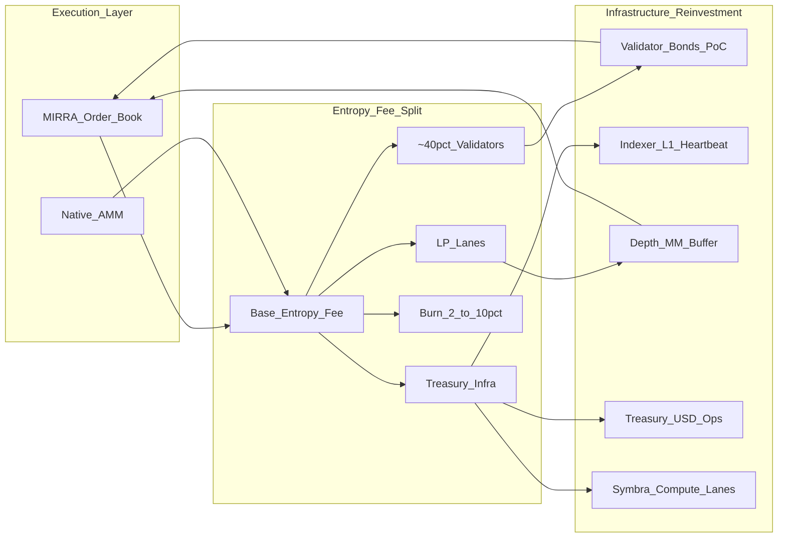
```mermaid
flowchart LR
  subgraph execution [Execution_Layer]
    MIRRA[MIRRA_Order_Book]
    AMM[Native_AMM]
  end
  subgraph fees [Entropy_Fee_Split]
    F[Base_Entropy_Fee]
    V[~40pct_Validators]
    LP[LP_Lanes]
    B[Burn_2_to_10pct]
    T[Treasury_Infra]
  end
  subgraph recycle [Infrastructure_Reinvestment]
    VAL[Validator_Bonds_PoC]
    IDX[Indexer_L1_Heartbeat]
    MM[Depth_MM_Buffer]
    OPS[Treasury_USD_Ops]
    SYM[Symbra_Compute_Lanes]
  end
  MIRRA --> F
  AMM --> F
  F --> V --> VAL
  F --> LP --> MM
  F --> B
  F --> T --> OPS
  T --> IDX
  T --> SYM
  VAL --> MIRRA
  MM --> MIRRA
```

#### Fee routing (on-chain policy)

| Entropy fee slice | Share (model) | Reinvests into | Code / module |
|-------------------|---------------|----------------|---------------|
| **Validator lane** | ~40% | Bonded stake, PoC security, unbonding discipline | `validator_manifold/`, `treasury_sink/validator_rewards` |
| **LP / liquidity lane** | ~25–35% | Native AMM + MIRRA book depth | `liquidity_stabilizer/`, `liquidity_bootstrap.rs` |
| **Deflationary burn** | 2% → 5% → 10% (phase) | Supply scarcity — **not** reinvested | `economic_core.rs` `burn_on_execute`, `state_compression_burn` |
| **Treasury / infra sink** | Remainder | Indexer, ops payroll, MM retainers, Symbra lanes | `treasury_sink/`, `ROUTE_TREASURY` |
| **Recursive burn-back** | 2.5% per sink depth | Compounding annihilation on high-volume routes | `recursive_burn_back()` (ATU 475) |

Burn and recycle are **both** programmatic — burns shrink float; non-burn slices **return as infrastructure capacity** (validators online, books deeper, indexers synced).

#### Portfolio visualization (programmatic display)

The **VIS Genesis Gateway** and **Proof-of-Yield** widget expose the recycle path as a live Sankey-style breakdown:

| UI element | Shows | API / telemetry |
|------------|-------|-----------------|
| **Yield source** | MIRRA + AMM fee attribution on your register tier | `/v1/sim/ticks` (pre-TGE modeled) · live fee events post-TGE |
| **Recycle split bar** | Validator / LP / burn / treasury percentages for current phase | Adaptive tokenomics phase (Bootstrap / Stabilization / Mature) |
| **Infra impact meter** | Estimated depth added, validator uptime credit, indexer lag | `/v1/status` (λ,H,E,R) · `/v1/alerts` |
| **Cumulative recycled** | Running total of non-burn fees reinvested (nano CLRTY + USD treasury) | SIM100 telemetry · treasury reporting |

**Pre-TGE:** recycle path is **modeled** from SIM100 volume bands — same honesty rules as Proof-of-Yield.  
**Post-TGE:** splits read from live entropy-bus fee events on `clrty-1`.

#### Reinvestment gates (fail-closed)

| Gate | Condition | Effect |
|------|-----------|--------|
| **Slippage governor** | Spread &gt; 150 bps | Pause treasury drain to MIRRA (`slippage_governor_paused`) |
| **Liquidity circuit** | Book depth &lt; 5% of target | Halt treasury → MM recycle (`SLIPPAGE_CIRCUIT_MIN_DEPTH_BPS`) |
| **Set-tier deflection** | High-velocity wash wallets | Fee multiplier ↑ via `fee_deflection_scaler.rs` — excess → burn/sink |
| **Dead-man / bridge pause** | Relayer heartbeat lost | Recycle to cross-chain paths frozen; L1 recycle continues |

> **Notion callout:** *Yield-Recycling is the closed loop — MIRRA fees fund the validators, books, and indexers that make the next MIRRA fill possible. Burn is the scarcity leg; recycle is the infrastructure leg. See [Abstraction Logic](#abstraction-logic-visual-depth-class) venous-return diagram.*

**Code anchors:** `token_core/blue_code/economic_core.rs` · `entropy_sink_engine/set_dynamics/fee_deflection_scaler.rs` · `mvm_execution/gas_deflation_matrix/state_compression_burn.rs` · `docs/tokenomics/TOKENOMICS_AND_COMPLIANCE.md` §3–§4

---

### Institutional Mirror-Trades (flow × network density feed)

**Objective:** Launch a **visual feed** that showcases how **institutional-sized flow** interacts with **$CLRTY network density** — depth, spread, validator stake, Set-tier concentration, and entropy heartbeat — in real time on the institutional gateway and B2B panel.

**Mirror-trades** are not retail copy-trading. They are **cross-venue institutional prints** detected by the producer/consumer arb stack (`FeedHub` → `SpreadDetector` → slippage gate) and **mirrored** onto the MIRRA book for visualization — showing where allocator flow would land without forcing settlement in dry-run / pre-TGE mode.

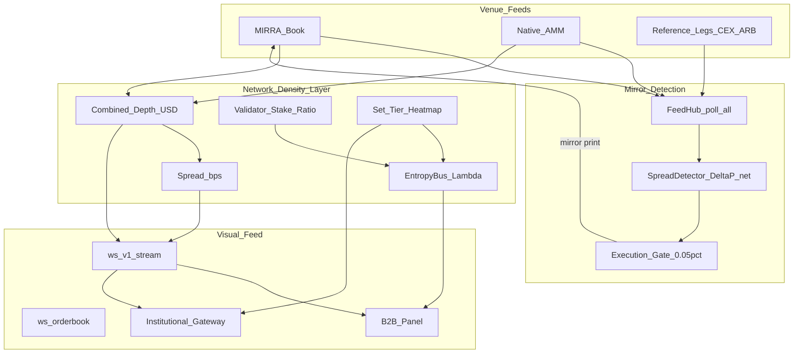
```mermaid
flowchart TB
  subgraph venues [Venue_Feeds]
    MIRRA[MIRRA_Book]
    AMM[Native_AMM]
    REF[Reference_Legs_CEX_ARB]
  end
  subgraph detect [Mirror_Detection]
    FH[FeedHub_poll_all]
    SD[SpreadDetector_DeltaP_net]
    EG[Execution_Gate_0.05pct]
  end
  subgraph density [Network_Density_Layer]
    DPT[Combined_Depth_USD]
    SPR[Spread_bps]
    VAL[Validator_Stake_Ratio]
    SET[Set_Tier_Heatmap]
    LAM[EntropyBus_Lambda]
  end
  subgraph feed [Visual_Feed]
    WS[ws_v1_stream]
    OB[ws_orderbook]
    PANEL[B2B_Panel]
    GW[Institutional_Gateway]
  end
  MIRRA --> FH
  AMM --> FH
  REF --> FH
  FH --> SD --> EG
  EG -->|mirror print| MIRRA
  MIRRA --> DPT
  AMM --> DPT
  DPT --> SPR
  VAL --> LAM
  SET --> LAM
  DPT --> WS
  SPR --> WS
  LAM --> PANEL
  SET --> GW
  WS --> PANEL
  WS --> GW
```

#### What the feed shows

| Panel zone | Metric | Institutional read |
|------------|--------|----------------------|
| **Flow tape** | Mirror-trade events (size, venue pair, ΔP_net) | Where allocators are crossing — MIRRA vs reference leg |
| **Density heatmap** | Combined bid+ask depth ($M) by price band | How much liquidity absorbs the next institutional clip |
| **Spread ribbon** | Live spread (bps) + SIM100 adversarial band | Stress context — wide ribbon = thin network |
| **Set migration trail** | Wallets moving Sets 99→N on large prints | CCR classifying behavior, not labels |
| **λ heartbeat** | EntropyBus PoC tuple (λ, H, E, R) | Consensus + coordination density on `clrty-1` |
| **Stake overlay** | % supply bonded vs. circulating | Security density backing the book |

#### Network density definition

**Network density** = the composite of liquidity + security + coordination on `clrty-1`:

| Component | Formula (display) | Source |
|-----------|-------------------|--------|
| **Book density** | `(bid_depth + ask_depth) / reference_mid` | MIRRA + AMM snapshots |
| **Security density** | `staked_clrtY / circulating_clrtY` | Validator manifold |
| **Coordination density** | Normalized λ from PoC status | `/v1/status` |
| **Behavioral density** | Inverse of cluster entropy (M₃) | CCR pipeline on large transfers |

High institutional flow into a **high-density** network → tight spreads, low slippage, mirror-trades queue rarely.  
High flow into **low-density** regime (SIM100 E51–75) → spreads widen, mirror-trades flag toxicity, slippage gate queues settlement.

#### Visual feed surfaces

| Surface | Audience | Refresh | Endpoints |
|---------|----------|---------|-----------|
| **Institutional Gateway** | Funds, OTC desks | 1–5s | `ws://…/v1/stream` · `/v1/orderbook` |
| **B2B panel** | MMs, integrators | 5s | [`frontend/b2b-panel/`](../../frontend/b2b-panel/index.html) · `/v1/status` · `/v1/alerts` |
| **SIM100 replay** | Pre-TGE demo | Event-indexed | `/v1/sim/ticks` · `/v1/sim/telemetry` |
| **Operator CLI** | Internal | On demand | `cargo run -p clarity-cli -- arb base arbitrum` |

**Pre-TGE:** feed runs on **SIM100 + Python mirror** (`simulators/clrty_mirror/`) — synthetic book injects institutional clips; density metrics match funded scenario charts ([Chart 5](#chart-5--sim100-live-market-session-seed-42), [Chart 7](#chart-7--order-book-depth-bid-vs-ask)).  
**Post-TGE:** same UI switches to live MIRRA + indexer events on `clrty-1`.

#### Mirror-trade event schema (feed row)

```json
{
  "type": "institutional_mirror",
  "venue_buy": "MIRRA",
  "venue_sell": "arbitrum_ref",
  "size_usd": 250000,
  "delta_p_net_bps": 12,
  "book_density_usd": 18500000,
  "spread_bps": 28,
  "network_density_score": 0.82,
  "queued": false,
  "set_tier_delta": -2
}
```

`network_density_score` ∈ [0,1] — composite of book + stake + λ; **not** a price prediction.

#### Safety rails on the feed

Mirror-trades on the **visual feed** respect the same rails as production arb ([Cross-Venue Arbitrage Architecture](#cross-venue-arbitrage-architecture)):

- **Consumer / dry-run default** — prints appear on feed; no on-chain settlement until producer mode + rails pass
- **Toxicity filter** — high cancel-rate venues dimmed on tape
- **Dead-man** — feed shows `BRIDGE_PAUSE` banner; L1 density metrics continue

> **Notion callout:** *Institutional Mirror-Trades make allocator flow legible — you see the clip, the book density it hits, and whether the network absorbs it or widens. Density is the context; the trade is the event.*

**References:** [`hedge_fund_integration_criteria.md`](../enterprise/hedge_fund_integration_criteria.md) · `quant_stack/fma/orderbook_feeds.rs` · `arbitrage_core/` · [Yield-Recycling Logic](#yield-recycling-logic-mirra--clrty-infrastructure) · [Abstraction Logic](#abstraction-logic-visual-depth-class)

---

### Abstraction Logic (visual-depth class)

**Canonical curriculum:** [`docs/investor/abstraction_logic_curriculum.md`](../investor/abstraction_logic_curriculum.md)

Teaches investors to read `clrty-1` as a **living circulatory system** — fixed 16M blood volume; λ pulse; MIRRA arteries; Set-tier capillaries; yield oxygen; entropy burn lymph; yield-recycle venous return. Progressive **L0→L3** lens over existing VIS Genesis Gateway widgets (Proof-of-Yield, Mirror-Trades, density heatmap, lifecycle swimlane). Institutional onboarding defaults to **L2** (pressure + density).

> **Notion callout:** *Abstraction Logic is how you learn to see the chain breathe. Full tables, mermaid maps, instructor notes, and SIM100 stress case study live in the canonical curriculum doc — not duplicated here.*

**Cross-links:** [Moniverse Economic Engine](../investor/moniverse_economic_engine.md) · [Register-Binding graph](../investor/register_binding_visualization.md) · [Cognitive Edge Training](../investor/cognitive_edge_training.md) · [Chart 30](#abstraction-logic-visual-depth-class)

---

### Automated Onboarding (&lt; 2 hours)

**Objective:** Reduce **investor → allocation** friction to **under two hours** for the standard accredited path using the automated **Attestation Blob** protocol (no manual ops queue on the happy path).

| Step | Action | Target SLA | Automation |
|------|--------|------------|------------|
| 1 | `POST /v1/compliance/wallet/register` | &lt; 5 min | Instant idempotent register |
| 2 | VIS Identity Gatekeeper KYC (portal) | &lt; 45 min | Custom VIS program; manual review only on flag |
| 3 | `POST /v1/compliance/kyc-webhook` → attestation issued | &lt; 2 min | Signed blob + sanctions pre-check |
| 4 | `GET /v1/compliance/attestation/:wallet` | &lt; 1 min | Poll until `approved` |
| 5 | Treasury deposit (USDC / USDT / ETH) | User-paced | Same wallet as attestation |
| 6 | `POST /v1/compliance/deposit/confirm` | &lt; 15 min | Safe API index + gatekeeper retry (`202` → `200`) |
| 7 | Register binding + escrow lock | &lt; 5 min | `ecosystem_vesting_escrow` programmatic |
| **Total (automated path)** | | **&lt; 2 hours** | Excludes user funding transfer time |

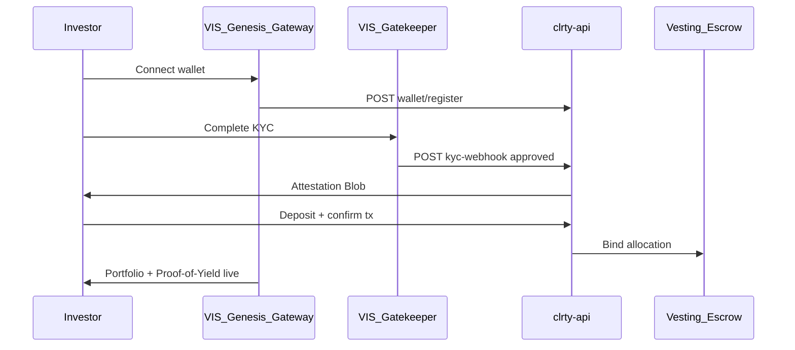
```mermaid
sequenceDiagram
  participant Inv as Investor
  participant GW as VIS_Genesis_Gateway
  participant KYC as VIS_Gatekeeper
  participant API as clrty-api
  participant Esc as Vesting_Escrow

  Inv->>GW: Connect wallet
  GW->>API: POST wallet/register
  Inv->>KYC: Complete KYC
  KYC->>API: POST kyc-webhook approved
  API->>Inv: Attestation Blob
  Inv->>API: Deposit + confirm tx
  API->>Esc: Bind allocation
  GW->>Inv: Portfolio + Proof-of-Yield live
```

**Friction killers:**

- Single wallet end-to-end — attestation, deposit, and register binding **must** share the same address.
- Unauthorized deposits without attestation → flagged in `flagged.wrm`; no silent allocation.
- Allocation preview before send: `GET /v1/compliance/allocation-preview?usd_cents=…` shows multiplier, cliff, and vest **before** capital moves.

**L1-only note:** Ethereum Safe settlement may be **deferred**; the Attestation Blob pipeline and status API remain live in-repo — treasury intake activates when settlement is un-deferred or migrated to L1-native custody.

---

### Institutional Gateway — VIS Genesis Gateway

**Objective:** Launch the **VIS Genesis Gateway** — the institutional entry surface with **high-depth visualization** of the full **token lifecycle** from first register touch through vesting, float, and fee participation.

**Portal:** [invest.clrty.network](https://invest.clrty.network) · **API base:** `http://127.0.0.1:8545` (dev) · **B2B panel:** `frontend/b2b-panel/`

#### Token lifecycle visualization (high-depth)

| Lifecycle stage | Investor sees | On-chain / repo anchor |
|-----------------|---------------|------------------------|
| **0 — Demand** | APS score, backlog tier 0–4 | Backlog funnel |
| **1 — Identity** | KYC status, attestation blob hash | `kyc_webhook.rs`, VIS Master Compliance Key |
| **2 — Capital lock** | USD committed, tier multiplier (1.5×–2.0×) | `allocation_weights.rs`, treasury Safe |
| **3 — Escrow** | CLRTY nano locked, cliff date, vest schedule | `ecosystem_vesting_escrow.rs` |
| **4 — Register bind** | L3 partition / Set 99 starting tier | `layout_v2.rs`, CCR pipeline |
| **5 — Pre-TGE yield view** | Proof-of-Yield meter (modeled) | SIM100 + allocation preview |
| **6 — TGE float** | Tradable vs. locked split | Genesis buckets, liquidity seed |
| **7 — Post-TGE fees** | Live MIRRA + entropy fee attribution | MIRRA book, entropy sink |
| **8 — Set migration** | CCR tier movement 99→1 | `binary_index_mapper.rs` |

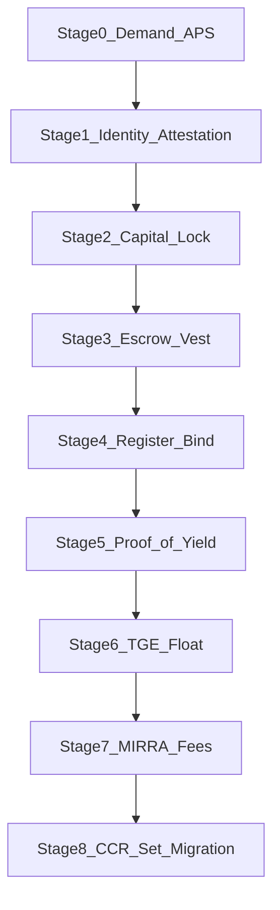
```mermaid
flowchart TD
  L0[Stage0_Demand_APS]
  L1[Stage1_Identity_Attestation]
  L2[Stage2_Capital_Lock]
  L3[Stage3_Escrow_Vest]
  L4[Stage4_Register_Bind]
  L5[Stage5_Proof_of_Yield]
  L6[Stage6_TGE_Float]
  L7[Stage7_MIRRA_Fees]
  L8[Stage8_CCR_Set_Migration]

  L0 --> L1 --> L2 --> L3 --> L4 --> L5 --> L6 --> L7 --> L8
```

#### Gateway surfaces

| Surface | Audience | Key views |
|---------|----------|-----------|
| **Retail genesis portal** | Seed / strategic wallets | Onboarding wizard, Proof-of-Yield, escrow timeline, **Abstraction Logic L0–L1** |
| **VIS Genesis Gateway (institutional)** | Funds, family offices, OTC | Multi-wallet dashboard, lifecycle swimlane, **Mirror-Trades feed**, **Abstraction Logic L2–L3**, allocation preview API |
| **B2B panel** | Market makers, integrators | `/v1/status` λ/H/E/R, order book stream, **density heatmap**, **circulatory stress ribbon**, compliance status |
| **Operator CLI** | Internal ops | `clrty settlement register-wallet`, `clrty-gatekeeper --once`, `clrty chain status` (λ,H,E,R) |

#### Lifecycle depth charts (portal embeds)

Recommended Notion / portal embeds from `docs/simulation/charts/`:

| Chart | Use in gateway |
|-------|----------------|
| [Vesting unlock curve (Chart 21)](#chart-21--vesting-unlock-curve-funded) | Escrow → float timeline |
| [Supply state funded (Chart 4)](#chart-4--supply-state-funded-launch-scenario) | Locked vs. circulating context |
| [554-day timeline (Chart 19)](#chart-19--554-day-launch-timeline) | Institutional roadmap anchor |
| [SIM100 dashboard (Chart 26)](#chart-26--sim100-dashboard-2x2-composite) | Pre-launch Proof-of-Yield reference band |
| [Abstraction Logic (Chart 30)](#abstraction-logic-visual-depth-class) | Circulatory curriculum · L0→L3 progressive lens |

**Institutional API quick-start:**

```bash
curl http://127.0.0.1:8545/v1/compliance/genesis-instructions
curl http://127.0.0.1:8545/v1/compliance/treasury
curl "http://127.0.0.1:8545/v1/compliance/allocation-preview?usd_cents=50000000"
curl http://127.0.0.1:8545/v1/compliance/wallet/0xYourWallet/status
curl http://127.0.0.1:8545/v1/sim/merkle   # determinism cross-check vs ATU 10001
```

Docs: [`genesis_participation_protocol.md`](../investor/genesis_participation_protocol.md) · [`vis_identity_gatekeeper_ops.md`](../compliance/data_room/technical/vis_identity_gatekeeper_ops.md)

---

## The five-phase launch strategy

### Phase 0 — Demand intelligence (pre-launch)

**Objective:** Know who is buying before a single CLRTY trades publicly.

- **VIS Genesis Gateway:** [Pre-launch investor experience](#pre-launch-investor-experience-vis-genesis-gateway) — Proof-of-Yield portfolio meter, &lt;2h Attestation onboarding, institutional lifecycle viz, **Abstraction Logic** circulatory curriculum.
- **Backlog funnel:** Landing → wallet → tier questionnaire → APS scoring → sybil filter → whitelist → genesis commit.
- **Outcome:** Public bucket (2M CLRTY) and backlog tiers 0–4 distribute into **measured tranches**, not one unlock.
- **Realistic expectation:** Even with massive inbound interest, **only vetted wallets** receive genesis binding. Unauthorized treasury deposits are flagged — capital without attestation does not auto-allocate.

### Phase 1 — Capital lock (genesis participation)

**Objective:** Convert USD into **vested register rights** on `clrty-1`.

| Tier | USD threshold | Token multiplier | Vest |
|------|---------------|------------------|------|
| Seed Genesis | $100K – $500K | 1.5× | 6 mo cliff / 24 mo linear |
| Strategic Round | $500K+ | 1.75× | 6 mo cliff / 24 mo linear |
| Hardware Node Partner | Compute score ≥ 80 | 2.0× | 12 mo cliff / 36 mo linear |

- Settlement: USDC, USDT, ETH → VIS Gnosis Safe treasury (L1-only scope; bridge settlement deferred).
- **Realistic expectation:** A $100M raise does **not** mean $100M of CLRTY hits the order book on day one. Most strategic capital is **escrowed and vested**. Float at TGE remains a fraction of total cap.

### Phase 2 — Genesis & liquidity seed (TGE)

**Objective:** Mint once, deploy pools, turn on the ledger.

**On-chain allocation (locked — cannot change without governance + timelock):**

| Bucket | CLRTY | % | Launch role |
|--------|-------|---|-------------|
| Treasury | 4.0M | 25% | Multisig reserve; programmatic spend |
| Liquidity | 4.0M | 25% | AMM + book seed at TGE |
| Validators | 3.0M | 18.75% | Bonded at genesis |
| Ecosystem | 3.0M | 18.75% | Grants — programmatic release |
| Public | 2.0M | 12.5% | Backlog-weighted float |

**Liquidity deployment (from `liquidity_bootstrap.rs` logic):**
- ~50% of liquidity bucket → native CLRTY/USDC pool seed.
- Remaining bucket split for ETH pairing and stabilizer reserves.
- Treasury USD **matches** token-side depth where the launch plan requires it — this is where massive funding matters most.

**Realistic TGE depth target (funded scenario @ $1.00 reference):**
- **On-book:** $15M – $25M combined bid/ask (vs. ~$10M in unfunded model).
- **Spread:** 20 – 40 bps in stable conditions.
- **Slippage on $250K market order:** &lt; 1.5% with MM active.

Without funding, the same 4M token bucket produces ** materially thinner books** — SIM100’s adversarial regime showed depth collapsing to ~$0.5M and spreads near **170 bps**. Massive funding **delays and softens** that collapse; it does not eliminate stress.

### Phase 3 — Market formation (months 0–6)

**Objective:** Establish price discovery, validator set, and fee flywheel.

**Adaptive tokenomics phases (fee policy only — no new supply):**

| Phase | Period | Burn share of fees | Purpose |
|-------|--------|-------------------|---------|
| Bootstrap | Mo 0–3 | 2% | Low friction while volume builds |
| Stabilization | Mo 3–6 | 5% | Begin deflationary pressure |
| Mature | Mo 6+ | 10% | Full burn schedule |

**Market mechanics:**
- **MIRRA order book** — primary execution layer on clrty-1.
- **Native AMM** (`liquidity_stabilizer/`) — backstop liquidity and routing.
- **Agent behavior (SIM100 validated):** arbitrageurs tighten cross-venue gaps; long-term holders add bid depth in stable regimes; panic sellers thin the ask in drawdowns — **normal**, not a protocol failure.

**Realistic volume assumption (funded + CEX listing):** $3M – $8M daily average by month 6 (vs. $1.2M in base model). Year-1 cumulative burn: **~150K – 250K CLRTY** at mature fee rates — meaningful but not supply-shocking on a 16M cap.

**Staking:** Validators receive ~40% of entropy fees. At funded volume, modeled staking yield **4% – 8% APY** on bonded supply — **not guaranteed**; scales with activity.

### Phase 4 — CEX & institutional access (months 6–18)

**Objective:** Secondary venues, B2B panel, compliance-grade reporting.

- **CEX listing** (Phase 5 roadmap): listing fees + MM budget drawn from treasury USD.
- **B2B institutional panel** + REST/WebSocket API (`clrty-api`) for allocators and market makers.
- **CCR Set tiers (99→1)** re-solved on every transfer — wallet classification follows **behavior**, not mint-time labels. Institutional flow that tightens spreads and extends holding half-life migrates sets upward over time.

**Realistic expectation:** CEX presence **adds volume and visibility**; it also adds **correlation to BTC/ETH risk-off days**. Treasury runway must assume 30–40% volume drawdown quarters — funding is partly a buffer for exactly that.

### Phase 5 — Mature coordination layer (18+ months)

**Objective:** CLRTY as liquidity/coordination engine — not bridge-first.

- L1 remains **authoritative ledger** for supply (`clrty-1` / `uclrty`).
- Cross-chain mirrors (LayerZero, Wormhole NTT) stay **deferred Phase 10** — no omnichain supply drift at launch.
- Governance: Set-1-weighted voting + **48-hour timelock** on core parameters.

---

## Supply & float — realistic 12-month view (funded scenario)

Reference price **$1.00** · **$5M/day** avg volume by month 6 · massive treasury deployed

| State | Month 0 | Month 6 | Month 12 | Notes |
|-------|---------|---------|----------|-------|
| **Circulating (tradable)** | ~3.2M | ~5.0M | ~5.8M | Public + partial LP; vesting limits insider float |
| **Staked (validators)** | ~2.4M | ~2.6M | ~2.8M | Grows with fee yield, not new mint |
| **Locked (vesting)** | ~9.0M | ~7.2M | ~5.8M | Treasury, ecosystem, strategic escrow |
| **Burned (cumulative)** | 0 | ~45K | ~180K | ~1.1% of cap by year 1 — slow, intentional |

**Key realism check:** Even with $100M+ in treasury, **~64% of supply is illiquid or locked at month 0**. The market trades a **small float on a fixed cap** — volatility will be higher than large-cap L1s. Funding improves **depth around that float**; it does not magically create a $16B asset.

---

## How the coin functions live (participant view)

### Traders
- Execute against MIRRA + AMM; slippage is a function of **depth**, not narrative.
- In adversarial regimes (latency spikes, spread stress, thin books), **expect wider spreads** — SIM100 proved the ledger holds; the book does not pretend to be infinitely deep.
- CCR means your **Set tier changes with behavior** — wash trading and cluster entropy carry on-chain cost.

### Strategic / genesis holders
- Allocations are **register-bound and escrowed** — 6-month cliff minimum on standard tiers.
- Multiplier (1.5× – 2.0×) rewards early capital and compute partners; it does **not** bypass vesting.
- Value is anchored in **register state + vesting schedule**, not day-one CEX price.

### Validators & node partners
- 3M CLRTY genesis allocation + fee share from entropy sink.
- Hardware-attested partners get **validator onboarding priority** and longer vest (12/36) — aligns security budget with network ops.

### Treasury & ecosystem
- 4M treasury CLRTY + USD reserve: audits, MM, grants, crisis absorption.
- 3M ecosystem: programmatic grants — not a discretionary slush fund; governance-gated.

---

## SIM100 stress test — what we learned (seed 42)

The 100-event simulation is the **honesty check** on the strategy above.

| Metric | Result | Strategic read |
|--------|--------|----------------|
| Price path | $1.005 → $1.131 (+12.5%) | Expansion + accumulation regimes drive discovery; stable/OQ1 periods flat |
| Peak depth | ~$7M combined | Funded launch target is higher; unfunded books look like pre-stress SIM |
| Adversarial (ev 51–75) | Depth → ~$0.5M, spread ~170 bps | **Survives** — no consensus break; MM and treasury must plan for this |
| Regimes | 45 stable · 30 adversarial · 15 expansion · 10 accumulation | Majority of life is normal ops; stress is recurring, not one-off |
| Merkle root | `94e73f18…732e` | Deterministic — same inputs, same proof |

**Bottom line for investors:** Massive funding should be sized to **survive the adversarial third** of market life, not just to paint a green day-one chart.

---

## Strategic principles (Notion callout)

> **1. Scarcity is non-negotiable.** 16M cap, null mint authority — funding never dilutes.  
> **2. Capital before float.** Backlog + genesis escrow + vesting — demand is structured before supply trades.  
> **3. Depth is bought, not printed.** Treasury USD pairs with the 4M liquidity bucket; MM retainers maintain quotes.  
> **4. Stress is priced in.** Adversarial regimes widen spreads; the protocol goal is **survival + integrity**, not zero volatility.  
> **5. Deflation is slow by design.** Burns ramp 2% → 5% → 10% of fees — year-1 removal is meaningful but not catastrophic to float.  
> **6. L1 first.** clrty-1 is the sole supply authority; bridges wait for Phase 10.

---

## Risks (stated plainly)

- **Small FDV, small float** — even with massive USD treasury, token cap is 16M; price can move sharply on moderate flow.
- **Vesting cliffs** — month 6 and month 12 unlock windows add **scheduled supply events**; treasury/MM must absorb, not ignore.
- **MM is not a floor** — professional makers widen or withdraw in extreme stress.
- **External dependencies** — third-party audit (**Blocked** — Gates 2–5), CEX agreements, 24/7 monitoring, regulatory jurisdiction (Phase 2 compliance) are **not fully in-repo**. Board tokenomics sign-off and GO authorization remain **External**.
- **No return guarantees** — staking yield and LP fees depend on volume; burns help scarcity, not price directly.

---

## Validation & proof points

| Gate | Status | Label |
|------|--------|-------|
| Tokenomics locked (`TOKENOMICS_LOCKED.md`) | Frozen in-repo | **Done** |
| 100-event SIM100 batch | Pass · merkle `94e73f18…732e` | **Confirmed (JSON)** |
| Merkle determinism (re-run) | Pass | **Done** |
| ATU milestone 10001 | Pass | **Done** |
| Genesis verify CLI | Pass | **Done** |
| L1 concurrency stress | Pass | **Done** |
| Full pretest 100 (4 zones) | 100/100 · L1 pulse green | **Confirmed (JSON)** |
| Launch readiness battery | 92.3% · `launch_ready: true` | **Confirmed (JSON)** · `fork_swap_stress` **fail** |
| Mainnet contract gates | 5/5 pass | **Confirmed (JSON)** |
| MSA-100 documented coverage | 100.0% · 8/8 live checks | **Confirmed (JSON)** |
| Sovereign-600 documented | 83.3% · atomic band 100% | **Confirmed (JSON)** |
| External third-party audit | Gates 2–5 not started | **Blocked** |
| Pretest campaign window | 176 days remaining | **Confirmed (JSON)** |

---

## Glossary

| Term | Definition |
|------|------------|
| **Hard cap** | 16,000,000 CLRTY maximum — ever |
| **Float** | Tokens freely tradable at a given time (~3–6M in funded year-1 model) |
| **MIRRA** | Order book / execution layer on clrty-1 |
| **CCR** | Convergent Collapse Rarity — Set tier 99→1 re-solved each transfer |
| **Entropy fee** | Protocol fee split: validators, LPs, burn |
| **APS** | Activity profile score — backlog weighting |
| **VIS Genesis Gateway** | Institutional pre-launch portal — lifecycle viz + Proof-of-Yield + Attestation onboarding + Abstraction Logic visual-depth class |
| **Proof-of-Yield** | Pre-TGE portfolio meter — modeled MIRRA/fee accrual on escrowed register rights |
| **Yield-Recycling** | Programmatic MIRRA fee → validator / LP / treasury / burn split reinvesting into L1 infra |
| **Mirror-Trades** | Visual feed — institutional flow vs. book/stake/λ network density on `clrty-1` |
| **Abstraction Logic** | Investor visual-depth curriculum — read `clrty-1` as a circulatory system (heart/validators, arteries/MIRRA, capillaries/Sets, lymph/burn, pulse/λ) |
| **Visual-depth class** | Progressive gateway teaching module (L0 surface → L3 systems view) embedded in VIS Genesis Gateway |
| **Network density** | Composite of liquidity depth, validator stake ratio, and EntropyBus λ coordination |
| **Attestation Blob** | VIS-signed KYC artifact binding wallet → genesis allocation |
| **TGE** | Token genesis event — one-time mint + pool seed |
| **Layout v2** | 256-byte `TokenStorageLayoutV2` — native `uclrty` account on `clrty-1` |
| **Register binding** | L3 cache partition mapping balance → hardware register slots |
| **Moniverse Economic Engine** | Autonetic Moniversion as value-accrual physics — fee capture, recycle, burn, Set scarcity |
| **Chain-Shift** | Branded framework for pressure gradients forming across venues — monthly institutional brief |
| **Cognitive Edge** | Private institutional Decision Intelligence mini-class within CLRTY/VIS |
| **Narrative ownership** | Structural-only investor comms doctrine — physics and integrity, not promotional FDV |
| **Clarity Visual Protocol (CVP)** | Institutional-grade aesthetic — Snowflake Blue, data density, L0→L3 chart catalog |
| **Signal normalization** | Allowed vs banned investor signals — high-impact visuals only |
| **Quantum Skills** | MCA · TSR · AVR · EHL — deterministic CLI trading augmentation layer |
| **MCA** | Metric-Collapse Arbitrage — 99→1 optimization distance filter |
| **TSR** | Topological State-Rebalancing — Set tier migration + fee priority |
| **AVR** | Attestation-Verified Routing — compliance-as-code execution gate |
| **EHL** | Entropy-Heartbeat Liquidation — black swan lane lock on extreme λ |
| **MSA-100** | Mass Security Architecture — 100 operational layers (Zones I–IV) |
| **Sovereign-600** | 600-protocol security registry — SP-001–600; atomic band SP-501–600 |
| **SP-600** | Terminal ledger seal — deterministic immutable ledger finality |
| **Compliance-as-Code** | Attestation Blob at execution time — protocol-layer AML/KYC |

---

## Internal references

- **Investor data room (June 2026):** [`technical_due_diligence.md`](../investor/technical_due_diligence.md) · [`tokenomics_model.md`](../investor/tokenomics_model.md) · [`security_audit_report.md`](../investor/security_audit_report.md) · [`regulatory_opinion_memo.md`](../investor/regulatory_opinion_memo.md) · [`roadmap_milestone_tracker.md`](../investor/roadmap_milestone_tracker.md) · [`quantum_skills_trading_suite.md`](../investor/quantum_skills_trading_suite.md)
- Tokenomics: `docs/tokenomics/TOKENOMICS_LOCKED.md`
- Genesis protocol: `docs/investor/genesis_participation_protocol.md`
- Investor kit: `docs/investor_kit.md`
- SIM100 catalog: `docs/simulation/events_100_catalog.md`
- ABM architecture: `docs/simulation/abm_architecture.md`
- Arbitrage producer: `docs/arbitrage/producer_engine.md`
- Master blueprint: `docs/master_blueprint.md`
- Chart generator: `docs/simulation/generate_charts.py`
- Token layout v2: `CLRTY_SUBSTRATE/token_core/layout_v2.rs` · `docs/token/structural_layout.md`
- Distribution mapping: `docs/distribution_mapping.md`
- Sovereign-600: `docs/security/SOVEREIGN_600_ARCHITECTURE.md` · `CLRTY_SUBSTRATE/boot/sovereign_canonical_titles.json`
- Quantum Skills manifest: `CLRTY_SUBSTRATE/boot/quant_skills_manifest.json` · `clrty-cli-core/src/skills/`
- Launch JSON: `var/launch/launch_readiness_report.json` · `var/launch/mainnet_contract_gates.json`
- Pretest JSON: `var/pretest/systemic_readiness.json` · `var/pretest/full_pretest_report.json`
- Run simulation: `bash scripts/sim/run_100_events.sh`
- Data Center (Performance & ROI): `docs/investor/performance_roi_tracking_template.md` · `make data-center-sync` · `GET /v1/data-center/snapshot`
- Launch readiness: `bash scripts/launch/launch_readiness.sh --continue --skip-foundry`

---

*Strategy document · massively funded scenario · 16M CLRTY hard cap · clrty-1 L1-only · SIM100 seed 42 · Investor data room update 2026-06-19*
