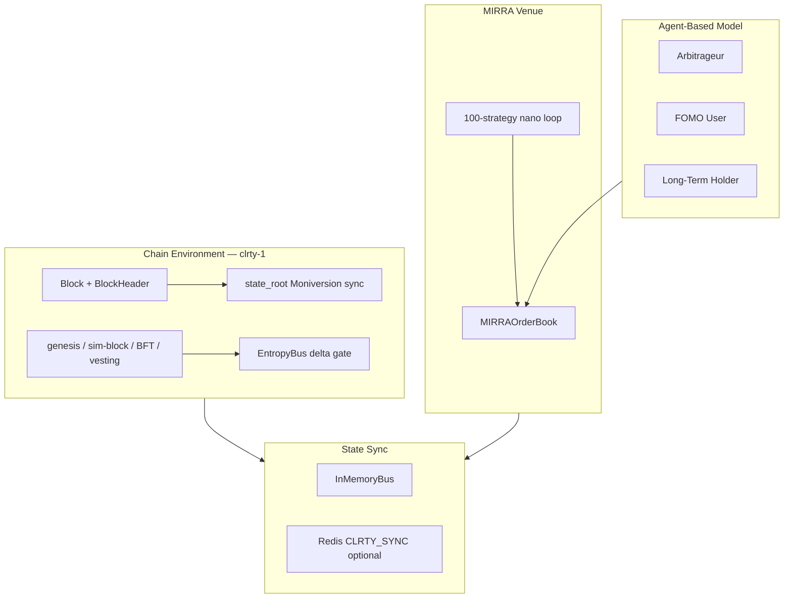

# CLRTY Agent-Based Simulation Architecture

This document maps the ABM simulation specification to the implemented `clrty-state-space-sim` engine and Python mirror layer.

## Architecture Overview



## I. Core Components

| Spec | Implementation | Path |
|------|----------------|------|
| Chain block structure | `Block`, `BlockHeader`, `validate_block` | `simulators/state_space/src/chain/mod.rs` |
| State determinism | Merkle batch root + `validate_block` state_root check | `simulators/state_space/src/merkle.rs`, `chain/mod.rs` |
| Entropy Bus drift gate | `EntropyBus` + `MAX_DRIFT_MS` invariant | `CLRTY_SUBSTRATE/kernel_core/entropy_bus.rs`, `invariants.rs` |
| ABM agents | Arbitrageur, FOMO, Long-Term Holder | `simulators/state_space/src/abm.rs`, `simulators/clrty_mirror/actors/` |
| MIRRA order book | Deterministic matching engine | `simulators/clrty_mirror/mirra_order_book.py` |
| 100-strategy loop | `StrategyGenerator` × events_100.json | `simulators/state_space/src/strategy_generator.rs` |
| Unified telemetry | `SimTelemetryLog` with pre/post state | `simulators/state_space/src/telemetry.rs` |
| Redis sync (optional) | `CLRTY_SIM_REDIS_URL` → `CLRTY_SYNC` channel | `simulators/state_space/src/state_bus.rs` (`redis-sync` feature) |

## II. Four Simulation Batches

### 1. Integrity & Consensus (OQ1, events 1–25)

| Test | Event band | L1 hook |
|------|------------|---------|
| Genesis verification | 1–10 | `genesis_verify` |
| Register / block sync | 11–15 | `register_sync` |
| Concurrent TX (TPS subset) | 16–20 | `sim_block` / `tps_burst` |
| BFT resilience (5% malicious) | 21–25 | `bft_stress` |

Run: `bash scripts/stress/l1_concurrency.sh` or `OQ1_ONLY=1 bash scripts/stress/l1_concurrency.sh`

### 2. Tokenomics & Flow (embedded in L1 hooks)

| Test | Hook | Validates |
|------|------|-----------|
| Supply dynamics | `supply_mint_burn` | Hard cap enforcement |
| Fee logic | `fee_stress` | `base_entropy_fee` under load |
| Vesting schedules | `vesting_release` | Cliff + linear release per whitepaper |

### 3. Stress & Adversarial (OQ3 + hooks)

| Test | Mechanism |
|------|-----------|
| TPS burst | `tps_burst` — 5× sim-block per event |
| Double-spend | `double_spend` — nonce ledger rejects duplicate |
| Reorg handling | `reorg_canonical` — longest nonce wins |
| Latency inject | `RegimeManager` + OQ3 events (2–50ms) |

### 4. Execution & Market Logic (OQ2–OQ4, events 26–100)

| Test | Mechanism |
|------|-----------|
| Liquidity absorption | `TradeExecutor` + MIRRA `match_order` slippage |
| Order churn | `P_reject = f(canceled/filled)` |
| Regime shift | `RegimeManager`: Stable → Expansion → Adversarial |

## III. Agent Personas

| Persona | Rust (`abm.rs`) | Python mirror |
|---------|-----------------|---------------|
| Arbitrageur | Narrows spread > 2% | `actors/arb.py` |
| FOMO User | Momentum buy on +0.1% move | `actors/fomo.py` |
| Long-Term Holder | Stakes + adds bid depth in Stable/Accumulation | `actors/holder.py` |
| Panic seller | (market adversarial) | `actors/panic.py` |

## IV. Telemetry Schema

Every event emits NDJSON to `fixtures/batch_100_telemetry.ndjson`:

```json
{
  "timestamp": "2026-06-15T12:01:00Z",
  "event_type": "chain_market",
  "event_id": 1,
  "pre_state": { "mid_price": 1.005, "bid_depth_usdc": 5000000, "ask_depth_usdc": 5000000, "staked_nano": 0, "entropy_root": "..." },
  "post_state": { "...": "..." },
  "status": "filled",
  "event_hash": "...",
  "agent_actions": [{ "persona": "arbitrageur", "action": "observe", "delta_mid": 0 }],
  "chain_id": "clrty-1"
}
```

## V. Running Simulations

```bash
# Full 100-event batch + merkle determinism
bash scripts/sim/run_100_events.sh

# Rust only
cargo run -p clrty-state-space-sim -- batch --seed 42 --events 1-100 --write-fixture

# Python ABM + MIRRA mirror
python3 simulators/clrty_mirror/run_batch.py --seed 42 --skip-rust

# CLI
cargo run -p clarity-cli -- sim batch --seed 42

# ATU SIM100 milestone
cargo run -p atu_runner -- 10001

# Optional Redis sync
CLRTY_SIM_REDIS_URL=redis://127.0.0.1:6379 cargo run -p clrty-state-space-sim --features redis-sync -- batch --seed 42
```

## VI. Determinism Guarantee

Given the same `--seed`, the batch Merkle root in `fixtures/batch_100_merkle.txt` must match on every re-run. CI enforces this via `.github/workflows/sim_verification.yml`.

If Merkle drifts after logic changes, regenerate with:

```bash
cargo run -p clrty-state-space-sim -- batch --seed 42 --events 1-100 --write-fixture
```
